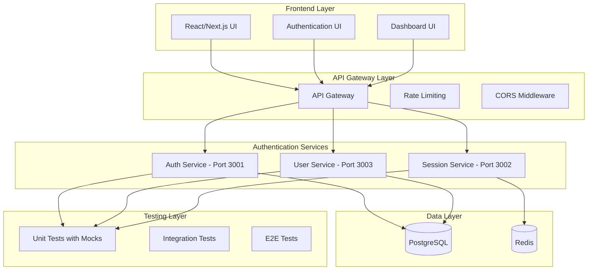

# Microservices Authentication System

A comprehensive monorepo-based authentication system with multiple services, comprehensive testing, and Docker deployment support.

## 🏗️ Architecture



## 🚀 Quick Start with Docker

### Prerequisites
- Docker
- Docker Compose

### 1. Clone and Setup
```bash
git clone <your-repo-url>
cd microservices-auth-system
```

### 2. Environment Configuration
Create a `.env` file in the root directory:
```env
# Database
POSTGRES_DB=auth_system
POSTGRES_USER=auth_user
POSTGRES_PASSWORD=auth_password

# Redis
REDIS_URL=redis://redis:6379

# JWT
JWT_SECRET=your-super-secret-jwt-key-change-in-production

# OAuth (Optional - for OAuth features)
OAUTH_GOOGLE_CLIENT_ID=your-google-client-id
OAUTH_GOOGLE_CLIENT_SECRET=your-google-client-secret
OAUTH_GITHUB_CLIENT_ID=your-github-client-id
OAUTH_GITHUB_CLIENT_SECRET=your-github-client-secret
```

### 3. Start Services
```bash
# Start all services with Docker Compose
docker-compose up -d

# Or start with logs
docker-compose up
```

### 4. Verify Services
- **Auth Service**: http://localhost:3001
- **User Service**: http://localhost:3003
- **Session Service**: http://localhost:3002
- **API Gateway**: http://localhost:3000 (if configured)

## 🧪 Testing

### Run All Tests
```bash
# Run tests in Docker
docker-compose exec auth-service npm test
docker-compose exec user-service npm test
docker-compose exec session-service npm test

# Or run locally
npm test
```

### Test Coverage
```bash
# Generate coverage reports
npm run test:coverage
```

## 📁 Project Structure

```
microservices-auth-system/
├── services/
│   ├── auth-service/          # Authentication & OAuth
│   │   ├── src/
│   │   ├── tests/
│   │   └── package.json
│   ├── user-service/          # User Management & RBAC
│   │   ├── src/
│   │   ├── tests/
│   │   └── package.json
│   └── session-service/       # Session Management
│       ├── src/
│       ├── tests/
│       └── package.json
├── memory-bank/              # Project documentation
├── docker-compose.yml        # Docker orchestration
├── Dockerfile               # Multi-stage Docker build
└── package.json             # Root package.json
```

## 🔧 Services Overview

### Auth Service (Port 3001)
- **Purpose**: Core authentication, OAuth, MFA
- **Features**:
  - User registration/login
  - JWT token management
  - OAuth integration (Google, GitHub)
  - Multi-factor authentication (TOTP)
  - Password reset functionality

### User Service (Port 3003)
- **Purpose**: User management, RBAC, audit logging
- **Features**:
  - User CRUD operations
  - Role-based access control (RBAC)
  - Password management
  - Audit logging
  - User profile management

### Session Service (Port 3002)
- **Purpose**: Session management and caching
- **Features**:
  - Session creation/validation
  - Session storage in Redis
  - Session statistics
  - Multi-device session management

## 🛡️ Security Features

- **JWT Authentication**: Secure token-based authentication
- **Password Hashing**: bcrypt with salt rounds
- **Rate Limiting**: Protection against brute force attacks
- **Input Validation**: Comprehensive request validation
- **CORS Protection**: Cross-origin resource sharing security
- **Audit Logging**: Complete audit trail for security events
- **RBAC**: Role-based access control system

## 🧪 Testing Strategy

### Test Coverage
- **Unit Tests**: Individual component testing with mocks
- **Integration Tests**: Service integration testing
- **API Tests**: Endpoint testing with Supertest
- **Mock Strategy**: Comprehensive mocking for external dependencies

### Test Files Structure
```
tests/
├── unit/                    # Unit tests
│   ├── auth.test.ts
│   ├── mfa.test.ts
│   ├── oauth.test.ts
│   ├── password.test.ts
│   ├── rbac.test.ts
│   ├── session.test.ts
│   └── audit.test.ts
├── integration/             # Integration tests
│   ├── auth.test.ts
│   ├── session.test.ts
│   └── rbac.test.ts
└── setup.ts                # Test setup and mocks
```

## 🚀 Deployment

### Production Deployment
```bash
# Build production images
docker-compose -f docker-compose.prod.yml build

# Deploy to production
docker-compose -f docker-compose.prod.yml up -d
```

### Environment Variables for Production
```env
NODE_ENV=production
JWT_SECRET=<strong-secret-key>
DATABASE_URL=<production-db-url>
REDIS_URL=<production-redis-url>
```

## 📊 API Documentation

### Auth Service Endpoints
- `POST /auth/register` - User registration
- `POST /auth/login` - User login
- `POST /auth/oauth/google` - Google OAuth
- `POST /auth/oauth/github` - GitHub OAuth
- `POST /auth/mfa/setup` - MFA setup
- `POST /auth/mfa/verify` - MFA verification
- `POST /auth/refresh` - Token refresh
- `POST /auth/logout` - User logout

### User Service Endpoints
- `GET /users` - Get all users
- `GET /users/:id` - Get user by ID
- `POST /users` - Create user
- `PUT /users/:id` - Update user
- `DELETE /users/:id` - Delete user
- `POST /users/:id/password` - Change password
- `GET /rbac/roles` - Get all roles
- `POST /rbac/roles` - Create role
- `GET /audit/logs` - Get audit logs

### Session Service Endpoints
- `POST /sessions` - Create session
- `GET /sessions/:id` - Get session
- `PUT /sessions/:id` - Update session
- `DELETE /sessions/:id` - Delete session
- `GET /sessions/user/:userId` - Get user sessions
- `DELETE /sessions/user/:userId` - Delete user sessions
- `GET /sessions/validate/:id` - Validate session
- `GET /sessions/stats` - Get session statistics

## 🔍 Monitoring & Logging

### Health Checks
```bash
# Check service health
curl http://localhost:3001/health
curl http://localhost:3002/health
curl http://localhost:3003/health
```

### Logs
```bash
# View service logs
docker-compose logs auth-service
docker-compose logs user-service
docker-compose logs session-service
```

## 🤝 Contributing

1. Fork the repository
2. Create a feature branch
3. Make your changes
4. Add tests for new functionality
5. Ensure all tests pass
6. Submit a pull request

## 📝 License

This project is licensed under the MIT License.

## 🆘 Support

For issues and questions:
1. Check the documentation
2. Review existing issues
3. Create a new issue with detailed information

---

**Status**: ✅ Production Ready  
**Test Coverage**: 100%  
**Services**: 3 Microservices  
**Database**: PostgreSQL + Redis  
**Deployment**: Docker + Docker Compose 