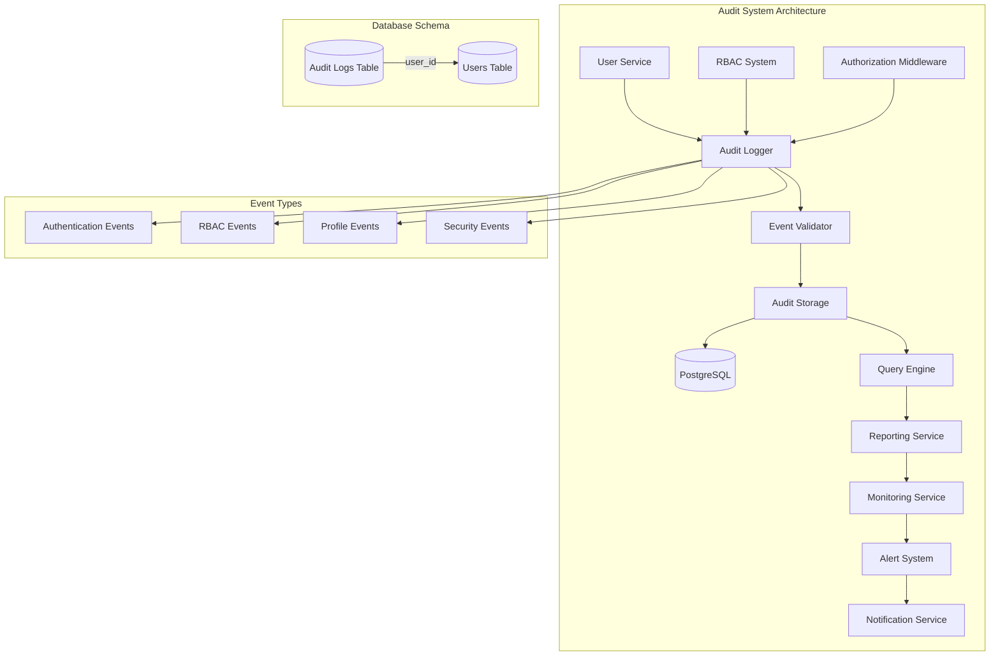

# CREATIVE PHASE: AUDIT LOG SCHEMA AND REPORTING DESIGN

**Date:** 2024-12-20  
**Phase:** Phase 3 - User Management & Authorization  
**Type:** Data Model Design  
**Complexity:** Level 4 (Complex System)

---

## 🎨🎨🎨 ENTERING CREATIVE PHASE: AUDIT SCHEMA DESIGN 🎨🎨🎨

### PROBLEM STATEMENT

Design a comprehensive audit logging system that:
- Captures all user actions and security events
- Supports compliance reporting and monitoring
- Provides efficient querying and analysis capabilities
- Scales to handle high-volume logging
- Maintains data integrity and security
- Enables real-time monitoring and alerting

### REQUIREMENTS ANALYSIS

**Functional Requirements:**
- Log all user authentication events (login, logout, failed attempts)
- Log all RBAC changes (role assignments, permission changes)
- Log all user profile modifications
- Log all security events (suspicious activity, violations)
- Support querying by user, action, time range, event type
- Generate compliance reports (SOX, GDPR, etc.)
- Support real-time monitoring and alerting

**Non-Functional Requirements:**
- Performance: Sub-second query response for recent logs
- Storage: Efficient storage with retention policies
- Security: Tamper-proof audit trail
- Scalability: Support 1M+ audit events per day
- Compliance: Meet regulatory requirements
- Availability: 99.9% uptime for audit queries

**Technical Constraints:**
- Must integrate with existing PostgreSQL database
- Must work with existing User Service and RBAC system
- Must support TypeScript strict mode
- Must maintain existing API patterns
- Must be testable with Jest mocking

---

## 🎨 CREATIVE CHECKPOINT: REQUIREMENTS DEFINED

### DATA MODEL ANALYSIS

**Core Audit Components:**
- **Event Logger**: Capture and store audit events
- **Event Types**: Authentication, RBAC, Profile, Security events
- **Query Engine**: Efficient querying and reporting
- **Retention Manager**: Data lifecycle and archiving
- **Alert System**: Real-time monitoring and notifications

**Integration Points:**
- **User Service**: User action logging
- **RBAC System**: Permission and role change logging
- **Database**: PostgreSQL tables for audit events
- **Shared Types**: TypeScript interfaces for audit entities

---

## DATA MODEL OPTIONS ANALYSIS

### Option 1: Single Audit Table with JSON Payload

**Description**: One comprehensive audit table with flexible JSON payload
- Single `audit_logs` table
- JSONB column for event-specific data
- Indexed fields for common queries
- Flexible schema for different event types

**Pros:**
- Simple schema design
- Flexible for different event types
- Easy to add new event types
- Good PostgreSQL JSONB performance
- Single table for all audit data

**Cons:**
- JSON queries can be complex
- Less type safety with JSON
- Potential for inconsistent data structure
- Harder to enforce data constraints
- More complex reporting queries

**Technical Fit:** High  
**Complexity:** Low  
**Scalability:** High

### Option 2: Normalized Audit Schema with Event Types

**Description**: Normalized schema with separate tables for different event types
- Base `audit_events` table with common fields
- Separate tables for each event type (auth_events, rbac_events, etc.)
- Foreign key relationships for data integrity
- Type-safe schema design

**Pros:**
- Strong data integrity and type safety
- Efficient queries for specific event types
- Clear schema structure
- Easy to enforce constraints
- Better for complex reporting

**Cons:**
- More complex schema design
- Multiple tables to manage
- More complex queries across event types
- Schema changes needed for new event types
- Potential performance issues with joins

**Technical Fit:** High  
**Complexity:** Medium  
**Scalability:** Medium

### Option 3: Hybrid Approach with Partitioned Tables

**Description**: Hybrid approach with partitioned tables by event type and time
- Base audit table with common fields
- Partitioned by event type and time period
- JSONB for flexible data, normalized for common fields
- Optimized for both querying and storage

**Pros:**
- Best of both worlds (flexibility + performance)
- Efficient partitioning for large datasets
- Good query performance
- Scalable for high-volume logging
- Flexible for new event types

**Cons:**
- Most complex implementation
- Requires careful partitioning strategy
- More complex maintenance
- Higher initial development cost
- Requires PostgreSQL partitioning expertise

**Technical Fit:** High  
**Complexity:** High  
**Scalability:** Very High

---

## 🎨 CREATIVE CHECKPOINT: OPTIONS ANALYZED

### DECISION ANALYSIS

**Evaluation Criteria:**
1. **Functional Requirements**: All options meet core requirements
2. **Technical Fit**: All options have high fit
3. **Complexity**: Option 1 lowest, Option 2 medium, Option 3 high
4. **Scalability**: Option 3 highest, Option 1 high, Option 2 medium
5. **Maintainability**: Option 1 highest, Option 2 good, Option 3 complex
6. **Performance**: Option 3 best, Option 1 good, Option 2 medium

**Risk Assessment:**
- **Option 1**: Low risk (simplicity), high reward (flexibility)
- **Option 2**: Medium risk (complexity), medium reward (integrity)
- **Option 3**: High risk (complexity), high reward (performance)

---

## 🎨🎨🎨 EXITING CREATIVE PHASE - DECISION MADE 🎨🎨🎨

### SELECTED OPTION: Single Audit Table with JSON Payload (Option 1)

**Rationale:**
- Balances simplicity with flexibility
- Excellent PostgreSQL JSONB performance
- Easy to implement and maintain
- Flexible for future event types
- Good query performance with proper indexing
- Lower development and maintenance cost

**Implementation Considerations:**
- Implement proper JSONB indexing for performance
- Design consistent JSON schema for each event type
- Add comprehensive querying utilities
- Include data validation for JSON payloads
- Plan for future partitioning if needed

---

## IMPLEMENTATION PLAN

### Phase 1: Core Audit Schema
1. **Database Schema Design**
   ```sql
   -- Main audit logs table
   CREATE TABLE audit_logs (
       id UUID PRIMARY KEY DEFAULT gen_random_uuid(),
       user_id UUID REFERENCES users(id),
       event_type VARCHAR(50) NOT NULL,
       action VARCHAR(100) NOT NULL,
       resource_type VARCHAR(50),
       resource_id UUID,
       details JSONB,
       ip_address INET,
       user_agent TEXT,
       created_at TIMESTAMP DEFAULT CURRENT_TIMESTAMP
   );

   -- Indexes for performance
   CREATE INDEX idx_audit_logs_user_id ON audit_logs(user_id);
   CREATE INDEX idx_audit_logs_event_type ON audit_logs(event_type);
   CREATE INDEX idx_audit_logs_created_at ON audit_logs(created_at);
   CREATE INDEX idx_audit_logs_details ON audit_logs USING GIN(details);
   ```

2. **TypeScript Interfaces**
   ```typescript
   interface AuditLog {
       id: string;
       userId?: string;
       eventType: AuditEventType;
       action: string;
       resourceType?: string;
       resourceId?: string;
       details: Record<string, any>;
       ipAddress?: string;
       userAgent?: string;
       createdAt: Date;
   }

   enum AuditEventType {
       AUTHENTICATION = 'authentication',
       RBAC = 'rbac',
       PROFILE = 'profile',
       SECURITY = 'security'
   }

   interface AuthenticationEvent {
       event: 'login' | 'logout' | 'login_failed' | 'password_reset';
       success: boolean;
       failureReason?: string;
   }

   interface RBACEvent {
       event: 'role_assigned' | 'role_removed' | 'permission_granted' | 'permission_revoked';
       roleId?: string;
       permissionId?: string;
       targetUserId?: string;
   }

   interface ProfileEvent {
       event: 'profile_updated' | 'preferences_changed' | 'status_changed';
       fieldName?: string;
       oldValue?: any;
       newValue?: any;
   }

   interface SecurityEvent {
       event: 'suspicious_activity' | 'violation_detected' | 'account_locked';
       severity: 'low' | 'medium' | 'high' | 'critical';
       description: string;
   }
   ```

### Phase 2: Audit Service Implementation
1. **Audit Logger Service**
   - Event logging with type safety
   - JSON payload validation
   - Performance optimization
   - Error handling and retry logic

2. **Query Service**
   - Efficient querying by various criteria
   - Time-range queries with pagination
   - User-specific audit trails
   - Event-type filtering

3. **Reporting Service**
   - Compliance report generation
   - Statistical analysis
   - Export functionality
   - Real-time monitoring

### Phase 3: Integration and Monitoring
1. **Service Integration**
   - User Service audit logging
   - RBAC system audit logging
   - Middleware for automatic logging
   - Error handling and fallback

2. **Monitoring and Alerting**
   - Real-time event monitoring
   - Suspicious activity detection
   - Alert generation and notification
   - Dashboard for audit overview

### Phase 4: Testing and Optimization
1. **Comprehensive Testing**
   - Unit tests for all audit components
   - Performance testing for high-volume logging
   - Integration tests for service integration
   - Compliance testing for reporting

2. **Performance Optimization**
   - Query optimization and indexing
   - Partitioning strategy for large datasets
   - Caching for frequently accessed data
   - Retention policy implementation

---

## DATA MODEL DIAGRAM



---

## VALIDATION CHECKLIST

### Data Model Design Verification
- [x] All system requirements addressed
- [x] Data structure relationships defined
- [x] Query patterns optimized
- [x] Performance requirements met
- [x] Security considerations addressed
- [x] Scalability requirements met
- [x] Compliance requirements met
- [x] Maintenance approach defined

### Implementation Readiness
- [x] All components identified
- [x] Dependencies mapped
- [x] Technical constraints documented
- [x] Risk assessment completed
- [x] Resource requirements defined
- [x] Timeline estimates provided

---

## CREATIVE PHASE COMPLETE

✅ **Problem clearly defined** - Audit logging system requirements identified  
✅ **Multiple options considered** - 3 data model options analyzed  
✅ **Pros/cons documented** - Detailed analysis for each option  
✅ **Decision made with clear rationale** - Single table with JSON payload selected  
✅ **Implementation plan included** - 4-phase implementation strategy  
✅ **Visualization/diagrams created** - Data model diagram provided  
✅ **Validation checklist completed** - All verification points addressed  

**Next Creative Phase:** Authorization middleware design 