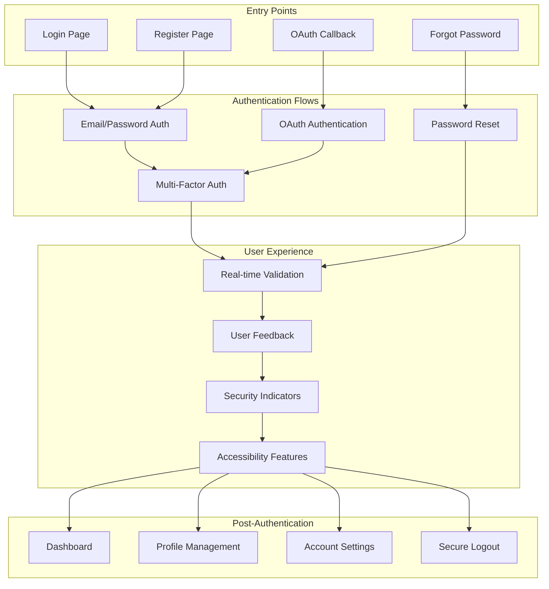

# 🎨 CREATIVE PHASE: AUTHENTICATION FLOW DESIGN

**Date:** 2024-12-20  
**Component:** Authentication Flow Design  
**Type:** UI/UX Design  
**Complexity:** Level 4 (Complex System)

━━━━━━━━━━━━━━━━━━━━━━━━━━━━━━━

## 1️⃣ PROBLEM

**Description:** Design comprehensive authentication flows and user interfaces for a monorepo authentication system that provides excellent user experience while maintaining security and accessibility.

**Requirements:**
- Design intuitive login and registration flows
- Support multiple authentication methods (email/password, OAuth, MFA)
- Provide clear error messages and feedback
- Ensure accessibility compliance (WCAG 2.1 AA)
- Support responsive design for all devices
- Implement progressive enhancement
- Provide clear security indicators
- Support password reset and account recovery

**Constraints:**
- Must work with React/Next.js frontend
- Must support modern browser features
- Must maintain performance and usability
- Must be testable with UI mocks
- Must follow accessibility guidelines

## 2️⃣ OPTIONS

**Option A: Traditional Multi-Page Authentication**
- Separate pages for login, register, password reset
- Traditional form-based authentication
- Simple to implement and maintain
- Limited user experience features

**Option A: Modern Single-Page Authentication**
- Single-page application with dynamic forms
- Rich user experience with animations
- Advanced features like social login
- Higher complexity and development time

**Option C: Progressive Authentication with Smart Flows**
- Intelligent authentication based on user context
- Adaptive security based on risk assessment
- Seamless user experience with minimal friction
- Highest complexity but best user experience

## 3️⃣ ANALYSIS

| Criterion | Traditional Multi-Page | Modern Single-Page | Progressive Smart |
|-----|-----|-----|-----|
| **User Experience** | ⭐⭐ | ⭐⭐⭐⭐ | ⭐⭐⭐⭐⭐ |
| **Implementation Complexity** | ⭐⭐⭐⭐⭐ | ⭐⭐⭐ | ⭐ |
| **Performance** | ⭐⭐⭐⭐⭐ | ⭐⭐⭐⭐ | ⭐⭐⭐ |
| **Accessibility** | ⭐⭐⭐⭐ | ⭐⭐⭐ | ⭐⭐⭐⭐ |
| **Security UX** | ⭐⭐ | ⭐⭐⭐⭐ | ⭐⭐⭐⭐⭐ |
| **Mobile Experience** | ⭐⭐⭐ | ⭐⭐⭐⭐ | ⭐⭐⭐⭐⭐ |
| **Maintenance** | ⭐⭐⭐⭐⭐ | ⭐⭐⭐ | ⭐⭐ |

**Key Insights:**
- Traditional approach is simplest but provides poor user experience
- Modern single-page provides good balance of features and complexity
- Progressive authentication offers best UX but requires significant development

## 4️⃣ DECISION

**Selected:** Option B: Modern Single-Page Authentication

**Rationale:** 
The modern single-page approach provides excellent user experience with rich features like social login, real-time validation, and smooth transitions, while maintaining reasonable complexity. It balances modern UX expectations with implementation feasibility.

## 5️⃣ IMPLEMENTATION NOTES

### Authentication Flow Architecture



### React Component Architecture

```javascript
// Authentication Context Provider
const AuthContext = createContext();

const AuthProvider = ({ children }) => {
  const [user, setUser] = useState(null);
  const [loading, setLoading] = useState(false);
  const [error, setError] = useState(null);

  const login = async (credentials) => {
    setLoading(true);
    setError(null);
    
    try {
      const response = await authService.login(credentials);
      setUser(response.user);
      localStorage.setItem('accessToken', response.accessToken);
      return response;
    } catch (error) {
      setError(error.message);
      throw error;
    } finally {
      setLoading(false);
    }
  };

  const register = async (userData) => {
    setLoading(true);
    setError(null);
    
    try {
      const response = await authService.register(userData);
      setUser(response.user);
      localStorage.setItem('accessToken', response.accessToken);
      return response;
    } catch (error) {
      setError(error.message);
      throw error;
    } finally {
      setLoading(false);
    }
  };

  const logout = async () => {
    try {
      await authService.logout();
    } finally {
      setUser(null);
      localStorage.removeItem('accessToken');
    }
  };

  const value = {
    user,
    loading,
    error,
    login,
    register,
    logout
  };

  return (
    <AuthContext.Provider value={value}>
      {children}
    </AuthContext.Provider>
  );
};

// Custom hook for authentication
const useAuth = () => {
  const context = useContext(AuthContext);
  if (!context) {
    throw new Error('useAuth must be used within an AuthProvider');
  }
  return context;
};
```

### Login Component with Modern UX

```javascript
// Modern Login Component
const LoginForm = () => {
  const { login, loading, error } = useAuth();
  const [formData, setFormData] = useState({
    email: '',
    password: '',
    rememberMe: false
  });
  const [validationErrors, setValidationErrors] = useState({});
  const [showPassword, setShowPassword] = useState(false);

  const validateField = (name, value) => {
    const errors = {};
    
    switch (name) {
      case 'email':
        if (!value) {
          errors.email = 'Email is required';
        } else if (!isValidEmail(value)) {
          errors.email = 'Please enter a valid email address';
        }
        break;
      case 'password':
        if (!value) {
          errors.password = 'Password is required';
        } else if (value.length < 8) {
          errors.password = 'Password must be at least 8 characters';
        }
        break;
    }
    
    return errors;
  };

  const handleInputChange = (e) => {
    const { name, value, type, checked } = e.target;
    const fieldValue = type === 'checkbox' ? checked : value;
    
    setFormData(prev => ({
      ...prev,
      [name]: fieldValue
    }));

    // Real-time validation
    const errors = validateField(name, fieldValue);
    setValidationErrors(prev => ({
      ...prev,
      [name]: errors[name]
    }));
  };

  const handleSubmit = async (e) => {
    e.preventDefault();
    
    // Validate all fields
    const errors = {};
    Object.keys(formData).forEach(key => {
      const fieldErrors = validateField(key, formData[key]);
      Object.assign(errors, fieldErrors);
    });
    
    if (Object.keys(errors).length > 0) {
      setValidationErrors(errors);
      return;
    }

    try {
      await login(formData);
      // Redirect to dashboard or intended page
    } catch (error) {
      // Error is handled by AuthContext
    }
  };

  return (
    <div className="min-h-screen flex items-center justify-center bg-gray-50 py-12 px-4 sm:px-6 lg:px-8">
      <div className="max-w-md w-full space-y-8">
        <div>
          <h2 className="mt-6 text-center text-3xl font-extrabold text-gray-900">
            Sign in to your account
          </h2>
          <p className="mt-2 text-center text-sm text-gray-600">
            Or{' '}
            <Link to="/register" className="font-medium text-indigo-600 hover:text-indigo-500">
              create a new account
            </Link>
          </p>
        </div>
        
        <form className="mt-8 space-y-6" onSubmit={handleSubmit}>
          <div className="rounded-md shadow-sm -space-y-px">
            <div>
              <label htmlFor="email" className="sr-only">
                Email address
              </label>
              <input
                id="email"
                name="email"
                type="email"
                autoComplete="email"
                required
                className={`appearance-none rounded-none relative block w-full px-3 py-2 border ${
                  validationErrors.email ? 'border-red-300' : 'border-gray-300'
                } placeholder-gray-500 text-gray-900 rounded-t-md focus:outline-none focus:ring-indigo-500 focus:border-indigo-500 focus:z-10 sm:text-sm`}
                placeholder="Email address"
                value={formData.email}
                onChange={handleInputChange}
                aria-describedby={validationErrors.email ? 'email-error' : undefined}
              />
              {validationErrors.email && (
                <p className="mt-2 text-sm text-red-600" id="email-error">
                  {validationErrors.email}
                </p>
              )}
            </div>
            
            <div className="relative">
              <label htmlFor="password" className="sr-only">
                Password
              </label>
              <input
                id="password"
                name="password"
                type={showPassword ? 'text' : 'password'}
                autoComplete="current-password"
                required
                className={`appearance-none rounded-none relative block w-full px-3 py-2 border ${
                  validationErrors.password ? 'border-red-300' : 'border-gray-300'
                } placeholder-gray-500 text-gray-900 rounded-b-md focus:outline-none focus:ring-indigo-500 focus:border-indigo-500 focus:z-10 sm:text-sm`}
                placeholder="Password"
                value={formData.password}
                onChange={handleInputChange}
                aria-describedby={validationErrors.password ? 'password-error' : undefined}
              />
              <button
                type="button"
                className="absolute inset-y-0 right-0 pr-3 flex items-center"
                onClick={() => setShowPassword(!showPassword)}
                aria-label={showPassword ? 'Hide password' : 'Show password'}
              >
                {showPassword ? <EyeOffIcon className="h-5 w-5 text-gray-400" /> : <EyeIcon className="h-5 w-5 text-gray-400" />}
              </button>
              {validationErrors.password && (
                <p className="mt-2 text-sm text-red-600" id="password-error">
                  {validationErrors.password}
                </p>
              )}
            </div>
          </div>

          <div className="flex items-center justify-between">
            <div className="flex items-center">
              <input
                id="remember-me"
                name="rememberMe"
                type="checkbox"
                className="h-4 w-4 text-indigo-600 focus:ring-indigo-500 border-gray-300 rounded"
                checked={formData.rememberMe}
                onChange={handleInputChange}
              />
              <label htmlFor="remember-me" className="ml-2 block text-sm text-gray-900">
                Remember me
              </label>
            </div>

            <div className="text-sm">
              <Link to="/forgot-password" className="font-medium text-indigo-600 hover:text-indigo-500">
                Forgot your password?
              </Link>
            </div>
          </div>

          {error && (
            <div className="rounded-md bg-red-50 p-4">
              <div className="flex">
                <div className="flex-shrink-0">
                  <ExclamationCircleIcon className="h-5 w-5 text-red-400" />
                </div>
                <div className="ml-3">
                  <h3 className="text-sm font-medium text-red-800">
                    Authentication failed
                  </h3>
                  <div className="mt-2 text-sm text-red-700">
                    <p>{error}</p>
                  </div>
                </div>
              </div>
            </div>
          )}

          <div>
            <button
              type="submit"
              disabled={loading}
              className="group relative w-full flex justify-center py-2 px-4 border border-transparent text-sm font-medium rounded-md text-white bg-indigo-600 hover:bg-indigo-700 focus:outline-none focus:ring-2 focus:ring-offset-2 focus:ring-indigo-500 disabled:opacity-50 disabled:cursor-not-allowed"
            >
              {loading ? (
                <SpinnerIcon className="animate-spin -ml-1 mr-3 h-5 w-5 text-white" />
              ) : (
                <LockClosedIcon className="h-5 w-5 text-indigo-500 group-hover:text-indigo-400" />
              )}
              {loading ? 'Signing in...' : 'Sign in'}
            </button>
          </div>

          <div className="mt-6">
            <div className="relative">
              <div className="absolute inset-0 flex items-center">
                <div className="w-full border-t border-gray-300" />
              </div>
              <div className="relative flex justify-center text-sm">
                <span className="px-2 bg-gray-50 text-gray-500">Or continue with</span>
              </div>
            </div>

            <div className="mt-6 grid grid-cols-2 gap-3">
              <button
                type="button"
                onClick={() => handleOAuthLogin('google')}
                className="w-full inline-flex justify-center py-2 px-4 border border-gray-300 rounded-md shadow-sm bg-white text-sm font-medium text-gray-500 hover:bg-gray-50"
              >
                <GoogleIcon className="h-5 w-5" />
                <span className="ml-2">Google</span>
              </button>

              <button
                type="button"
                onClick={() => handleOAuthLogin('github')}
                className="w-full inline-flex justify-center py-2 px-4 border border-gray-300 rounded-md shadow-sm bg-white text-sm font-medium text-gray-500 hover:bg-gray-50"
              >
                <GitHubIcon className="h-5 w-5" />
                <span className="ml-2">GitHub</span>
              </button>
            </div>
          </div>
        </form>
      </div>
    </div>
  );
};
```

### Multi-Factor Authentication Component

```javascript
// MFA Component with Modern UX
const MFAForm = ({ onSuccess, onCancel }) => {
  const [mfaCode, setMfaCode] = useState('');
  const [loading, setLoading] = useState(false);
  const [error, setError] = useState(null);
  const [timeLeft, setTimeLeft] = useState(30);
  const inputRefs = useRef([]);

  useEffect(() => {
    const timer = setInterval(() => {
      setTimeLeft(prev => {
        if (prev <= 1) {
          clearInterval(timer);
          return 0;
        }
        return prev - 1;
      });
    }, 1000);

    return () => clearInterval(timer);
  }, []);

  const handleCodeChange = (index, value) => {
    if (value.length > 1) return; // Only allow single digit
    
    const newCode = mfaCode.split('');
    newCode[index] = value;
    const updatedCode = newCode.join('');
    setMfaCode(updatedCode);

    // Auto-focus next input
    if (value && index < 5) {
      inputRefs.current[index + 1]?.focus();
    }
  };

  const handleKeyDown = (index, e) => {
    if (e.key === 'Backspace' && !mfaCode[index] && index > 0) {
      inputRefs.current[index - 1]?.focus();
    }
  };

  const handleSubmit = async (e) => {
    e.preventDefault();
    
    if (mfaCode.length !== 6) {
      setError('Please enter the complete 6-digit code');
      return;
    }

    setLoading(true);
    setError(null);

    try {
      await authService.verifyMFA(mfaCode);
      onSuccess();
    } catch (error) {
      setError(error.message);
      setMfaCode('');
      inputRefs.current[0]?.focus();
    } finally {
      setLoading(false);
    }
  };

  const handleResendCode = async () => {
    setLoading(true);
    try {
      await authService.resendMFACode();
      setTimeLeft(30);
    } catch (error) {
      setError('Failed to resend code. Please try again.');
    } finally {
      setLoading(false);
    }
  };

  return (
    <div className="min-h-screen flex items-center justify-center bg-gray-50 py-12 px-4 sm:px-6 lg:px-8">
      <div className="max-w-md w-full space-y-8">
        <div>
          <div className="mx-auto flex items-center justify-center h-12 w-12 rounded-full bg-indigo-100">
            <ShieldCheckIcon className="h-6 w-6 text-indigo-600" />
          </div>
          <h2 className="mt-6 text-center text-3xl font-extrabold text-gray-900">
            Two-factor authentication
          </h2>
          <p className="mt-2 text-center text-sm text-gray-600">
            Enter the 6-digit code from your authenticator app
          </p>
        </div>

        <form className="mt-8 space-y-6" onSubmit={handleSubmit}>
          <div>
            <label htmlFor="mfa-code" className="sr-only">
              Authentication code
            </label>
            <div className="flex justify-center space-x-2">
              {Array.from({ length: 6 }).map((_, index) => (
                <input
                  key={index}
                  ref={el => inputRefs.current[index] = el}
                  type="text"
                  inputMode="numeric"
                  pattern="[0-9]*"
                  maxLength={1}
                  className="w-12 h-12 text-center text-lg font-semibold border border-gray-300 rounded-md focus:outline-none focus:ring-2 focus:ring-indigo-500 focus:border-indigo-500"
                  value={mfaCode[index] || ''}
                  onChange={e => handleCodeChange(index, e.target.value)}
                  onKeyDown={e => handleKeyDown(index, e)}
                  onFocus={e => e.target.select()}
                />
              ))}
            </div>
          </div>

          {error && (
            <div className="rounded-md bg-red-50 p-4">
              <div className="flex">
                <div className="flex-shrink-0">
                  <ExclamationCircleIcon className="h-5 w-5 text-red-400" />
                </div>
                <div className="ml-3">
                  <h3 className="text-sm font-medium text-red-800">
                    Verification failed
                  </h3>
                  <div className="mt-2 text-sm text-red-700">
                    <p>{error}</p>
                  </div>
                </div>
              </div>
            </div>
          )}

          <div className="flex items-center justify-between">
            <button
              type="button"
              onClick={onCancel}
              className="text-sm font-medium text-indigo-600 hover:text-indigo-500"
            >
              Use a different method
            </button>
            
            <button
              type="button"
              onClick={handleResendCode}
              disabled={timeLeft > 0 || loading}
              className="text-sm font-medium text-indigo-600 hover:text-indigo-500 disabled:opacity-50 disabled:cursor-not-allowed"
            >
              {timeLeft > 0 ? `Resend in ${timeLeft}s` : 'Resend code'}
            </button>
          </div>

          <div className="flex space-x-3">
            <button
              type="button"
              onClick={onCancel}
              className="flex-1 py-2 px-4 border border-gray-300 rounded-md shadow-sm text-sm font-medium text-gray-700 bg-white hover:bg-gray-50 focus:outline-none focus:ring-2 focus:ring-offset-2 focus:ring-indigo-500"
            >
              Cancel
            </button>
            
            <button
              type="submit"
              disabled={mfaCode.length !== 6 || loading}
              className="flex-1 py-2 px-4 border border-transparent rounded-md shadow-sm text-sm font-medium text-white bg-indigo-600 hover:bg-indigo-700 focus:outline-none focus:ring-2 focus:ring-offset-2 focus:ring-indigo-500 disabled:opacity-50 disabled:cursor-not-allowed"
            >
              {loading ? 'Verifying...' : 'Verify'}
            </button>
          </div>
        </form>
      </div>
    </div>
  );
};
```

### Password Reset Flow

```javascript
// Password Reset Component
const PasswordResetForm = () => {
  const [step, setStep] = useState('email'); // email, code, password
  const [formData, setFormData] = useState({
    email: '',
    code: '',
    password: '',
    confirmPassword: ''
  });
  const [loading, setLoading] = useState(false);
  const [error, setError] = useState(null);
  const [success, setSuccess] = useState(false);

  const handleEmailSubmit = async (e) => {
    e.preventDefault();
    setLoading(true);
    setError(null);

    try {
      await authService.sendPasswordResetEmail(formData.email);
      setStep('code');
    } catch (error) {
      setError(error.message);
    } finally {
      setLoading(false);
    }
  };

  const handleCodeSubmit = async (e) => {
    e.preventDefault();
    setLoading(true);
    setError(null);

    try {
      await authService.verifyPasswordResetCode(formData.email, formData.code);
      setStep('password');
    } catch (error) {
      setError(error.message);
    } finally {
      setLoading(false);
    }
  };

  const handlePasswordSubmit = async (e) => {
    e.preventDefault();
    
    if (formData.password !== formData.confirmPassword) {
      setError('Passwords do not match');
      return;
    }

    setLoading(true);
    setError(null);

    try {
      await authService.resetPassword(formData.email, formData.code, formData.password);
      setSuccess(true);
    } catch (error) {
      setError(error.message);
    } finally {
      setLoading(false);
    }
  };

  if (success) {
    return (
      <div className="min-h-screen flex items-center justify-center bg-gray-50 py-12 px-4 sm:px-6 lg:px-8">
        <div className="max-w-md w-full space-y-8">
          <div>
            <div className="mx-auto flex items-center justify-center h-12 w-12 rounded-full bg-green-100">
              <CheckCircleIcon className="h-6 w-6 text-green-600" />
            </div>
            <h2 className="mt-6 text-center text-3xl font-extrabold text-gray-900">
              Password reset successful
            </h2>
            <p className="mt-2 text-center text-sm text-gray-600">
              Your password has been successfully reset. You can now sign in with your new password.
            </p>
          </div>
          
          <div>
            <Link
              to="/login"
              className="group relative w-full flex justify-center py-2 px-4 border border-transparent text-sm font-medium rounded-md text-white bg-indigo-600 hover:bg-indigo-700 focus:outline-none focus:ring-2 focus:ring-offset-2 focus:ring-indigo-500"
            >
              Sign in
            </Link>
          </div>
        </div>
      </div>
    );
  }

  return (
    <div className="min-h-screen flex items-center justify-center bg-gray-50 py-12 px-4 sm:px-6 lg:px-8">
      <div className="max-w-md w-full space-y-8">
        <div>
          <h2 className="mt-6 text-center text-3xl font-extrabold text-gray-900">
            Reset your password
          </h2>
          <p className="mt-2 text-center text-sm text-gray-600">
            {step === 'email' && 'Enter your email address to receive a reset code'}
            {step === 'code' && 'Enter the code sent to your email'}
            {step === 'password' && 'Enter your new password'}
          </p>
        </div>

        <form className="mt-8 space-y-6" onSubmit={
          step === 'email' ? handleEmailSubmit :
          step === 'code' ? handleCodeSubmit :
          handlePasswordSubmit
        }>
          {step === 'email' && (
            <div>
              <label htmlFor="email" className="sr-only">
                Email address
              </label>
              <input
                id="email"
                name="email"
                type="email"
                autoComplete="email"
                required
                className="appearance-none rounded-md relative block w-full px-3 py-2 border border-gray-300 placeholder-gray-500 text-gray-900 focus:outline-none focus:ring-indigo-500 focus:border-indigo-500 focus:z-10 sm:text-sm"
                placeholder="Email address"
                value={formData.email}
                onChange={e => setFormData(prev => ({ ...prev, email: e.target.value }))}
              />
            </div>
          )}

          {step === 'code' && (
            <div>
              <label htmlFor="code" className="sr-only">
                Reset code
              </label>
              <input
                id="code"
                name="code"
                type="text"
                autoComplete="one-time-code"
                required
                className="appearance-none rounded-md relative block w-full px-3 py-2 border border-gray-300 placeholder-gray-500 text-gray-900 focus:outline-none focus:ring-indigo-500 focus:border-indigo-500 focus:z-10 sm:text-sm"
                placeholder="Enter 6-digit code"
                value={formData.code}
                onChange={e => setFormData(prev => ({ ...prev, code: e.target.value }))}
              />
            </div>
          )}

          {step === 'password' && (
            <div className="space-y-4">
              <div>
                <label htmlFor="password" className="sr-only">
                  New password
                </label>
                <input
                  id="password"
                  name="password"
                  type="password"
                  autoComplete="new-password"
                  required
                  className="appearance-none rounded-md relative block w-full px-3 py-2 border border-gray-300 placeholder-gray-500 text-gray-900 focus:outline-none focus:ring-indigo-500 focus:border-indigo-500 focus:z-10 sm:text-sm"
                  placeholder="New password"
                  value={formData.password}
                  onChange={e => setFormData(prev => ({ ...prev, password: e.target.value }))}
                />
              </div>
              
              <div>
                <label htmlFor="confirmPassword" className="sr-only">
                  Confirm new password
                </label>
                <input
                  id="confirmPassword"
                  name="confirmPassword"
                  type="password"
                  autoComplete="new-password"
                  required
                  className="appearance-none rounded-md relative block w-full px-3 py-2 border border-gray-300 placeholder-gray-500 text-gray-900 focus:outline-none focus:ring-indigo-500 focus:border-indigo-500 focus:z-10 sm:text-sm"
                  placeholder="Confirm new password"
                  value={formData.confirmPassword}
                  onChange={e => setFormData(prev => ({ ...prev, confirmPassword: e.target.value }))}
                />
              </div>
            </div>
          )}

          {error && (
            <div className="rounded-md bg-red-50 p-4">
              <div className="flex">
                <div className="flex-shrink-0">
                  <ExclamationCircleIcon className="h-5 w-5 text-red-400" />
                </div>
                <div className="ml-3">
                  <h3 className="text-sm font-medium text-red-800">
                    {step === 'email' ? 'Email error' :
                     step === 'code' ? 'Code error' :
                     'Password error'}
                  </h3>
                  <div className="mt-2 text-sm text-red-700">
                    <p>{error}</p>
                  </div>
                </div>
              </div>
            </div>
          )}

          <div className="flex items-center justify-between">
            {step !== 'email' && (
              <button
                type="button"
                onClick={() => setStep(step === 'code' ? 'email' : 'code')}
                className="text-sm font-medium text-indigo-600 hover:text-indigo-500"
              >
                Back
              </button>
            )}
            
            <button
              type="submit"
              disabled={loading}
              className="ml-auto py-2 px-4 border border-transparent rounded-md shadow-sm text-sm font-medium text-white bg-indigo-600 hover:bg-indigo-700 focus:outline-none focus:ring-2 focus:ring-offset-2 focus:ring-indigo-500 disabled:opacity-50 disabled:cursor-not-allowed"
            >
              {loading ? 'Processing...' : 
               step === 'email' ? 'Send reset code' :
               step === 'code' ? 'Verify code' :
               'Reset password'}
            </button>
          </div>
        </form>
      </div>
    </div>
  );
};
```

━━━━━━━━━━━━━━━━━━━━━━━━━━━━━━━
📌 CREATIVE PHASE END: AUTHENTICATION FLOW DESIGN 