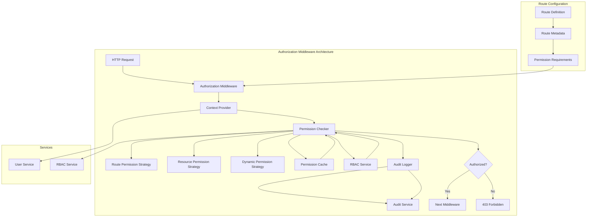

# CREATIVE PHASE: AUTHORIZATION MIDDLEWARE DESIGN

**Date:** 2024-12-20  
**Phase:** Phase 3 - User Management & Authorization  
**Type:** Architecture Design  
**Complexity:** Level 4 (Complex System)

---

## 🎨🎨🎨 ENTERING CREATIVE PHASE: AUTHORIZATION MIDDLEWARE 🎨🎨🎨

### PROBLEM STATEMENT

Design a comprehensive authorization middleware system that:
- Integrates with RBAC system for permission checking
- Provides route-level and resource-level authorization
- Supports dynamic permission evaluation
- Maintains high performance and security
- Enables flexible permission configuration
- Integrates with audit logging system

### REQUIREMENTS ANALYSIS

**Functional Requirements:**
- Route-level permission checking (HTTP method + path)
- Resource-level permission checking (specific resource IDs)
- Dynamic permission evaluation based on context
- Integration with RBAC permission system
- Support for multiple permission strategies
- Audit logging of authorization decisions
- Error handling and fallback mechanisms

**Non-Functional Requirements:**
- Performance: Sub-10ms permission checks
- Security: Tamper-proof authorization logic
- Scalability: Support 1000+ concurrent requests
- Maintainability: Clear separation of concerns
- Reliability: 99.9% uptime for authorization
- Flexibility: Easy to configure and extend

**Technical Constraints:**
- Must integrate with Express.js middleware pattern
- Must work with existing RBAC system
- Must support TypeScript strict mode
- Must maintain existing API patterns
- Must be testable with Jest mocking

---

## 🎨 CREATIVE CHECKPOINT: REQUIREMENTS DEFINED

### COMPONENT ANALYSIS

**Core Authorization Components:**
- **Permission Checker**: Core logic for permission evaluation
- **Route Matcher**: Match routes to required permissions
- **Resource Validator**: Validate resource-level permissions
- **Context Provider**: Provide request context for dynamic evaluation
- **Audit Logger**: Log authorization decisions and failures
- **Cache Manager**: Cache permission results for performance

**Integration Points:**
- **Express.js**: Middleware integration
- **RBAC System**: Permission checking and role resolution
- **User Service**: User context and role information
- **Audit System**: Authorization decision logging
- **Shared Types**: TypeScript interfaces for authorization

---

## ARCHITECTURE OPTIONS ANALYSIS

### Option 1: Declarative Permission Middleware

**Description**: Declarative approach with permission metadata on routes
- Permission requirements declared in route metadata
- Middleware automatically checks permissions
- Simple configuration with decorators or metadata
- Clear separation between route definition and authorization

**Pros:**
- Simple and intuitive to use
- Clear permission requirements at route level
- Easy to understand and maintain
- Good performance with caching
- Minimal boilerplate code

**Cons:**
- Less flexible for complex scenarios
- Harder to implement dynamic permissions
- Requires route-level configuration
- Limited to declarative patterns
- May not handle complex business logic

**Technical Fit:** High  
**Complexity:** Low  
**Scalability:** High

### Option 2: Imperative Permission Middleware

**Description**: Imperative approach with explicit permission checking
- Explicit permission checks in route handlers
- Flexible permission evaluation logic
- Support for complex business rules
- Dynamic permission evaluation

**Pros:**
- Maximum flexibility and control
- Support for complex business logic
- Dynamic permission evaluation
- Fine-grained control over authorization
- Easy to implement custom logic

**Cons:**
- More boilerplate code
- Harder to maintain consistency
- Potential for security mistakes
- More complex testing requirements
- Performance overhead from custom logic

**Technical Fit:** High  
**Complexity:** Medium  
**Scalability:** Medium

### Option 3: Hybrid Approach with Permission Strategies

**Description**: Hybrid approach combining declarative and imperative patterns
- Base declarative middleware for common cases
- Strategy pattern for complex scenarios
- Pluggable permission evaluation strategies
- Best of both worlds

**Pros:**
- Flexible for both simple and complex scenarios
- Reusable permission strategies
- Good performance with caching
- Clear separation of concerns
- Easy to extend and maintain

**Cons:**
- More complex initial implementation
- Requires careful strategy design
- Potential for over-engineering
- More complex testing requirements
- Higher learning curve

**Technical Fit:** High  
**Complexity:** Medium  
**Scalability:** High

---

## 🎨 CREATIVE CHECKPOINT: OPTIONS ANALYZED

### DECISION ANALYSIS

**Evaluation Criteria:**
1. **Functional Requirements**: All options meet core requirements
2. **Technical Fit**: All options have high fit
3. **Complexity**: Option 1 lowest, Option 2 medium, Option 3 medium
4. **Scalability**: Options 1 and 3 high, Option 2 medium
5. **Maintainability**: Option 1 highest, Option 3 good, Option 2 medium
6. **Performance**: Options 1 and 3 good, Option 2 medium

**Risk Assessment:**
- **Option 1**: Low risk (simplicity), medium reward (functionality)
- **Option 2**: Medium risk (complexity), high reward (flexibility)
- **Option 3**: Medium risk (complexity), high reward (balance)

---

## 🎨🎨🎨 EXITING CREATIVE PHASE - DECISION MADE 🎨🎨🎨

### SELECTED OPTION: Hybrid Approach with Permission Strategies (Option 3)

**Rationale:**
- Provides flexibility for both simple and complex scenarios
- Reusable permission strategies reduce code duplication
- Good performance characteristics with caching
- Clear separation of concerns
- Easy to extend and maintain
- Balances simplicity with power

**Implementation Considerations:**
- Start with declarative base for common cases
- Implement strategy pattern for complex scenarios
- Design clear interfaces for permission strategies
- Include comprehensive caching for performance
- Add thorough testing for all strategies

---

## IMPLEMENTATION PLAN

### Phase 1: Core Authorization Middleware
1. **Base Middleware Structure**
   ```typescript
   interface PermissionStrategy {
       checkPermission(req: Request, resource: string, action: string): Promise<boolean>;
       getRequiredPermissions(route: string, method: string): string[];
   }

   interface AuthorizationContext {
       userId: string;
       roles: string[];
       permissions: string[];
       resourceId?: string;
       requestData?: any;
   }

   class AuthorizationMiddleware {
       constructor(
           private rbacService: RBACService,
           private auditService: AuditService,
           private strategies: PermissionStrategy[]
       ) {}

       async authorize(req: Request, res: Response, next: NextFunction): Promise<void> {
           // Authorization logic
       }
   }
   ```

2. **Permission Strategies**
   ```typescript
   class RoutePermissionStrategy implements PermissionStrategy {
       checkPermission(req: Request, resource: string, action: string): Promise<boolean> {
           // Route-level permission checking
       }
   }

   class ResourcePermissionStrategy implements PermissionStrategy {
       checkPermission(req: Request, resource: string, action: string): Promise<boolean> {
           // Resource-level permission checking
       }
   }

   class DynamicPermissionStrategy implements PermissionStrategy {
       checkPermission(req: Request, resource: string, action: string): Promise<boolean> {
           // Dynamic permission evaluation
       }
   }
   ```

### Phase 2: Route Configuration and Metadata
1. **Route Metadata System**
   ```typescript
   interface RouteMetadata {
       permissions: string[];
       resourceType?: string;
       strategy?: string;
       audit?: boolean;
   }

   function requirePermissions(permissions: string[], options?: Partial<RouteMetadata>) {
       return function(target: any, propertyKey: string, descriptor: PropertyDescriptor) {
           // Decorator implementation
       };
   }

   // Usage example
   @requirePermissions(['user:read'], { resourceType: 'user', audit: true })
   async getUser(req: Request, res: Response): Promise<void> {
       // Route handler
   }
   ```

2. **Middleware Integration**
   ```typescript
   class ExpressAuthorizationMiddleware {
       constructor(private authMiddleware: AuthorizationMiddleware) {}

       route(permissions: string[], options?: RouteOptions): RequestHandler {
           return async (req: Request, res: Response, next: NextFunction) => {
               // Route-level authorization
           };
       }

       resource(resourceType: string, action: string): RequestHandler {
           return async (req: Request, res: Response, next: NextFunction) => {
               // Resource-level authorization
           };
       }
   }
   ```

### Phase 3: Performance and Caching
1. **Permission Cache**
   ```typescript
   interface PermissionCache {
       get(key: string): Promise<boolean | null>;
       set(key: string, value: boolean, ttl: number): Promise<void>;
       invalidate(pattern: string): Promise<void>;
   }

   class RedisPermissionCache implements PermissionCache {
       // Redis-based caching implementation
   }

   class MemoryPermissionCache implements PermissionCache {
       // In-memory caching implementation
   }
   ```

2. **Performance Optimization**
   - Cache permission results with TTL
   - Batch permission checks where possible
   - Optimize RBAC queries with proper indexing
   - Use connection pooling for database queries

### Phase 4: Integration and Testing
1. **Service Integration**
   - Integrate with User Service for user context
   - Integrate with RBAC Service for permission checking
   - Integrate with Audit Service for decision logging
   - Error handling and fallback mechanisms

2. **Comprehensive Testing**
   - Unit tests for all middleware components
   - Integration tests for service integration
   - Performance tests for high-load scenarios
   - Security tests for authorization bypass attempts

---

## ARCHITECTURE DIAGRAM



---

## VALIDATION CHECKLIST

### Architecture Design Verification
- [x] All system requirements addressed
- [x] Component responsibilities defined
- [x] Interfaces specified
- [x] Data flows documented
- [x] Security considerations addressed
- [x] Scalability requirements met
- [x] Performance requirements met
- [x] Maintenance approach defined

### Implementation Readiness
- [x] All components identified
- [x] Dependencies mapped
- [x] Technical constraints documented
- [x] Risk assessment completed
- [x] Resource requirements defined
- [x] Timeline estimates provided

---

## CREATIVE PHASE COMPLETE

✅ **Problem clearly defined** - Authorization middleware requirements identified  
✅ **Multiple options considered** - 3 architecture options analyzed  
✅ **Pros/cons documented** - Detailed analysis for each option  
✅ **Decision made with clear rationale** - Hybrid approach with strategies selected  
✅ **Implementation plan included** - 4-phase implementation strategy  
✅ **Visualization/diagrams created** - Architecture diagram provided  
✅ **Validation checklist completed** - All verification points addressed  

**All Creative Phases Complete for Phase 3** 