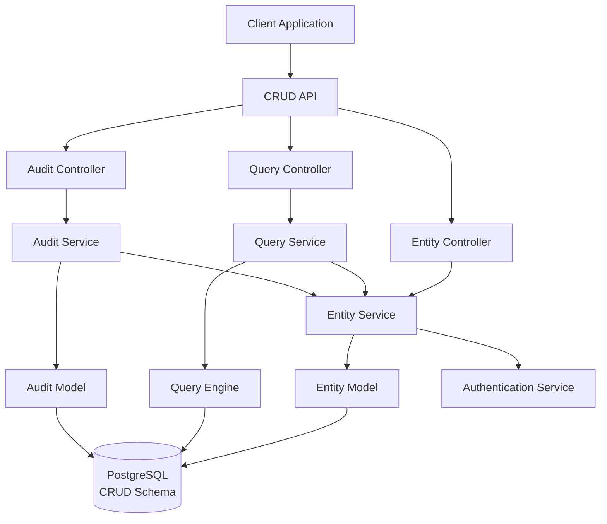
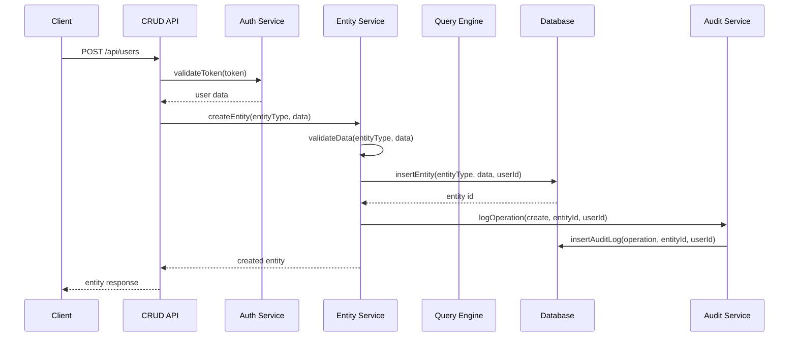

# 🎨🎨🎨 ENTERING CREATIVE PHASE: CRUD SERVICE DESIGN 🎨🎨🎨

## PROBLEM STATEMENT

Design a generic CRUD service that:
- Provides universal Create, Read, Update, Delete operations for any data entity
- Maintains service independence while integrating with Authentication Service
- Supports advanced querying, filtering, and pagination
- Implements audit logging for all data operations
- Ensures data integrity and security
- Scales efficiently for a hobby project

## CONTEXT & REQUIREMENTS

### Functional Requirements
- Generic CRUD operations for any entity type
- Advanced search and filtering capabilities
- Pagination and sorting support
- Audit logging for all data changes
- Data validation and sanitization
- Soft delete functionality
- Data export capabilities

### Non-Functional Requirements
- Performance: Fast query response (< 200ms)
- Scalability: Support 10,000+ records per entity
- Security: Proper authorization and data isolation
- Maintainability: Clean, extensible code structure
- Independence: No shared code with other services

### Technical Constraints
- Node.js/Express.js framework
- PostgreSQL database (crud schema)
- Service-to-service communication via HTTP APIs
- Integration with Authentication Service for authorization
- JSONB for flexible data storage

## OPTIONS ANALYSIS

### Option 1: Simple Generic CRUD
**Description**: Basic CRUD operations with minimal complexity
- Single table with entity_type and JSONB data
- Basic CRUD endpoints with simple validation
- Direct database queries
- Minimal audit logging

**Pros**:
- Simple to implement and understand
- Fast development time
- Low complexity
- Easy to test

**Cons**:
- Limited query capabilities
- No advanced filtering
- Basic audit trail
- No data validation rules

**Complexity**: Low
**Implementation Time**: 1-2 weeks

### Option 2: Advanced Generic CRUD with Query Engine
**Description**: Comprehensive CRUD with advanced querying and validation
- Generic entity table with metadata
- Advanced query engine with filtering and sorting
- Comprehensive audit logging
- Data validation rules per entity type
- Soft delete and data export

**Pros**:
- Powerful query capabilities
- Comprehensive audit trail
- Flexible data validation
- Better data integrity
- Scalable architecture

**Cons**:
- Higher complexity
- More code to maintain
- More potential failure points
- Steeper learning curve

**Complexity**: Medium
**Implementation Time**: 2-3 weeks

### Option 3: Entity-Specific CRUD with Code Generation
**Description**: Generate specific CRUD operations for each entity type
- Code generation for entity-specific endpoints
- Type-safe operations per entity
- Custom validation per entity
- Optimized queries per entity type

**Pros**:
- Type safety and validation
- Optimized performance per entity
- Clear API structure
- Better developer experience

**Cons**:
- Highest complexity
- Code generation overhead
- Less flexible for dynamic entities
- Overkill for hobby project

**Complexity**: High
**Implementation Time**: 3-4 weeks

## DECISION

**Chosen Option**: Option 2 - Advanced Generic CRUD with Query Engine

**Rationale**:
- Provides the right balance of flexibility and functionality
- Supports dynamic entity creation without code generation
- Enables powerful querying capabilities for data analysis
- Maintains service independence while providing robust CRUD operations
- Aligns with modern API design patterns

**Implementation Considerations**:
- Use JSONB for flexible data storage
- Implement comprehensive query parsing
- Add entity-specific validation rules
- Ensure proper indexing for performance
- Implement comprehensive audit logging

## ARCHITECTURE DESIGN

### Component Structure


### Data Flow for CRUD Operations


### Generic Data Model

#### Entities Table
```sql
CREATE TABLE crud.entities (
  id SERIAL PRIMARY KEY,
  entity_type VARCHAR(100) NOT NULL,
  data JSONB NOT NULL,
  metadata JSONB DEFAULT '{}',
  created_by INTEGER NOT NULL,
  created_at TIMESTAMP DEFAULT CURRENT_TIMESTAMP,
  updated_at TIMESTAMP DEFAULT CURRENT_TIMESTAMP,
  deleted_at TIMESTAMP NULL,
  version INTEGER DEFAULT 1
);

-- Indexes for performance
CREATE INDEX idx_entities_type ON crud.entities(entity_type);
CREATE INDEX idx_entities_created_by ON crud.entities(created_by);
CREATE INDEX idx_entities_created_at ON crud.entities(created_at);
CREATE INDEX idx_entities_deleted_at ON crud.entities(deleted_at);
CREATE INDEX idx_entities_data_gin ON crud.entities USING GIN (data);
```

#### Audit Log Table
```sql
CREATE TABLE crud.audit_log (
  id SERIAL PRIMARY KEY,
  entity_id INTEGER REFERENCES crud.entities(id),
  operation VARCHAR(50) NOT NULL,
  user_id INTEGER NOT NULL,
  changes JSONB,
  timestamp TIMESTAMP DEFAULT CURRENT_TIMESTAMP,
  ip_address INET,
  user_agent TEXT
);

-- Indexes for audit queries
CREATE INDEX idx_audit_entity_id ON crud.audit_log(entity_id);
CREATE INDEX idx_audit_user_id ON crud.audit_log(user_id);
CREATE INDEX idx_audit_timestamp ON crud.audit_log(timestamp);
```

## API DESIGN

### Generic CRUD Endpoints
```javascript
// Create entity
POST /api/:entityType
Authorization: Bearer token
{
  "data": {
    "name": "John Doe",
    "email": "john@example.com",
    "age": 30
  },
  "metadata": {
    "tags": ["customer", "vip"],
    "priority": "high"
  }
}

// Get entity by ID
GET /api/:entityType/:id
Authorization: Bearer token

// Update entity
PUT /api/:entityType/:id
Authorization: Bearer token
{
  "data": {
    "name": "John Smith",
    "email": "john.smith@example.com"
  }
}

// Delete entity (soft delete)
DELETE /api/:entityType/:id
Authorization: Bearer token

// List entities with querying
GET /api/:entityType?search=john&filter[age][gte]=25&sort=created_at&order=desc&page=1&limit=20
Authorization: Bearer token
```

### Advanced Query Parameters
```javascript
// Search across all fields
?search=john

// Filter by specific fields
?filter[name]=john&filter[age][gte]=25&filter[age][lte]=50

// Sort by fields
?sort=name&order=asc

// Pagination
?page=1&limit=20

// Select specific fields
?fields=name,email,created_at

// Include related data
?include=audit_log
```

### Response Formats
```javascript
// Success response
{
  "success": true,
  "data": {
    "id": 1,
    "entity_type": "users",
    "data": {
      "name": "John Doe",
      "email": "john@example.com",
      "age": 30
    },
    "metadata": {
      "tags": ["customer", "vip"]
    },
    "created_by": 1,
    "created_at": "2023-01-01T00:00:00Z",
    "updated_at": "2023-01-01T00:00:00Z",
    "version": 1
  },
  "message": "Entity created successfully"
}

// List response
{
  "success": true,
  "data": {
    "entities": [...],
    "pagination": {
      "page": 1,
      "limit": 20,
      "total": 100,
      "pages": 5
    }
  }
}
```

## QUERY ENGINE DESIGN

### Query Parser
```javascript
class QueryParser {
  constructor(query) {
    this.search = query.search;
    this.filters = this.parseFilters(query.filter);
    this.sort = this.parseSort(query.sort, query.order);
    this.pagination = this.parsePagination(query.page, query.limit);
    this.fields = this.parseFields(query.fields);
  }

  parseFilters(filterObj) {
    const filters = [];
    for (const [field, conditions] of Object.entries(filterObj)) {
      if (typeof conditions === 'object') {
        // Range filters: {age: {gte: 25, lte: 50}}
        for (const [operator, value] of Object.entries(conditions)) {
          filters.push({ field, operator, value });
        }
      } else {
        // Exact match: {name: 'john'}
        filters.push({ field, operator: 'eq', value: conditions });
      }
    }
    return filters;
  }

  buildWhereClause() {
    let whereClause = 'WHERE deleted_at IS NULL';
    const params = [];
    let paramIndex = 1;

    // Add search
    if (this.search) {
      whereClause += ` AND data::text ILIKE $${paramIndex}`;
      params.push(`%${this.search}%`);
      paramIndex++;
    }

    // Add filters
    for (const filter of this.filters) {
      whereClause += ` AND data->>'${filter.field}' ${this.getOperator(filter.operator)} $${paramIndex}`;
      params.push(filter.value);
      paramIndex++;
    }

    return { whereClause, params };
  }
}
```

### Advanced Query Examples
```sql
-- Search with filters
SELECT * FROM crud.entities 
WHERE entity_type = 'users' 
  AND deleted_at IS NULL
  AND data::text ILIKE '%john%'
  AND (data->>'age')::int >= 25
  AND (data->>'age')::int <= 50
ORDER BY (data->>'name') ASC
LIMIT 20 OFFSET 0;

-- Aggregation queries
SELECT 
  COUNT(*) as total,
  AVG((data->>'age')::int) as avg_age,
  MIN((data->>'age')::int) as min_age,
  MAX((data->>'age')::int) as max_age
FROM crud.entities 
WHERE entity_type = 'users' 
  AND deleted_at IS NULL;
```

## VALIDATION SYSTEM

### Entity-Specific Validation Rules
```javascript
const validationRules = {
  users: {
    required: ['name', 'email'],
    types: {
      name: 'string',
      email: 'email',
      age: 'number'
    },
    constraints: {
      name: { minLength: 2, maxLength: 100 },
      email: { pattern: /^[^\s@]+@[^\s@]+\.[^\s@]+$/ },
      age: { min: 0, max: 150 }
    }
  },
  products: {
    required: ['name', 'price'],
    types: {
      name: 'string',
      price: 'number',
      category: 'string'
    },
    constraints: {
      name: { minLength: 1, maxLength: 200 },
      price: { min: 0 },
      category: { enum: ['electronics', 'clothing', 'books'] }
    }
  }
};

class DataValidator {
  validateEntity(entityType, data) {
    const rules = validationRules[entityType];
    if (!rules) {
      throw new Error(`No validation rules for entity type: ${entityType}`);
    }

    const errors = [];

    // Check required fields
    for (const field of rules.required) {
      if (!data[field]) {
        errors.push(`Field '${field}' is required`);
      }
    }

    // Validate field types and constraints
    for (const [field, value] of Object.entries(data)) {
      const fieldRules = rules.types[field];
      if (fieldRules) {
        const fieldErrors = this.validateField(field, value, fieldRules, rules.constraints[field]);
        errors.push(...fieldErrors);
      }
    }

    if (errors.length > 0) {
      throw new Error(`Validation failed: ${errors.join(', ')}`);
    }

    return true;
  }
}
```

## AUDIT LOGGING

### Audit Service Implementation
```javascript
class AuditService {
  async logOperation(operation, entityId, userId, changes = null, request = null) {
    const auditLog = {
      entity_id: entityId,
      operation,
      user_id: userId,
      changes: changes ? JSON.stringify(changes) : null,
      ip_address: request?.ip,
      user_agent: request?.get('User-Agent'),
      timestamp: new Date()
    };

    await this.auditModel.create(auditLog);
  }

  async getEntityHistory(entityId, limit = 50) {
    return await this.auditModel.findByEntityId(entityId, limit);
  }

  async getUserActivity(userId, limit = 50) {
    return await this.auditModel.findByUserId(userId, limit);
  }
}
```

## SECURITY CONSIDERATIONS

### Authorization Middleware
```javascript
const authorizeEntityAccess = async (req, res, next) => {
  const { entityType, id } = req.params;
  const userId = req.user.userId;

  // Check if user has permission to access this entity type
  const hasPermission = await checkEntityPermission(userId, entityType, req.method);
  if (!hasPermission) {
    return res.status(403).json({ error: 'Insufficient permissions' });
  }

  // For specific entity operations, check ownership
  if (id && req.method !== 'POST') {
    const entity = await entityModel.findById(id);
    if (!entity) {
      return res.status(404).json({ error: 'Entity not found' });
    }

    // Allow access if user is owner or has admin role
    if (entity.created_by !== userId && req.user.role !== 'admin') {
      return res.status(403).json({ error: 'Access denied' });
    }
  }

  next();
};
```

### Data Sanitization
```javascript
const sanitizeData = (data) => {
  const sanitized = {};
  
  for (const [key, value] of Object.entries(data)) {
    if (typeof value === 'string') {
      // Remove potentially dangerous content
      sanitized[key] = value
        .replace(/<script\b[^<]*(?:(?!<\/script>)<[^<]*)*<\/script>/gi, '')
        .trim();
    } else {
      sanitized[key] = value;
    }
  }
  
  return sanitized;
};
```

## IMPLEMENTATION PLAN

### Phase 1: Core CRUD Operations (Week 1)
1. Set up Express.js server structure
2. Implement basic CRUD endpoints
3. Create generic entity model
4. Add basic validation
5. Implement authentication integration

### Phase 2: Advanced Querying (Week 2)
1. Implement query parser and engine
2. Add filtering and sorting capabilities
3. Implement pagination
4. Add search functionality
5. Create comprehensive API documentation

### Phase 3: Audit and Security (Week 3)
1. Implement audit logging system
2. Add authorization middleware
3. Implement data sanitization
4. Add rate limiting
5. Create security tests

## TESTING STRATEGY

### Unit Tests
- Entity model operations
- Query parser functionality
- Data validation rules
- Audit logging operations

### Integration Tests
- CRUD operations flow
- Query engine functionality
- Authentication integration
- Audit trail verification

### Performance Tests
- Large dataset querying
- Concurrent user access
- Memory usage optimization
- Database query optimization

## 🎨 CREATIVE CHECKPOINT: CRUD SERVICE DESIGN COMPLETE

The CRUD Service Design is complete with:
- ✅ Generic CRUD operations for any entity type
- ✅ Advanced query engine with filtering and sorting
- ✅ Comprehensive audit logging system
- ✅ Flexible data validation per entity type
- ✅ Security and authorization controls
- ✅ Performance optimization with proper indexing
- ✅ Implementation plan with clear phases

## 🎨🎨🎨 EXITING CREATIVE PHASE - CRUD SERVICE DESIGN DECISION MADE 🎨🎨🎨 