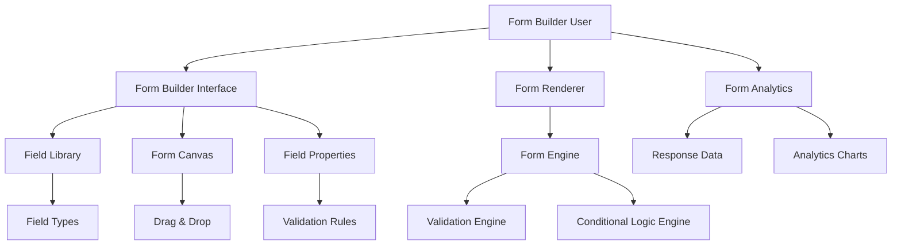
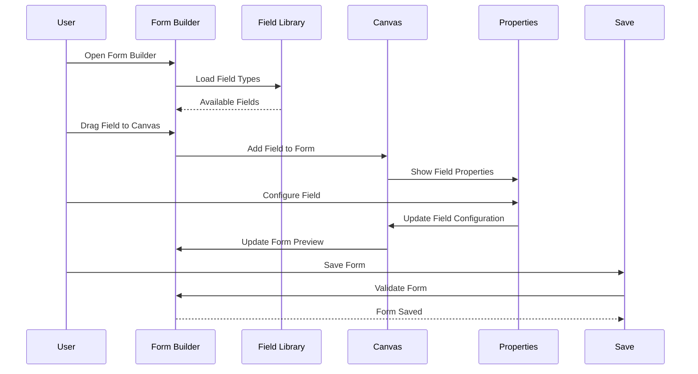

# 🎨🎨🎨 ENTERING CREATIVE PHASE: FORM SERVICE UI/UX DESIGN 🎨🎨🎨

## PROBLEM STATEMENT

Design a dynamic form builder interface that:
- Allows users to create custom forms with a visual builder
- Provides dynamic form rendering and validation
- Supports complex form types and conditional logic
- Maintains service independence while integrating with other services
- Ensures excellent user experience for form creation and submission
- Scales efficiently for a hobby project

## CONTEXT & REQUIREMENTS

### Functional Requirements
- Visual form builder interface
- Dynamic form rendering engine
- Real-time form validation
- Conditional field logic
- Form templates and versioning
- Response data collection and analytics
- Form sharing and access control

### Non-Functional Requirements
- Performance: Fast form rendering (< 500ms)
- Usability: Intuitive form builder interface
- Accessibility: WCAG AA compliance
- Responsiveness: Works on all device sizes
- Independence: No shared code with other services

### Technical Constraints
- Node.js/Express.js backend
- PostgreSQL database (forms schema)
- Service-to-service communication via HTTP APIs
- Integration with Authentication and CRUD services
- Modern web technologies (React/Vue.js for frontend)

## OPTIONS ANALYSIS

### Option 1: Simple Form Builder
**Description**: Basic form builder with essential features
- Drag-and-drop form builder
- Basic field types (text, number, select, checkbox)
- Simple validation rules
- Basic form rendering
- Minimal styling and customization

**Pros**:
- Simple to implement and understand
- Fast development time
- Low complexity
- Easy to test and debug

**Cons**:
- Limited field types
- Basic validation capabilities
- Minimal customization options
- No conditional logic

**Complexity**: Low
**Implementation Time**: 2-3 weeks

### Option 2: Advanced Form Builder with Conditional Logic
**Description**: Comprehensive form builder with advanced features
- Rich drag-and-drop interface
- Advanced field types (file upload, date, time, rating)
- Conditional field logic and branching
- Advanced validation rules
- Form templates and versioning
- Response analytics and reporting

**Pros**:
- Powerful form creation capabilities
- Rich user experience
- Advanced validation and logic
- Comprehensive analytics
- Scalable architecture

**Cons**:
- Higher complexity
- More code to maintain
- Steeper learning curve
- More potential failure points

**Complexity**: Medium
**Implementation Time**: 3-4 weeks

### Option 3: Enterprise Form Platform
**Description**: Full-featured form platform with advanced capabilities
- Multi-step form wizards
- Advanced workflow integration
- Real-time collaboration
- Advanced analytics and reporting
- API integrations and webhooks
- Custom field type development

**Pros**:
- Maximum functionality
- Enterprise-grade features
- Advanced workflow capabilities
- Comprehensive integration options

**Cons**:
- Highest complexity
- Overkill for hobby project
- Long development time
- High maintenance overhead

**Complexity**: High
**Implementation Time**: 4-6 weeks

## DECISION

**Chosen Option**: Option 2 - Advanced Form Builder with Conditional Logic

**Rationale**:
- Provides rich functionality without over-engineering
- Balances features with complexity for a hobby project
- Enables powerful form creation capabilities
- Maintains service independence while providing robust functionality
- Aligns with modern web application standards

**Implementation Considerations**:
- Use React for frontend form builder
- Implement drag-and-drop with react-beautiful-dnd
- Use JSON schema for form definitions
- Implement real-time validation
- Add comprehensive form analytics

## UI/UX ARCHITECTURE DESIGN

### Component Structure


### User Interface Flow


## FORM BUILDER INTERFACE DESIGN

### Main Layout Structure
```jsx
// Form Builder Layout
const FormBuilder = () => {
  return (
    <div className="form-builder">
      <Header />
      <div className="builder-container">
        <Sidebar>
          <FieldLibrary />
          <FormSettings />
        </Sidebar>
        <MainArea>
          <Toolbar />
          <Canvas />
          <PropertiesPanel />
        </MainArea>
      </div>
    </div>
  );
};
```

### Field Library Component
```jsx
const FieldLibrary = () => {
  const fieldTypes = [
    { id: 'text', name: 'Text Input', icon: 'text', category: 'basic' },
    { id: 'textarea', name: 'Text Area', icon: 'textarea', category: 'basic' },
    { id: 'number', name: 'Number Input', icon: 'number', category: 'basic' },
    { id: 'email', name: 'Email Input', icon: 'email', category: 'basic' },
    { id: 'select', name: 'Dropdown', icon: 'select', category: 'choice' },
    { id: 'radio', name: 'Radio Buttons', icon: 'radio', category: 'choice' },
    { id: 'checkbox', name: 'Checkboxes', icon: 'checkbox', category: 'choice' },
    { id: 'date', name: 'Date Picker', icon: 'date', category: 'advanced' },
    { id: 'file', name: 'File Upload', icon: 'file', category: 'advanced' },
    { id: 'rating', name: 'Rating', icon: 'star', category: 'advanced' }
  ];

  return (
    <div className="field-library">
      <h3>Form Fields</h3>
      <div className="field-categories">
        {Object.entries(groupBy(fieldTypes, 'category')).map(([category, fields]) => (
          <div key={category} className="field-category">
            <h4>{category.charAt(0).toUpperCase() + category.slice(1)}</h4>
            {fields.map(field => (
              <DraggableField key={field.id} field={field} />
            ))}
          </div>
        ))}
      </div>
    </div>
  );
};
```

### Form Canvas Component
```jsx
const FormCanvas = () => {
  const [fields, setFields] = useState([]);
  const [selectedField, setSelectedField] = useState(null);

  const handleDrop = (result) => {
    if (!result.destination) return;

    const newField = {
      id: generateId(),
      type: result.draggableId,
      label: `New ${result.draggableId} Field`,
      required: false,
      validation: {},
      position: result.destination.index
    };

    const newFields = Array.from(fields);
    newFields.splice(result.destination.index, 0, newField);
    setFields(newFields);
  };

  return (
    <div className="form-canvas">
      <DragDropContext onDragEnd={handleDrop}>
        <Droppable droppableId="form-fields">
          {(provided) => (
            <div
              {...provided.droppableProps}
              ref={provided.innerRef}
              className="form-fields"
            >
              {fields.map((field, index) => (
                <Draggable key={field.id} draggableId={field.id} index={index}>
                  {(provided) => (
                    <div
                      ref={provided.innerRef}
                      {...provided.draggableProps}
                      {...provided.dragHandleProps}
                      className={`form-field ${selectedField?.id === field.id ? 'selected' : ''}`}
                      onClick={() => setSelectedField(field)}
                    >
                      <FormFieldRenderer field={field} />
                    </div>
                  )}
                </Draggable>
              ))}
              {provided.placeholder}
            </div>
          )}
        </Droppable>
      </DragDropContext>
    </div>
  );
};
```

### Properties Panel Component
```jsx
const PropertiesPanel = ({ selectedField, onFieldUpdate }) => {
  if (!selectedField) {
    return (
      <div className="properties-panel">
        <h3>Properties</h3>
        <p>Select a field to edit its properties</p>
      </div>
    );
  }

  return (
    <div className="properties-panel">
      <h3>Field Properties</h3>
      
      <div className="property-group">
        <label>Field Label</label>
        <input
          type="text"
          value={selectedField.label}
          onChange={(e) => onFieldUpdate(selectedField.id, { label: e.target.value })}
        />
      </div>

      <div className="property-group">
        <label>Required Field</label>
        <input
          type="checkbox"
          checked={selectedField.required}
          onChange={(e) => onFieldUpdate(selectedField.id, { required: e.target.checked })}
        />
      </div>

      <div className="property-group">
        <label>Placeholder Text</label>
        <input
          type="text"
          value={selectedField.placeholder || ''}
          onChange={(e) => onFieldUpdate(selectedField.id, { placeholder: e.target.value })}
        />
      </div>

      <ValidationRules field={selectedField} onUpdate={onFieldUpdate} />
      <ConditionalLogic field={selectedField} onUpdate={onFieldUpdate} />
    </div>
  );
};
```

## FORM RENDERING ENGINE

### Form Schema Structure
```javascript
const formSchema = {
  id: "form_123",
  title: "Customer Feedback Form",
  description: "Help us improve our service",
  version: 1,
  fields: [
    {
      id: "field_1",
      type: "text",
      label: "Full Name",
      required: true,
      placeholder: "Enter your full name",
      validation: {
        minLength: 2,
        maxLength: 100
      }
    },
    {
      id: "field_2",
      type: "email",
      label: "Email Address",
      required: true,
      validation: {
        pattern: "^[^\\s@]+@[^\\s@]+\\.[^\\s@]+$"
      }
    },
    {
      id: "field_3",
      type: "select",
      label: "Service Rating",
      required: true,
      options: [
        { value: "excellent", label: "Excellent" },
        { value: "good", label: "Good" },
        { value: "average", label: "Average" },
        { value: "poor", label: "Poor" }
      ]
    },
    {
      id: "field_4",
      type: "textarea",
      label: "Additional Comments",
      required: false,
      placeholder: "Share your thoughts...",
      conditional: {
        show: {
          field: "field_3",
          operator: "not_equals",
          value: "excellent"
        }
      }
    }
  ],
  settings: {
    allowAnonymous: false,
    requireCaptcha: true,
    maxSubmissions: 1000,
    expirationDate: "2023-12-31"
  }
};
```

### Form Renderer Component
```jsx
const FormRenderer = ({ formSchema, onSubmit }) => {
  const [formData, setFormData] = useState({});
  const [errors, setErrors] = useState({});
  const [isSubmitting, setIsSubmitting] = useState(false);

  const handleFieldChange = (fieldId, value) => {
    setFormData(prev => ({ ...prev, [fieldId]: value }));
    // Clear error when user starts typing
    if (errors[fieldId]) {
      setErrors(prev => ({ ...prev, [fieldId]: null }));
    }
  };

  const validateField = (field, value) => {
    const fieldErrors = [];

    if (field.required && (!value || value.trim() === '')) {
      fieldErrors.push('This field is required');
    }

    if (value && field.validation) {
      if (field.validation.minLength && value.length < field.validation.minLength) {
        fieldErrors.push(`Minimum ${field.validation.minLength} characters required`);
      }
      if (field.validation.maxLength && value.length > field.validation.maxLength) {
        fieldErrors.push(`Maximum ${field.validation.maxLength} characters allowed`);
      }
      if (field.validation.pattern && !new RegExp(field.validation.pattern).test(value)) {
        fieldErrors.push('Invalid format');
      }
    }

    return fieldErrors;
  };

  const handleSubmit = async (e) => {
    e.preventDefault();
    
    // Validate all fields
    const newErrors = {};
    formSchema.fields.forEach(field => {
      const fieldErrors = validateField(field, formData[field.id]);
      if (fieldErrors.length > 0) {
        newErrors[field.id] = fieldErrors;
      }
    });

    if (Object.keys(newErrors).length > 0) {
      setErrors(newErrors);
      return;
    }

    setIsSubmitting(true);
    try {
      await onSubmit(formData);
      // Show success message
    } catch (error) {
      // Show error message
    } finally {
      setIsSubmitting(false);
    }
  };

  return (
    <form onSubmit={handleSubmit} className="form-renderer">
      <div className="form-header">
        <h1>{formSchema.title}</h1>
        {formSchema.description && (
          <p className="form-description">{formSchema.description}</p>
        )}
      </div>

      <div className="form-fields">
        {formSchema.fields.map(field => (
          <FormField
            key={field.id}
            field={field}
            value={formData[field.id]}
            error={errors[field.id]}
            onChange={(value) => handleFieldChange(field.id, value)}
            formData={formData}
          />
        ))}
      </div>

      <div className="form-actions">
        <button
          type="submit"
          disabled={isSubmitting}
          className="submit-button"
        >
          {isSubmitting ? 'Submitting...' : 'Submit'}
        </button>
      </div>
    </form>
  );
};
```

## CONDITIONAL LOGIC ENGINE

### Conditional Logic Implementation
```javascript
class ConditionalLogicEngine {
  evaluateCondition(condition, formData) {
    const { field, operator, value } = condition;
    const fieldValue = formData[field];

    switch (operator) {
      case 'equals':
        return fieldValue === value;
      case 'not_equals':
        return fieldValue !== value;
      case 'contains':
        return fieldValue && fieldValue.includes(value);
      case 'greater_than':
        return Number(fieldValue) > Number(value);
      case 'less_than':
        return Number(fieldValue) < Number(value);
      case 'is_empty':
        return !fieldValue || fieldValue.trim() === '';
      case 'is_not_empty':
        return fieldValue && fieldValue.trim() !== '';
      default:
        return true;
    }
  }

  shouldShowField(field, formData) {
    if (!field.conditional) return true;

    const { show, hide } = field.conditional;
    
    if (show) {
      return this.evaluateCondition(show, formData);
    }
    
    if (hide) {
      return !this.evaluateCondition(hide, formData);
    }

    return true;
  }
}
```

## VALIDATION ENGINE

### Validation Rules Implementation
```javascript
class ValidationEngine {
  validateField(field, value) {
    const errors = [];

    // Required validation
    if (field.required && (!value || value.trim() === '')) {
      errors.push('This field is required');
    }

    if (value && field.validation) {
      // Length validation
      if (field.validation.minLength && value.length < field.validation.minLength) {
        errors.push(`Minimum ${field.validation.minLength} characters required`);
      }
      if (field.validation.maxLength && value.length > field.validation.maxLength) {
        errors.push(`Maximum ${field.validation.maxLength} characters allowed`);
      }

      // Pattern validation
      if (field.validation.pattern) {
        const regex = new RegExp(field.validation.pattern);
        if (!regex.test(value)) {
          errors.push(field.validation.patternMessage || 'Invalid format');
        }
      }

      // Custom validation
      if (field.validation.custom) {
        const customError = field.validation.custom(value);
        if (customError) {
          errors.push(customError);
        }
      }
    }

    return errors;
  }

  validateForm(formSchema, formData) {
    const errors = {};
    
    formSchema.fields.forEach(field => {
      const fieldErrors = this.validateField(field, formData[field.id]);
      if (fieldErrors.length > 0) {
        errors[field.id] = fieldErrors;
      }
    });

    return errors;
  }
}
```

## FORM ANALYTICS

### Analytics Dashboard Component
```jsx
const FormAnalytics = ({ formId }) => {
  const [analytics, setAnalytics] = useState(null);
  const [loading, setLoading] = useState(true);

  useEffect(() => {
    fetchAnalytics(formId);
  }, [formId]);

  const fetchAnalytics = async (formId) => {
    try {
      const response = await fetch(`/api/forms/${formId}/analytics`);
      const data = await response.json();
      setAnalytics(data);
    } catch (error) {
      console.error('Failed to fetch analytics:', error);
    } finally {
      setLoading(false);
    }
  };

  if (loading) return <div>Loading analytics...</div>;

  return (
    <div className="form-analytics">
      <h2>Form Analytics</h2>
      
      <div className="analytics-grid">
        <div className="metric-card">
          <h3>Total Submissions</h3>
          <p className="metric-value">{analytics.totalSubmissions}</p>
        </div>
        
        <div className="metric-card">
          <h3>Completion Rate</h3>
          <p className="metric-value">{analytics.completionRate}%</p>
        </div>
        
        <div className="metric-card">
          <h3>Average Time</h3>
          <p className="metric-value">{analytics.averageTime}s</p>
        </div>
      </div>

      <div className="charts-section">
        <ResponseChart data={analytics.responses} />
        <FieldAnalytics data={analytics.fieldAnalytics} />
      </div>
    </div>
  );
};
```

## RESPONSIVE DESIGN

### Mobile-First Approach
```css
/* Base styles for mobile */
.form-builder {
  display: flex;
  flex-direction: column;
  height: 100vh;
}

.builder-container {
  display: flex;
  flex: 1;
  overflow: hidden;
}

.sidebar {
  width: 250px;
  background: #f5f5f5;
  border-right: 1px solid #ddd;
  overflow-y: auto;
}

.main-area {
  flex: 1;
  display: flex;
  flex-direction: column;
}

/* Tablet styles */
@media (max-width: 768px) {
  .builder-container {
    flex-direction: column;
  }
  
  .sidebar {
    width: 100%;
    height: 200px;
    border-right: none;
    border-bottom: 1px solid #ddd;
  }
}

/* Mobile styles */
@media (max-width: 480px) {
  .sidebar {
    height: 150px;
  }
  
  .properties-panel {
    position: fixed;
    bottom: 0;
    left: 0;
    right: 0;
    height: 50vh;
    background: white;
    border-top: 1px solid #ddd;
    z-index: 1000;
  }
}
```

## ACCESSIBILITY FEATURES

### ARIA Implementation
```jsx
const FormField = ({ field, value, error, onChange }) => {
  const fieldId = `field-${field.id}`;
  const errorId = `error-${field.id}`;

  return (
    <div className="form-field">
      <label htmlFor={fieldId} className="field-label">
        {field.label}
        {field.required && <span className="required">*</span>}
      </label>
      
      <input
        id={fieldId}
        type={field.type}
        value={value || ''}
        onChange={(e) => onChange(e.target.value)}
        placeholder={field.placeholder}
        required={field.required}
        aria-describedby={error ? errorId : undefined}
        aria-invalid={error ? 'true' : 'false'}
        className={error ? 'field-error' : ''}
      />
      
      {error && (
        <div id={errorId} className="error-message" role="alert">
          {error}
        </div>
      )}
    </div>
  );
};
```

## IMPLEMENTATION PLAN

### Phase 1: Core Form Builder (Week 1)
1. Set up React frontend structure
2. Implement drag-and-drop functionality
3. Create basic field types and rendering
4. Add form schema management
5. Implement basic validation

### Phase 2: Advanced Features (Week 2)
1. Add conditional logic engine
2. Implement advanced validation rules
3. Create form templates system
4. Add form versioning
5. Implement form sharing

### Phase 3: Analytics and Polish (Week 3)
1. Create analytics dashboard
2. Add response data visualization
3. Implement accessibility features
4. Add responsive design
5. Create comprehensive testing

## TESTING STRATEGY

### Unit Tests
- Form schema validation
- Conditional logic evaluation
- Validation rule testing
- Field rendering components

### Integration Tests
- Form builder workflow
- Form submission flow
- Analytics data collection
- Service integration

### User Experience Tests
- Form builder usability
- Form submission experience
- Mobile responsiveness
- Accessibility compliance

## 🎨 CREATIVE CHECKPOINT: FORM SERVICE UI/UX DESIGN COMPLETE

The Form Service UI/UX Design is complete with:
- ✅ Advanced form builder with drag-and-drop interface
- ✅ Dynamic form rendering engine with validation
- ✅ Conditional logic and branching capabilities
- ✅ Comprehensive analytics and reporting
- ✅ Responsive design for all devices
- ✅ Accessibility compliance (WCAG AA)
- ✅ Implementation plan with clear phases

## 🎨🎨🎨 EXITING CREATIVE PHASE - FORM SERVICE UI/UX DESIGN DECISION MADE 🎨🎨🎨 