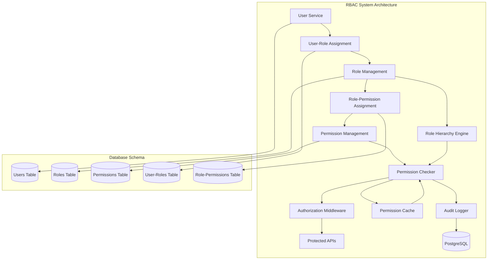

# CREATIVE PHASE: RBAC MODEL AND PERMISSION STRUCTURE DESIGN

**Date:** 2024-12-20  
**Phase:** Phase 3 - User Management & Authorization  
**Type:** Architecture Design  
**Complexity:** Level 4 (Complex System)

---

## 🎨🎨🎨 ENTERING CREATIVE PHASE: RBAC ARCHITECTURE 🎨🎨🎨

### PROBLEM STATEMENT

Design a comprehensive Role-Based Access Control (RBAC) system that:
- Supports hierarchical roles and fine-grained permissions
- Integrates with existing User Service and database
- Provides secure permission checking middleware
- Scales to handle complex permission scenarios
- Maintains audit trail of permission changes
- Supports dynamic permission assignment

### REQUIREMENTS ANALYSIS

**Functional Requirements:**
- Role CRUD operations (create, read, update, delete)
- Permission CRUD operations with granular control
- User-role assignment and management
- Permission checking at route and resource levels
- Role hierarchy support (inheritance)
- Permission inheritance and override mechanisms

**Non-Functional Requirements:**
- Performance: Sub-second permission checks
- Security: Tamper-proof permission validation
- Scalability: Support 1000+ roles and 10000+ permissions
- Maintainability: Clear separation of concerns
- Audit: Complete trail of permission changes

**Technical Constraints:**
- Must integrate with existing PostgreSQL database
- Must work with existing User Service architecture
- Must support TypeScript strict mode
- Must maintain existing API patterns
- Must be testable with Jest mocking

---

## 🎨 CREATIVE CHECKPOINT: REQUIREMENTS DEFINED

### COMPONENT ANALYSIS

**Core RBAC Components:**
- **Role Management**: CRUD operations for roles, hierarchy support
- **Permission Management**: CRUD operations for permissions, granular control
- **Assignment Engine**: User-role and role-permission assignments
- **Permission Checker**: Middleware for route/resource-level checks
- **Audit Logger**: Track all RBAC changes and permission checks

**Integration Points:**
- **User Service**: User-role assignments, user context
- **Database**: PostgreSQL tables for roles, permissions, assignments
- **Middleware**: Express.js middleware for permission checking
- **Shared Types**: TypeScript interfaces for RBAC entities

---

## ARCHITECTURE OPTIONS ANALYSIS

### Option 1: Hierarchical RBAC with Permission Inheritance

**Description**: Traditional RBAC with role hierarchy and permission inheritance
- Roles can inherit from parent roles
- Permissions are assigned to roles
- Users are assigned to roles
- Permission checks traverse role hierarchy

**Pros:**
- Well-established pattern, widely understood
- Natural role hierarchy (Admin → Manager → User)
- Efficient permission inheritance
- Clear audit trail
- Good performance with proper indexing

**Cons:**
- Complex role hierarchy management
- Potential for permission conflicts in inheritance
- More complex permission checking logic
- Risk of over-privileged roles

**Technical Fit:** High  
**Complexity:** Medium  
**Scalability:** High

### Option 2: Flat RBAC with Direct Permission Assignment

**Description**: Simplified RBAC without hierarchy
- Flat role structure (no inheritance)
- Direct permission assignments to roles
- Simple user-role assignments
- Direct permission checking

**Pros:**
- Simple to implement and understand
- Clear permission boundaries
- Easy to audit and manage
- Predictable permission checking
- Lower complexity

**Cons:**
- No role hierarchy benefits
- More roles needed for complex scenarios
- Manual permission assignment for each role
- Less flexible for organizational changes

**Technical Fit:** High  
**Complexity:** Low  
**Scalability:** Medium

### Option 3: Attribute-Based RBAC (ABAC Hybrid)

**Description**: RBAC enhanced with attribute-based access control
- Traditional RBAC as base
- Additional attribute-based rules
- Context-aware permission checking
- Dynamic permission evaluation

**Pros:**
- Highly flexible and powerful
- Context-aware decisions (time, location, etc.)
- Fine-grained control
- Future-proof for complex scenarios

**Cons:**
- High complexity
- Difficult to audit and debug
- Performance overhead
- Overkill for current requirements
- Complex testing requirements

**Technical Fit:** Medium  
**Complexity:** High  
**Scalability:** High

---

## 🎨 CREATIVE CHECKPOINT: OPTIONS ANALYZED

### DECISION ANALYSIS

**Evaluation Criteria:**
1. **Functional Requirements**: All options meet core requirements
2. **Technical Fit**: Options 1 and 2 have high fit, Option 3 medium
3. **Complexity**: Option 2 lowest, Option 1 medium, Option 3 high
4. **Scalability**: Options 1 and 3 high, Option 2 medium
5. **Maintainability**: Option 2 highest, Option 1 good, Option 3 complex
6. **Performance**: Option 2 best, Option 1 good, Option 3 overhead

**Risk Assessment:**
- **Option 1**: Medium risk (complexity), high reward (flexibility)
- **Option 2**: Low risk (simplicity), medium reward (functionality)
- **Option 3**: High risk (complexity), high reward (power)

---

## 🎨🎨🎨 EXITING CREATIVE PHASE - DECISION MADE 🎨🎨🎨

### SELECTED OPTION: Hierarchical RBAC with Permission Inheritance (Option 1)

**Rationale:**
- Balances complexity with flexibility
- Supports future growth and organizational changes
- Well-established pattern with proven security
- Good performance characteristics
- Clear audit trail and maintainability

**Implementation Considerations:**
- Start with simple hierarchy, expand as needed
- Implement proper indexing for performance
- Add comprehensive testing for inheritance logic
- Include conflict resolution for permission overrides
- Design clear API for role hierarchy management

---

## IMPLEMENTATION PLAN

### Phase 1: Core RBAC Structure
1. **Database Schema Design**
   ```sql
   -- Roles table with hierarchy support
   CREATE TABLE roles (
       id UUID PRIMARY KEY DEFAULT gen_random_uuid(),
       name VARCHAR(100) UNIQUE NOT NULL,
       description TEXT,
       parent_role_id UUID REFERENCES roles(id),
       created_at TIMESTAMP DEFAULT CURRENT_TIMESTAMP,
       updated_at TIMESTAMP DEFAULT CURRENT_TIMESTAMP
   );

   -- Permissions table
   CREATE TABLE permissions (
       id UUID PRIMARY KEY DEFAULT gen_random_uuid(),
       name VARCHAR(100) UNIQUE NOT NULL,
       description TEXT,
       resource VARCHAR(100) NOT NULL,
       action VARCHAR(100) NOT NULL,
       created_at TIMESTAMP DEFAULT CURRENT_TIMESTAMP
   );

   -- Role-permission assignments
   CREATE TABLE role_permissions (
       role_id UUID REFERENCES roles(id) ON DELETE CASCADE,
       permission_id UUID REFERENCES permissions(id) ON DELETE CASCADE,
       granted BOOLEAN DEFAULT true,
       created_at TIMESTAMP DEFAULT CURRENT_TIMESTAMP,
       PRIMARY KEY (role_id, permission_id)
   );

   -- User-role assignments
   CREATE TABLE user_roles (
       user_id UUID REFERENCES users(id) ON DELETE CASCADE,
       role_id UUID REFERENCES roles(id) ON DELETE CASCADE,
       assigned_at TIMESTAMP DEFAULT CURRENT_TIMESTAMP,
       PRIMARY KEY (user_id, role_id)
   );
   ```

2. **TypeScript Interfaces**
   ```typescript
   interface Role {
       id: string;
       name: string;
       description?: string;
       parentRoleId?: string;
       createdAt: Date;
       updatedAt: Date;
   }

   interface Permission {
       id: string;
       name: string;
       description?: string;
       resource: string;
       action: string;
       createdAt: Date;
   }

   interface RolePermission {
       roleId: string;
       permissionId: string;
       granted: boolean;
       createdAt: Date;
   }

   interface UserRole {
       userId: string;
       roleId: string;
       assignedAt: Date;
   }
   ```

### Phase 2: RBAC Service Implementation
1. **Role Management Service**
   - CRUD operations for roles
   - Hierarchy management (parent-child relationships)
   - Role validation and conflict detection

2. **Permission Management Service**
   - CRUD operations for permissions
   - Resource-action mapping
   - Permission assignment to roles

3. **Assignment Service**
   - User-role assignment management
   - Role-permission assignment management
   - Assignment validation and conflict resolution

### Phase 3: Permission Checking Engine
1. **Permission Checker Service**
   - Hierarchical permission resolution
   - Caching for performance
   - Conflict resolution for permission overrides

2. **Authorization Middleware**
   - Route-level permission checking
   - Resource-level permission checking
   - Integration with Express.js middleware

### Phase 4: Integration and Testing
1. **User Service Integration**
   - User context with roles
   - Permission checking in user operations
   - Audit logging for RBAC changes

2. **Comprehensive Testing**
   - Unit tests for all RBAC components
   - Integration tests for permission flows
   - Performance tests for permission checking

---

## ARCHITECTURE DIAGRAM



---

## VALIDATION CHECKLIST

### Architecture Design Verification
- [x] All system requirements addressed
- [x] Component responsibilities defined
- [x] Interfaces specified
- [x] Data flows documented
- [x] Security considerations addressed
- [x] Scalability requirements met
- [x] Performance requirements met
- [x] Maintenance approach defined

### Implementation Readiness
- [x] All components identified
- [x] Dependencies mapped
- [x] Technical constraints documented
- [x] Risk assessment completed
- [x] Resource requirements defined
- [x] Timeline estimates provided

---

## CREATIVE PHASE COMPLETE

✅ **Problem clearly defined** - RBAC system requirements identified  
✅ **Multiple options considered** - 3 architecture options analyzed  
✅ **Pros/cons documented** - Detailed analysis for each option  
✅ **Decision made with clear rationale** - Hierarchical RBAC selected  
✅ **Implementation plan included** - 4-phase implementation strategy  
✅ **Visualization/diagrams created** - Architecture diagram provided  
✅ **Validation checklist completed** - All verification points addressed  

**Next Creative Phase:** Audit log schema and reporting design 