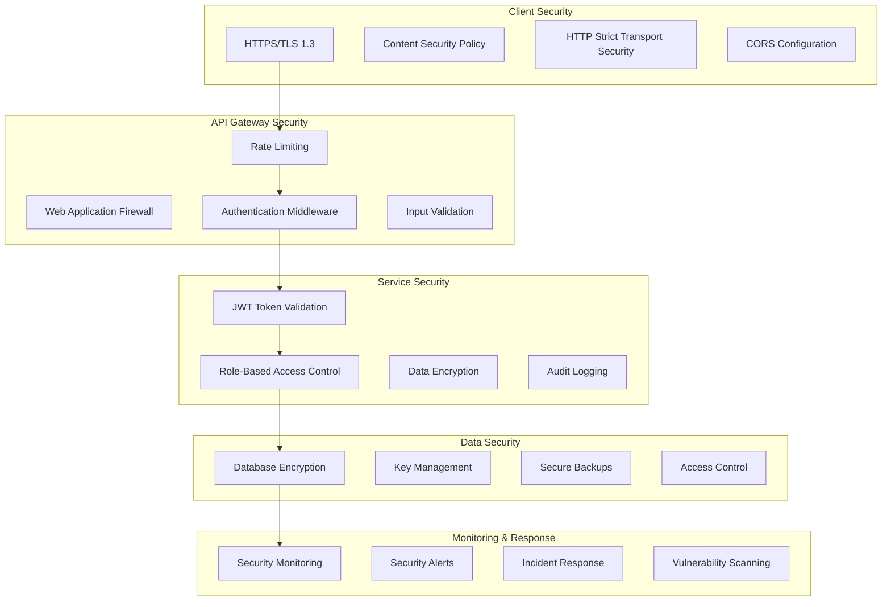

# 🎨 CREATIVE PHASE: SECURITY ARCHITECTURE

**Date:** 2024-12-20  
**Component:** Security Architecture Design  
**Type:** Security Design  
**Complexity:** Level 4 (Complex System)

━━━━━━━━━━━━━━━━━━━━━━━━━━━━━━━

## 1️⃣ PROBLEM

**Description:** Design a comprehensive security architecture for a monorepo authentication system that protects against common security threats while maintaining usability and performance.

**Requirements:**
- Implement defense-in-depth security model
- Protect against OWASP Top 10 vulnerabilities
- Support secure authentication and authorization
- Enable secure data transmission and storage
- Provide audit logging and monitoring
- Support secure session management
- Implement rate limiting and DDoS protection
- Enable secure API access and token management

**Constraints:**
- Must work with JWT tokens and OAuth flows
- Must support multi-factor authentication
- Must maintain performance under security measures
- Must be testable with security mocks
- Must comply with security best practices

## 2️⃣ OPTIONS

**Option A: Basic Security with Standard Libraries**
- Use standard security libraries (bcrypt, JWT, helmet)
- Implement basic authentication and authorization
- Simple to implement and maintain
- Limited security features

**Option B: Comprehensive Security with Advanced Patterns**
- Implement advanced security patterns (OAuth2, OIDC, RBAC)
- Use security frameworks and middleware
- Comprehensive security coverage
- Higher complexity and maintenance overhead

**Option C: Zero-Trust Security Architecture**
- Implement zero-trust principles throughout
- Continuous verification and monitoring
- Maximum security with minimal trust
- Highest complexity and resource requirements

## 3️⃣ ANALYSIS

| Criterion | Basic Security | Comprehensive Security | Zero-Trust |
|-----|-----|-----|-----|
| **Security Level** | ⭐⭐ | ⭐⭐⭐⭐ | ⭐⭐⭐⭐⭐ |
| **Implementation Complexity** | ⭐⭐⭐⭐⭐ | ⭐⭐⭐ | ⭐ |
| **Performance Impact** | ⭐⭐⭐⭐⭐ | ⭐⭐⭐ | ⭐⭐ |
| **Maintenance Overhead** | ⭐⭐⭐⭐⭐ | ⭐⭐⭐ | ⭐ |
| **Compliance** | ⭐⭐ | ⭐⭐⭐⭐ | ⭐⭐⭐⭐⭐ |
| **Scalability** | ⭐⭐⭐ | ⭐⭐⭐⭐ | ⭐⭐⭐⭐⭐ |
| **Testing Complexity** | ⭐⭐⭐⭐⭐ | ⭐⭐⭐ | ⭐⭐ |

**Key Insights:**
- Basic security is easiest to implement but provides limited protection
- Comprehensive security balances protection with complexity
- Zero-trust provides maximum security but requires significant infrastructure

## 4️⃣ DECISION

**Selected:** Option B: Comprehensive Security with Advanced Patterns

**Rationale:** 
The comprehensive security approach provides excellent protection against modern threats while maintaining reasonable complexity and performance. It includes advanced patterns like OAuth2, OIDC, and RBAC that are industry standards, while avoiding the over-engineering of zero-trust for a development-focused system.

## 5️⃣ IMPLEMENTATION NOTES

### Security Architecture Overview



### Authentication Security Implementation

```javascript
// JWT Token Security Configuration
const jwtConfig = {
  // Use RS256 for asymmetric signing
  algorithm: 'RS256',
  
  // Token expiration times
  accessTokenExpiry: '15m',
  refreshTokenExpiry: '7d',
  
  // Token rotation
  enableTokenRotation: true,
  
  // JWT blacklisting for logout
  enableBlacklisting: true,
  
  // Audience and issuer validation
  audience: process.env.JWT_AUDIENCE,
  issuer: process.env.JWT_ISSUER
};

// JWT Token Service with Security Features
class SecureJWTService {
  constructor() {
    this.privateKey = fs.readFileSync(process.env.JWT_PRIVATE_KEY_PATH);
    this.publicKey = fs.readFileSync(process.env.JWT_PUBLIC_KEY_PATH);
    this.redis = new Redis(process.env.REDIS_URL);
  }

  async generateTokens(userId, roles, permissions) {
    const accessToken = jwt.sign(
      {
        sub: userId,
        roles,
        permissions,
        type: 'access'
      },
      this.privateKey,
      {
        algorithm: 'RS256',
        expiresIn: jwtConfig.accessTokenExpiry,
        audience: jwtConfig.audience,
        issuer: jwtConfig.issuer
      }
    );

    const refreshToken = jwt.sign(
      {
        sub: userId,
        type: 'refresh',
        jti: uuidv4() // JWT ID for tracking
      },
      this.privateKey,
      {
        algorithm: 'RS256',
        expiresIn: jwtConfig.refreshTokenExpiry,
        audience: jwtConfig.audience,
        issuer: jwtConfig.issuer
      }
    );

    // Store refresh token hash for validation
    const refreshTokenHash = await bcrypt.hash(refreshToken, 12);
    await this.redis.setex(
      `refresh_token:${userId}`,
      7 * 24 * 60 * 60, // 7 days
      refreshTokenHash
    );

    return { accessToken, refreshToken };
  }

  async validateToken(token) {
    try {
      const decoded = jwt.verify(token, this.publicKey, {
        algorithms: ['RS256'],
        audience: jwtConfig.audience,
        issuer: jwtConfig.issuer
      });

      // Check if token is blacklisted
      const isBlacklisted = await this.redis.exists(`blacklist:${token}`);
      if (isBlacklisted) {
        throw new Error('Token is blacklisted');
      }

      return decoded;
    } catch (error) {
      throw new Error('Invalid token');
    }
  }

  async revokeToken(token, userId) {
    // Add to blacklist
    const decoded = jwt.decode(token);
    const timeToExpiry = decoded.exp - Math.floor(Date.now() / 1000);
    
    if (timeToExpiry > 0) {
      await this.redis.setex(`blacklist:${token}`, timeToExpiry, 'revoked');
    }

    // Remove refresh token
    await this.redis.del(`refresh_token:${userId}`);
  }
}
```

### Password Security Implementation

```javascript
// Password Security Service
class PasswordSecurityService {
  constructor() {
    this.saltRounds = 12;
    this.passwordHistorySize = 5;
  }

  async hashPassword(password) {
    return await bcrypt.hash(password, this.saltRounds);
  }

  async verifyPassword(password, hash) {
    return await bcrypt.compare(password, hash);
  }

  validatePasswordStrength(password) {
    const requirements = {
      minLength: 8,
      maxLength: 128,
      requireUppercase: true,
      requireLowercase: true,
      requireNumbers: true,
      requireSpecialChars: true,
      preventCommonPasswords: true
    };

    const errors = [];

    if (password.length < requirements.minLength) {
      errors.push(`Password must be at least ${requirements.minLength} characters`);
    }

    if (password.length > requirements.maxLength) {
      errors.push(`Password must be no more than ${requirements.maxLength} characters`);
    }

    if (requirements.requireUppercase && !/[A-Z]/.test(password)) {
      errors.push('Password must contain at least one uppercase letter');
    }

    if (requirements.requireLowercase && !/[a-z]/.test(password)) {
      errors.push('Password must contain at least one lowercase letter');
    }

    if (requirements.requireNumbers && !/\d/.test(password)) {
      errors.push('Password must contain at least one number');
    }

    if (requirements.requireSpecialChars && !/[!@#$%^&*(),.?":{}|<>]/.test(password)) {
      errors.push('Password must contain at least one special character');
    }

    if (requirements.preventCommonPasswords && this.isCommonPassword(password)) {
      errors.push('Password is too common');
    }

    return {
      isValid: errors.length === 0,
      errors
    };
  }

  isCommonPassword(password) {
    const commonPasswords = [
      'password', '123456', 'qwerty', 'admin', 'letmein',
      'welcome', 'monkey', 'dragon', 'master', 'hello'
    ];
    return commonPasswords.includes(password.toLowerCase());
  }

  async checkPasswordHistory(userId, newPasswordHash) {
    const history = await this.getPasswordHistory(userId);
    
    for (const oldHash of history) {
      if (await bcrypt.compare(newPasswordHash, oldHash)) {
        return false; // Password already used
      }
    }
    
    return true; // Password is new
  }

  async updatePasswordHistory(userId, newPasswordHash) {
    const history = await this.getPasswordHistory(userId);
    history.unshift(newPasswordHash);
    
    // Keep only the last N passwords
    const trimmedHistory = history.slice(0, this.passwordHistorySize);
    
    await this.savePasswordHistory(userId, trimmedHistory);
  }
}
```

### Multi-Factor Authentication Security

```javascript
// MFA Security Service
class MFASecurityService {
  constructor() {
    this.totp = require('speakeasy');
    this.qrcode = require('qrcode');
  }

  async generateMFASecret(userId) {
    const secret = this.totp.generateSecret({
      name: process.env.APP_NAME,
      issuer: process.env.JWT_ISSUER,
      length: 32
    });

    // Store secret securely
    await this.storeMFASecret(userId, secret.base32);
    
    return {
      secret: secret.base32,
      qrCode: await this.qrcode.toDataURL(secret.otpauth_url)
    };
  }

  async verifyMFAToken(userId, token) {
    const secret = await this.getMFASecret(userId);
    
    return this.totp.totp.verify({
      secret,
      encoding: 'base32',
      token,
      window: 2 // Allow 2 time steps for clock skew
    });
  }

  async generateBackupCodes(userId) {
    const codes = [];
    for (let i = 0; i < 10; i++) {
      codes.push(this.generateRandomCode());
    }

    const hashedCodes = await Promise.all(
      codes.map(code => bcrypt.hash(code, 12))
    );

    await this.storeBackupCodes(userId, hashedCodes);
    
    return codes; // Return plain codes to user
  }

  async verifyBackupCode(userId, code) {
    const storedCodes = await this.getBackupCodes(userId);
    
    for (let i = 0; i < storedCodes.length; i++) {
      if (await bcrypt.compare(code, storedCodes[i])) {
        // Remove used backup code
        storedCodes.splice(i, 1);
        await this.updateBackupCodes(userId, storedCodes);
        return true;
      }
    }
    
    return false;
  }

  generateRandomCode() {
    return Math.random().toString(36).substring(2, 8).toUpperCase();
  }
}
```

### Rate Limiting and DDoS Protection

```javascript
// Advanced Rate Limiting Service
class SecurityRateLimiter {
  constructor() {
    this.redis = new Redis(process.env.REDIS_URL);
  }

  async checkRateLimit(key, limit, window) {
    const current = await this.redis.incr(key);
    
    if (current === 1) {
      await this.redis.expire(key, window);
    }
    
    if (current > limit) {
      throw new Error('Rate limit exceeded');
    }
    
    return {
      remaining: Math.max(0, limit - current),
      reset: await this.redis.ttl(key)
    };
  }

  async checkLoginRateLimit(identifier, isIP = false) {
    const key = isIP ? `login:ip:${identifier}` : `login:email:${identifier}`;
    const limit = isIP ? 5 : 3; // 5 attempts per IP, 3 per email
    const window = 15 * 60; // 15 minutes
    
    return await this.checkRateLimit(key, limit, window);
  }

  async checkPasswordResetRateLimit(email) {
    const key = `password_reset:${email}`;
    const limit = 3; // 3 attempts per email
    const window = 60 * 60; // 1 hour
    
    return await this.checkRateLimit(key, limit, window);
  }

  async checkAPIRateLimit(userId, endpoint) {
    const key = `api:${userId}:${endpoint}`;
    const limit = this.getEndpointLimit(endpoint);
    const window = 60; // 1 minute
    
    return await this.checkRateLimit(key, limit, window);
  }

  getEndpointLimit(endpoint) {
    const limits = {
      '/auth/login': 10,
      '/auth/register': 5,
      '/users/profile': 100,
      '/users/update': 20
    };
    
    return limits[endpoint] || 50;
  }
}
```

### Input Validation and Sanitization

```javascript
// Security Input Validation
class SecurityInputValidator {
  constructor() {
    this.validator = require('validator');
    this.xss = require('xss');
  }

  validateEmail(email) {
    if (!this.validator.isEmail(email)) {
      throw new Error('Invalid email format');
    }
    
    // Check for disposable email domains
    if (this.isDisposableEmail(email)) {
      throw new Error('Disposable email addresses are not allowed');
    }
    
    return this.validator.normalizeEmail(email);
  }

  validatePassword(password) {
    const minLength = 8;
    const maxLength = 128;
    
    if (password.length < minLength || password.length > maxLength) {
      throw new Error(`Password must be between ${minLength} and ${maxLength} characters`);
    }
    
    // Check for common patterns
    if (/(.)\1{2,}/.test(password)) {
      throw new Error('Password cannot contain repeated characters');
    }
    
    return password;
  }

  sanitizeInput(input, type = 'string') {
    switch (type) {
      case 'string':
        return this.xss(input.trim());
      case 'email':
        return this.validator.normalizeEmail(input);
      case 'url':
        return this.validator.escape(input);
      case 'html':
        return this.xss(input, {
          whiteList: {},
          stripIgnoreTag: true
        });
      default:
        return this.xss(input);
    }
  }

  validateJSONSchema(data, schema) {
    const Ajv = require('ajv');
    const ajv = new Ajv({ allErrors: true });
    
    const validate = ajv.compile(schema);
    const valid = validate(data);
    
    if (!valid) {
      throw new Error(`Validation failed: ${ajv.errorsText(validate.errors)}`);
    }
    
    return data;
  }

  isDisposableEmail(email) {
    const disposableDomains = [
      'tempmail.org', '10minutemail.com', 'guerrillamail.com'
    ];
    
    const domain = email.split('@')[1];
    return disposableDomains.includes(domain);
  }
}
```

### Audit Logging and Monitoring

```javascript
// Security Audit Service
class SecurityAuditService {
  constructor() {
    this.logger = require('winston');
    this.setupLogger();
  }

  setupLogger() {
    this.logger.configure({
      level: 'info',
      format: this.logger.format.combine(
        this.logger.format.timestamp(),
        this.logger.format.json()
      ),
      transports: [
        new this.logger.transports.File({ filename: 'security-audit.log' }),
        new this.logger.transports.Console()
      ]
    });
  }

  async logSecurityEvent(event) {
    const auditEntry = {
      timestamp: new Date().toISOString(),
      event: event.type,
      userId: event.userId,
      ipAddress: event.ipAddress,
      userAgent: event.userAgent,
      details: event.details,
      severity: event.severity || 'info',
      sessionId: event.sessionId
    };

    // Log to file
    this.logger.log(auditEntry.severity, 'Security Event', auditEntry);

    // Store in database for analysis
    await this.storeAuditEntry(auditEntry);

    // Send alerts for high-severity events
    if (auditEntry.severity === 'high' || auditEntry.severity === 'critical') {
      await this.sendSecurityAlert(auditEntry);
    }
  }

  async logLoginAttempt(userId, success, ipAddress, userAgent) {
    await this.logSecurityEvent({
      type: success ? 'login_success' : 'login_failure',
      userId,
      ipAddress,
      userAgent,
      severity: success ? 'info' : 'warning',
      details: {
        success,
        timestamp: new Date().toISOString()
      }
    });
  }

  async logPasswordChange(userId, ipAddress, userAgent) {
    await this.logSecurityEvent({
      type: 'password_change',
      userId,
      ipAddress,
      userAgent,
      severity: 'info',
      details: {
        timestamp: new Date().toISOString()
      }
    });
  }

  async logSuspiciousActivity(userId, activity, ipAddress, userAgent) {
    await this.logSecurityEvent({
      type: 'suspicious_activity',
      userId,
      ipAddress,
      userAgent,
      severity: 'high',
      details: {
        activity,
        timestamp: new Date().toISOString()
      }
    });
  }

  async sendSecurityAlert(auditEntry) {
    // Send email/SMS alert to security team
    const alertMessage = {
      subject: `Security Alert: ${auditEntry.event}`,
      body: `High-severity security event detected:
        - Event: ${auditEntry.event}
        - User: ${auditEntry.userId}
        - IP: ${auditEntry.ipAddress}
        - Time: ${auditEntry.timestamp}
        - Details: ${JSON.stringify(auditEntry.details)}`
    };

    // Implementation depends on notification service
    await this.notificationService.sendAlert(alertMessage);
  }
}
```

### Security Headers and CORS Configuration

```javascript
// Security Middleware Configuration
const securityMiddleware = {
  // Helmet configuration for security headers
  helmet: helmet({
    contentSecurityPolicy: {
      directives: {
        defaultSrc: ["'self'"],
        styleSrc: ["'self'", "'unsafe-inline'"],
        scriptSrc: ["'self'"],
        imgSrc: ["'self'", "data:", "https:"],
        connectSrc: ["'self'"],
        fontSrc: ["'self'"],
        objectSrc: ["'none'"],
        mediaSrc: ["'self'"],
        frameSrc: ["'none'"]
      }
    },
    hsts: {
      maxAge: 31536000,
      includeSubDomains: true,
      preload: true
    },
    noSniff: true,
    referrerPolicy: { policy: 'strict-origin-when-cross-origin' }
  }),

  // CORS configuration
  cors: cors({
    origin: process.env.ALLOWED_ORIGINS?.split(',') || ['http://localhost:3000'],
    credentials: true,
    methods: ['GET', 'POST', 'PUT', 'DELETE', 'OPTIONS'],
    allowedHeaders: ['Content-Type', 'Authorization', 'X-Requested-With'],
    exposedHeaders: ['X-Total-Count'],
    maxAge: 86400 // 24 hours
  }),

  // Rate limiting configuration
  rateLimit: rateLimit({
    windowMs: 15 * 60 * 1000, // 15 minutes
    max: 100, // limit each IP to 100 requests per windowMs
    message: 'Too many requests from this IP',
    standardHeaders: true,
    legacyHeaders: false
  })
};
```

━━━━━━━━━━━━━━━━━━━━━━━━━━━━━━━
📌 CREATIVE PHASE END: SECURITY ARCHITECTURE 