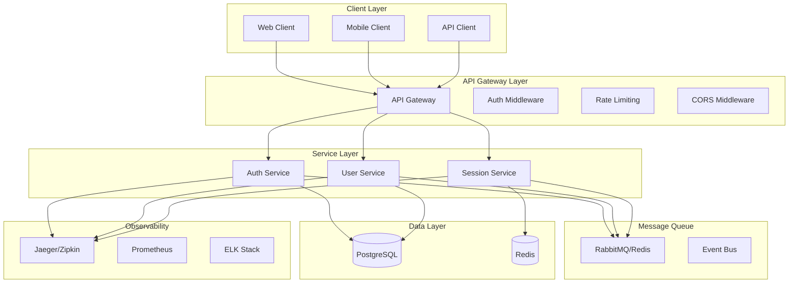

# 🎨 CREATIVE PHASE: SERVICE COMMUNICATION PATTERNS

**Date:** 2024-12-20  
**Component:** Service Communication Design  
**Type:** Architecture Design  
**Complexity:** Level 4 (Complex System)

━━━━━━━━━━━━━━━━━━━━━━━━━━━━━━━

## 1️⃣ PROBLEM

**Description:** Design communication patterns for a monorepo authentication system with multiple services that need to interact efficiently while maintaining security, reliability, and scalability.

**Requirements:**
- Enable secure inter-service communication
- Support synchronous and asynchronous communication
- Handle authentication and authorization across services
- Provide reliable error handling and retry mechanisms
- Support service discovery and health checking
- Enable monitoring and observability
- Support rate limiting and circuit breaking
- Handle distributed tracing and logging

**Constraints:**
- Must work within a monorepo structure
- Must support development and production environments
- Must maintain security best practices
- Must be testable with mocks
- Must support graceful degradation

## 2️⃣ OPTIONS

**Option A: Direct HTTP Communication with API Gateway**
- Services communicate directly via HTTP/REST APIs
- API Gateway handles routing, authentication, and rate limiting
- Simple to implement and debug
- Synchronous communication only

**Option B: Event-Driven Architecture with Message Queue**
- Services communicate via events and message queues
- Asynchronous communication with event sourcing
- Better scalability and loose coupling
- More complex to implement and debug

**Option C: Hybrid Communication with Service Mesh**
- Combination of direct HTTP and event-driven patterns
- Service mesh handles cross-cutting concerns
- Maximum flexibility and observability
- Highest complexity and resource requirements

## 3️⃣ ANALYSIS

| Criterion | Direct HTTP | Event-Driven | Hybrid |
|-----|-----|-----|-----|
| **Performance** | ⭐⭐⭐⭐ | ⭐⭐⭐ | ⭐⭐⭐⭐⭐ |
| **Scalability** | ⭐⭐ | ⭐⭐⭐⭐⭐ | ⭐⭐⭐⭐ |
| **Reliability** | ⭐⭐ | ⭐⭐⭐⭐ | ⭐⭐⭐⭐⭐ |
| **Complexity** | ⭐⭐⭐⭐⭐ | ⭐⭐ | ⭐ |
| **Debugging** | ⭐⭐⭐⭐⭐ | ⭐⭐ | ⭐⭐⭐ |
| **Security** | ⭐⭐⭐⭐ | ⭐⭐⭐ | ⭐⭐⭐⭐⭐ |
| **Testing** | ⭐⭐⭐⭐⭐ | ⭐⭐⭐ | ⭐⭐⭐ |

**Key Insights:**
- Direct HTTP is simplest but lacks scalability and reliability
- Event-driven provides best scalability but increases complexity
- Hybrid approach balances all concerns but requires more infrastructure

## 4️⃣ DECISION

**Selected:** Option C: Hybrid Communication with Service Mesh

**Rationale:** 
The hybrid approach provides the best balance of performance, scalability, reliability, and security. It allows for both synchronous communication when needed (like authentication checks) and asynchronous communication for better scalability (like audit logging). The service mesh provides excellent observability and security features.

## 5️⃣ IMPLEMENTATION NOTES

### Service Communication Architecture



### API Gateway Configuration

```javascript
// API Gateway setup with Express
const express = require('express');
const rateLimit = require('express-rate-limit');
const cors = require('cors');
const helmet = require('helmet');

const app = express();

// Security middleware
app.use(helmet());
app.use(cors({
  origin: process.env.ALLOWED_ORIGINS?.split(',') || ['http://localhost:3000'],
  credentials: true
}));

// Rate limiting
const limiter = rateLimit({
  windowMs: 15 * 60 * 1000, // 15 minutes
  max: 100, // limit each IP to 100 requests per windowMs
  message: 'Too many requests from this IP'
});
app.use('/api/', limiter);

// Service routing
app.use('/api/auth', createProxyMiddleware({
  target: 'http://auth-service:3001',
  changeOrigin: true,
  pathRewrite: {
    '^/api/auth': ''
  }
}));

app.use('/api/users', createProxyMiddleware({
  target: 'http://user-service:3002',
  changeOrigin: true,
  pathRewrite: {
    '^/api/users': ''
  }
}));

app.use('/api/sessions', createProxyMiddleware({
  target: 'http://session-service:3003',
  changeOrigin: true,
  pathRewrite: {
    '^/api/sessions': ''
  }
}));
```

### Inter-Service Communication

```javascript
// Service client with retry and circuit breaker
class ServiceClient {
  constructor(serviceName, baseUrl) {
    this.serviceName = serviceName;
    this.baseUrl = baseUrl;
    this.circuitBreaker = new CircuitBreaker();
  }

  async request(endpoint, options = {}) {
    const url = `${this.baseUrl}${endpoint}`;
    
    try {
      const response = await this.circuitBreaker.call(async () => {
        return await axios({
          url,
          method: options.method || 'GET',
          data: options.data,
          headers: {
            'Content-Type': 'application/json',
            'Authorization': options.token ? `Bearer ${options.token}` : undefined,
            'X-Service-Name': this.serviceName,
            'X-Request-ID': options.requestId,
            ...options.headers
          },
          timeout: options.timeout || 5000
        });
      });

      return response.data;
    } catch (error) {
      this.handleError(error, endpoint);
      throw error;
    }
  }

  handleError(error, endpoint) {
    // Log error for monitoring
    logger.error('Service communication error', {
      service: this.serviceName,
      endpoint,
      error: error.message,
      status: error.response?.status
    });

    // Update circuit breaker
    this.circuitBreaker.recordFailure();
  }
}

// Usage example
const authClient = new ServiceClient('auth-service', 'http://auth-service:3001');
const userClient = new ServiceClient('user-service', 'http://user-service:3002');
```

### Event-Driven Communication

```javascript
// Event bus implementation
class EventBus {
  constructor() {
    this.subscribers = new Map();
    this.redis = new Redis(process.env.REDIS_URL);
  }

  async publish(event, data) {
    const eventData = {
      id: uuidv4(),
      event,
      data,
      timestamp: new Date().toISOString(),
      source: process.env.SERVICE_NAME
    };

    // Publish to Redis
    await this.redis.publish('events', JSON.stringify(eventData));
    
    // Store for replay if needed
    await this.redis.lpush(`events:${event}`, JSON.stringify(eventData));
    await this.redis.ltrim(`events:${event}`, 0, 999); // Keep last 1000 events
  }

  async subscribe(event, handler) {
    if (!this.subscribers.has(event)) {
      this.subscribers.set(event, []);
    }
    this.subscribers.get(event).push(handler);
  }

  async handleEvent(eventData) {
    const handlers = this.subscribers.get(eventData.event) || [];
    await Promise.all(handlers.map(handler => handler(eventData)));
  }
}

// Event handlers
const eventBus = new EventBus();

// Auth service events
eventBus.subscribe('user.registered', async (event) => {
  await userService.createProfile(event.data.userId);
  await sessionService.createDefaultSession(event.data.userId);
});

eventBus.subscribe('user.login', async (event) => {
  await auditService.logLogin(event.data.userId, event.data.ipAddress);
  await sessionService.updateLastLogin(event.data.userId);
});

eventBus.subscribe('user.logout', async (event) => {
  await sessionService.invalidateSession(event.data.sessionId);
  await auditService.logLogout(event.data.userId);
});
```

### Service Discovery and Health Checks

```javascript
// Service registry
class ServiceRegistry {
  constructor() {
    this.services = new Map();
    this.redis = new Redis(process.env.REDIS_URL);
  }

  async register(serviceName, serviceUrl, healthCheckUrl) {
    const serviceInfo = {
      name: serviceName,
      url: serviceUrl,
      healthCheckUrl,
      status: 'healthy',
      lastCheck: new Date().toISOString(),
      metadata: {}
    };

    await this.redis.hset('services', serviceName, JSON.stringify(serviceInfo));
    this.services.set(serviceName, serviceInfo);
  }

  async getService(serviceName) {
    const serviceData = await this.redis.hget('services', serviceName);
    return serviceData ? JSON.parse(serviceData) : null;
  }

  async healthCheck() {
    for (const [serviceName, serviceInfo] of this.services) {
      try {
        const response = await axios.get(serviceInfo.healthCheckUrl, {
          timeout: 5000
        });
        
        if (response.status === 200) {
          await this.updateServiceStatus(serviceName, 'healthy');
        } else {
          await this.updateServiceStatus(serviceName, 'unhealthy');
        }
      } catch (error) {
        await this.updateServiceStatus(serviceName, 'unhealthy');
      }
    }
  }

  async updateServiceStatus(serviceName, status) {
    const serviceInfo = await this.getService(serviceName);
    if (serviceInfo) {
      serviceInfo.status = status;
      serviceInfo.lastCheck = new Date().toISOString();
      await this.redis.hset('services', serviceName, JSON.stringify(serviceInfo));
    }
  }
}
```

### Distributed Tracing

```javascript
// Tracing setup with OpenTelemetry
const { trace, context } = require('@opentelemetry/api');
const { NodeTracerProvider } = require('@opentelemetry/node');
const { SimpleSpanProcessor } = require('@opentelemetry/tracing');
const { JaegerExporter } = require('@opentelemetry/exporter-jaeger');

const provider = new NodeTracerProvider();
const exporter = new JaegerExporter({
  endpoint: process.env.JAEGER_ENDPOINT || 'http://localhost:14268/api/traces'
});

provider.addSpanProcessor(new SimpleSpanProcessor(exporter));
provider.register();

// Tracing middleware
const tracingMiddleware = (req, res, next) => {
  const tracer = trace.getTracer('auth-service');
  const span = tracer.startSpan(`${req.method} ${req.path}`);
  
  // Add trace context to request
  req.traceContext = context.active();
  req.span = span;
  
  // Add trace headers to response
  res.on('finish', () => {
    span.setAttributes({
      'http.status_code': res.statusCode,
      'http.method': req.method,
      'http.url': req.url
    });
    span.end();
  });
  
  next();
};

// Service communication with tracing
class TracedServiceClient extends ServiceClient {
  async request(endpoint, options = {}) {
    const tracer = trace.getTracer(this.serviceName);
    const span = tracer.startSpan(`${this.serviceName}.${endpoint}`);
    
    try {
      const result = await super.request(endpoint, {
        ...options,
        headers: {
          ...options.headers,
          'traceparent': trace.getSpan(context.active())?.context().traceId
        }
      });
      
      span.setStatus({ code: trace.SpanStatusCode.OK });
      return result;
    } catch (error) {
      span.setStatus({ code: trace.SpanStatusCode.ERROR, message: error.message });
      throw error;
    } finally {
      span.end();
    }
  }
}
```

### Error Handling and Retry Logic

```javascript
// Circuit breaker implementation
class CircuitBreaker {
  constructor(options = {}) {
    this.failureThreshold = options.failureThreshold || 5;
    this.resetTimeout = options.resetTimeout || 60000;
    this.failures = 0;
    this.lastFailureTime = null;
    this.state = 'CLOSED'; // CLOSED, OPEN, HALF_OPEN
  }

  async call(fn) {
    if (this.state === 'OPEN') {
      if (Date.now() - this.lastFailureTime > this.resetTimeout) {
        this.state = 'HALF_OPEN';
      } else {
        throw new Error('Circuit breaker is OPEN');
      }
    }

    try {
      const result = await fn();
      this.onSuccess();
      return result;
    } catch (error) {
      this.onFailure();
      throw error;
    }
  }

  onSuccess() {
    this.failures = 0;
    this.state = 'CLOSED';
  }

  onFailure() {
    this.failures++;
    this.lastFailureTime = Date.now();
    
    if (this.failures >= this.failureThreshold) {
      this.state = 'OPEN';
    }
  }
}

// Retry logic with exponential backoff
class RetryClient {
  constructor(maxRetries = 3, baseDelay = 1000) {
    this.maxRetries = maxRetries;
    this.baseDelay = baseDelay;
  }

  async execute(fn) {
    let lastError;
    
    for (let attempt = 0; attempt <= this.maxRetries; attempt++) {
      try {
        return await fn();
      } catch (error) {
        lastError = error;
        
        if (attempt === this.maxRetries) {
          break;
        }
        
        const delay = this.baseDelay * Math.pow(2, attempt);
        await new Promise(resolve => setTimeout(resolve, delay));
      }
    }
    
    throw lastError;
  }
}
```

### Mock Testing Strategy

```javascript
// Mock service client for testing
class MockServiceClient extends ServiceClient {
  constructor(mockResponses = {}) {
    super('mock-service', 'http://mock-service:3000');
    this.mockResponses = mockResponses;
    this.calls = [];
  }

  async request(endpoint, options = {}) {
    this.calls.push({ endpoint, options });
    
    const mockKey = `${options.method || 'GET'}:${endpoint}`;
    const mockResponse = this.mockResponses[mockKey];
    
    if (mockResponse) {
      if (mockResponse.error) {
        throw new Error(mockResponse.error);
      }
      return mockResponse.data;
    }
    
    throw new Error(`No mock response for ${mockKey}`);
  }

  getCalls() {
    return this.calls;
  }

  clearCalls() {
    this.calls = [];
  }
}

// Usage in tests
describe('Auth Service Integration', () => {
  let mockUserClient;
  
  beforeEach(() => {
    mockUserClient = new MockServiceClient({
      'GET:/users/profile': { data: { id: 'user-1', email: 'test@example.com' } },
      'POST:/users': { data: { id: 'user-2', email: 'new@example.com' } }
    });
  });

  it('should create user profile on registration', async () => {
    // Test implementation
  });
});
```

━━━━━━━━━━━━━━━━━━━━━━━━━━━━━━━
📌 CREATIVE PHASE END: SERVICE COMMUNICATION PATTERNS 