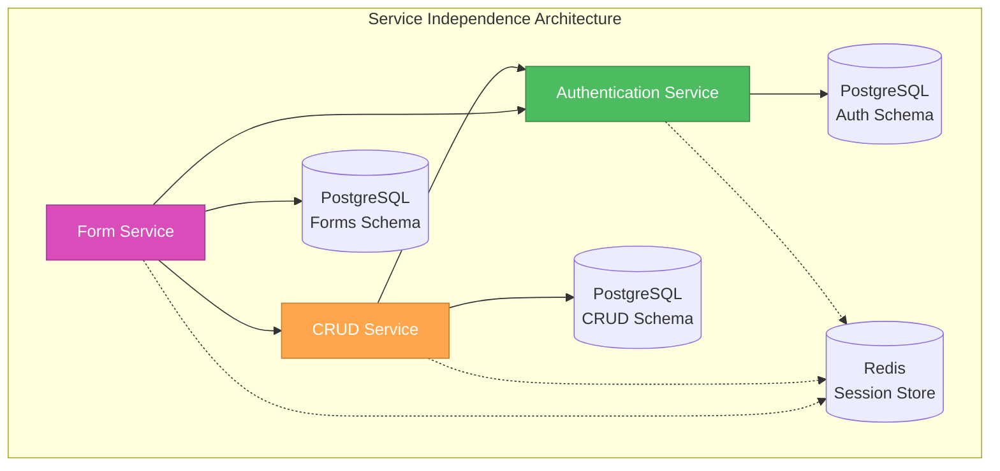
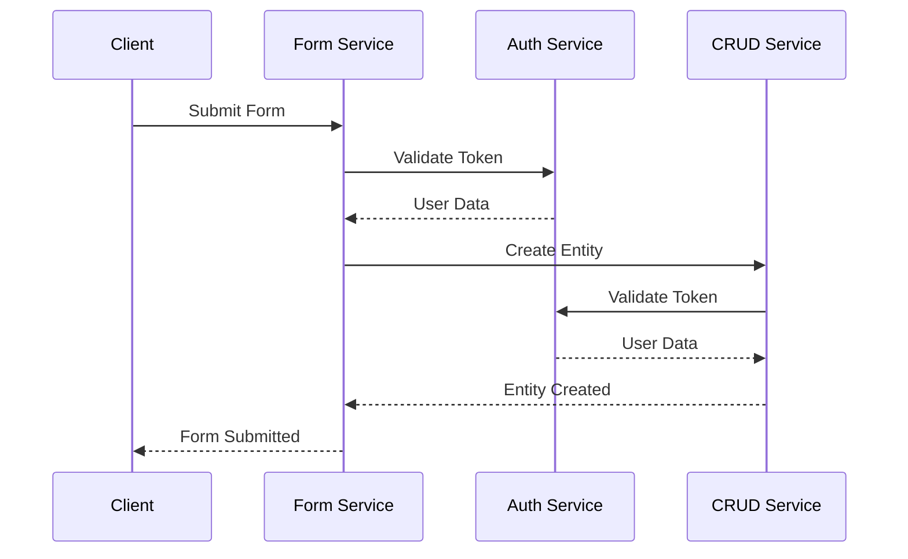

# 🎨🎨🎨 ENTERING CREATIVE PHASE: SERVICE INDEPENDENCE DESIGN 🎨🎨🎨

## PROBLEM STATEMENT

Design independent development patterns that:
- Maintain complete service separation in the monorepo
- Enable independent development, testing, and deployment
- Facilitate service-to-service communication via HTTP APIs
- Ensure no shared code between services initially
- Support future refactoring to extract shared utilities
- Provide clear boundaries and responsibilities for each service

## CONTEXT & REQUIREMENTS

### Functional Requirements
- Independent service development workflows
- Service-to-service communication patterns
- Error handling and retry mechanisms
- Service discovery and configuration
- Independent testing strategies
- Deployment isolation

### Non-Functional Requirements
- Independence: No shared code between services
- Maintainability: Clear service boundaries
- Testability: Independent testing per service
- Scalability: Independent scaling capabilities
- Flexibility: Easy to extract shared utilities later

### Technical Constraints
- Node.js/Express.js for all services
- PostgreSQL with service-specific schemas
- Redis for session management
- HTTP APIs for inter-service communication
- npm workspaces for monorepo management

## OPTIONS ANALYSIS

### Option 1: Minimal Independence
**Description**: Basic service separation with some shared utilities
- Independent services with basic separation
- Some shared configuration and utilities
- Simple service-to-service communication
- Basic error handling

**Pros**:
- Simple to implement
- Fast development time
- Easy to understand
- Minimal complexity

**Cons**:
- Limited independence
- Potential for tight coupling
- Difficult to extract shared code later
- Less scalable

**Complexity**: Low
**Implementation Time**: 1-2 weeks

### Option 2: Complete Independence with API Gateway
**Description**: Fully independent services with API gateway pattern
- Complete service separation
- API gateway for service routing
- Comprehensive service-to-service communication
- Advanced error handling and retry mechanisms
- Service discovery and health checks

**Pros**:
- Maximum independence
- Clear service boundaries
- Easy to extract shared utilities
- Scalable architecture
- Better testing isolation

**Cons**:
- Higher complexity
- More infrastructure overhead
- Steeper learning curve
- More potential failure points

**Complexity**: High
**Implementation Time**: 3-4 weeks

### Option 3: Balanced Independence
**Description**: Independent services with minimal shared infrastructure
- Independent services with clear boundaries
- Service-to-service communication via HTTP APIs
- Shared only essential infrastructure (database, Redis)
- Comprehensive error handling
- Independent testing and deployment

**Pros**:
- Good balance of independence and simplicity
- Clear service boundaries
- Easy to extract shared utilities later
- Appropriate complexity for hobby project
- Scalable without over-engineering

**Cons**:
- Moderate complexity
- Some infrastructure overhead
- Requires careful API design

**Complexity**: Medium
**Implementation Time**: 2-3 weeks

## DECISION

**Chosen Option**: Option 3 - Balanced Independence

**Rationale**:
- Provides the right balance for a hobby project
- Maintains service independence without over-engineering
- Enables easy extraction of shared utilities later
- Supports future growth and scaling
- Aligns with modern microservices patterns

**Implementation Considerations**:
- Use HTTP APIs for all inter-service communication
- Implement comprehensive error handling
- Create clear service boundaries
- Design for future shared utility extraction
- Maintain independent testing strategies

## ARCHITECTURE DESIGN

### Service Independence Pattern


### Service Communication Flow


## MONOREPO STRUCTURE DESIGN

### Project Organization
```
project-root/
├── package.json                 # Root with workspaces
├── packages/
│   ├── auth-service/           # Authentication Service
│   │   ├── package.json       # Independent dependencies
│   │   ├── src/
│   │   │   ├── routes/        # Service-specific routes
│   │   │   ├── controllers/   # Service-specific controllers
│   │   │   ├── models/        # Service-specific models
│   │   │   ├── middleware/    # Service-specific middleware
│   │   │   ├── services/      # Service-specific business logic
│   │   │   ├── utils/         # Service-specific utilities
│   │   │   └── config/        # Service-specific configuration
│   │   ├── tests/             # Independent test suite
│   │   ├── docs/              # Service-specific documentation
│   │   └── README.md
│   ├── crud-service/          # CRUD Service
│   │   ├── package.json       # Independent dependencies
│   │   ├── src/
│   │   │   ├── routes/        # Service-specific routes
│   │   │   ├── controllers/   # Service-specific controllers
│   │   │   ├── models/        # Service-specific models
│   │   │   ├── middleware/    # Service-specific middleware
│   │   │   ├── services/      # Service-specific business logic
│   │   │   ├── utils/         # Service-specific utilities
│   │   │   └── config/        # Service-specific configuration
│   │   ├── tests/             # Independent test suite
│   │   ├── docs/              # Service-specific documentation
│   │   └── README.md
│   └── form-service/          # Form Service
│       ├── package.json       # Independent dependencies
│       ├── src/
│       │   ├── routes/        # Service-specific routes
│       │   ├── controllers/   # Service-specific controllers
│       │   ├── models/        # Service-specific models
│       │   ├── middleware/    # Service-specific middleware
│       │   ├── services/      # Service-specific business logic
│       │   ├── utils/         # Service-specific utilities
│       │   └── config/        # Service-specific configuration
│       ├── tests/             # Independent test suite
│       ├── docs/              # Service-specific documentation
│       └── README.md
├── scripts/                   # Build and deployment scripts
├── docs/                     # Project documentation
└── docker-compose.yml        # Development environment
```

### Root Package.json Configuration
```json
{
  "name": "three-services-monorepo",
  "version": "1.0.0",
  "private": true,
  "workspaces": [
    "packages/*"
  ],
  "scripts": {
    "dev": "concurrently \"npm run dev:auth\" \"npm run dev:crud\" \"npm run dev:form\"",
    "dev:auth": "npm run dev --workspace=auth-service",
    "dev:crud": "npm run dev --workspace=crud-service",
    "dev:form": "npm run dev --workspace=form-service",
    "build": "npm run build --workspaces",
    "test": "npm run test --workspaces",
    "lint": "npm run lint --workspaces",
    "clean": "npm run clean --workspaces"
  },
  "devDependencies": {
    "concurrently": "^8.0.0",
    "typescript": "^5.0.0",
    "eslint": "^8.0.0",
    "prettier": "^3.0.0"
  }
}
```

## SERVICE-TO-SERVICE COMMUNICATION PATTERNS

### HTTP Client Implementation
```javascript
// Service HTTP Client (each service has its own)
class ServiceClient {
  constructor(baseURL, timeout = 5000) {
    this.baseURL = baseURL;
    this.timeout = timeout;
    this.axios = axios.create({
      baseURL,
      timeout,
      headers: {
        'Content-Type': 'application/json'
      }
    });
  }

  async request(method, url, data = null, headers = {}) {
    try {
      const response = await this.axios.request({
        method,
        url,
        data,
        headers
      });
      return response.data;
    } catch (error) {
      throw new ServiceCommunicationError(
        `Failed to communicate with ${this.baseURL}${url}`,
        error.response?.status,
        error.response?.data
      );
    }
  }

  async get(url, headers = {}) {
    return this.request('GET', url, null, headers);
  }

  async post(url, data, headers = {}) {
    return this.request('POST', url, data, headers);
  }

  async put(url, data, headers = {}) {
    return this.request('PUT', url, data, headers);
  }

  async delete(url, headers = {}) {
    return this.request('DELETE', url, null, headers);
  }
}
```

### Authentication Service Integration
```javascript
// CRUD Service - Authentication Integration
class AuthService {
  constructor() {
    this.authClient = new ServiceClient(process.env.AUTH_SERVICE_URL);
  }

  async validateToken(token) {
    try {
      const response = await this.authClient.get('/auth/validate', {
        'Authorization': `Bearer ${token}`
      });
      return response.data;
    } catch (error) {
      throw new AuthenticationError('Invalid or expired token');
    }
  }

  async getUserProfile(token) {
    try {
      const response = await this.authClient.get('/auth/profile', {
        'Authorization': `Bearer ${token}`
      });
      return response.data;
    } catch (error) {
      throw new AuthenticationError('Failed to get user profile');
    }
  }
}
```

### Error Handling Patterns
```javascript
// Custom Error Classes
class ServiceCommunicationError extends Error {
  constructor(message, statusCode, responseData) {
    super(message);
    this.name = 'ServiceCommunicationError';
    this.statusCode = statusCode;
    this.responseData = responseData;
  }
}

class AuthenticationError extends Error {
  constructor(message) {
    super(message);
    this.name = 'AuthenticationError';
  }
}

// Error Handling Middleware
const errorHandler = (error, req, res, next) => {
  console.error('Error:', error);

  if (error instanceof ServiceCommunicationError) {
    return res.status(error.statusCode || 502).json({
      success: false,
      error: {
        code: 'SERVICE_COMMUNICATION_ERROR',
        message: error.message,
        details: error.responseData
      }
    });
  }

  if (error instanceof AuthenticationError) {
    return res.status(401).json({
      success: false,
      error: {
        code: 'AUTHENTICATION_ERROR',
        message: error.message
      }
    });
  }

  // Default error response
  return res.status(500).json({
    success: false,
    error: {
      code: 'INTERNAL_SERVER_ERROR',
      message: 'An unexpected error occurred'
    }
  });
};
```

## INDEPENDENT DEVELOPMENT PATTERNS

### Service-Specific Configuration
```javascript
// Each service has its own configuration
// auth-service/src/config/index.js
const config = {
  port: process.env.AUTH_SERVICE_PORT || 3001,
  database: {
    url: process.env.DATABASE_URL,
    schema: 'auth'
  },
  redis: {
    url: process.env.REDIS_URL
  },
  jwt: {
    secret: process.env.JWT_SECRET,
    refreshSecret: process.env.JWT_REFRESH_SECRET,
    accessTokenExpiry: '15m',
    refreshTokenExpiry: '7d'
  },
  cors: {
    origin: process.env.ALLOWED_ORIGINS?.split(',') || ['http://localhost:3000']
  },
  rateLimit: {
    windowMs: 15 * 60 * 1000, // 15 minutes
    max: 100 // limit each IP to 100 requests per windowMs
  }
};

module.exports = config;
```

### Service-Specific Dependencies
```javascript
// auth-service/package.json
{
  "name": "auth-service",
  "version": "1.0.0",
  "main": "src/index.js",
  "scripts": {
    "dev": "nodemon src/index.js",
    "start": "node src/index.js",
    "test": "jest",
    "lint": "eslint src/",
    "build": "echo 'No build step needed'"
  },
  "dependencies": {
    "express": "^4.18.2",
    "pg": "^8.11.0",
    "bcrypt": "^5.1.0",
    "jsonwebtoken": "^9.0.0",
    "redis": "^4.6.0",
    "joi": "^17.9.0",
    "helmet": "^7.0.0",
    "express-rate-limit": "^6.7.0",
    "axios": "^1.4.0"
  },
  "devDependencies": {
    "nodemon": "^3.0.0",
    "jest": "^29.0.0",
    "supertest": "^6.3.0",
    "eslint": "^8.0.0"
  }
}
```

### Service-Specific Testing
```javascript
// auth-service/tests/auth.test.js
const request = require('supertest');
const app = require('../src/app');
const { setupTestDatabase, cleanupTestDatabase } = require('./testUtils');

describe('Authentication Service', () => {
  beforeAll(async () => {
    await setupTestDatabase();
  });

  afterAll(async () => {
    await cleanupTestDatabase();
  });

  describe('POST /auth/register', () => {
    it('should register a new user successfully', async () => {
      const response = await request(app)
        .post('/auth/register')
        .send({
          email: 'test@example.com',
          password: 'SecurePass123',
          firstName: 'John',
          lastName: 'Doe'
        });

      expect(response.status).toBe(201);
      expect(response.body.success).toBe(true);
      expect(response.body.data.user.email).toBe('test@example.com');
    });
  });

  describe('POST /auth/login', () => {
    it('should login user and return tokens', async () => {
      const response = await request(app)
        .post('/auth/login')
        .send({
          email: 'test@example.com',
          password: 'SecurePass123'
        });

      expect(response.status).toBe(200);
      expect(response.body.data.tokens).toHaveProperty('accessToken');
      expect(response.body.data.tokens).toHaveProperty('refreshToken');
    });
  });
});
```

## SERVICE DISCOVERY AND CONFIGURATION

### Environment-Based Service Discovery
```javascript
// Service configuration for each service
const serviceConfig = {
  auth: {
    url: process.env.AUTH_SERVICE_URL || 'http://localhost:3001',
    timeout: 5000,
    retries: 3
  },
  crud: {
    url: process.env.CRUD_SERVICE_URL || 'http://localhost:3002',
    timeout: 5000,
    retries: 3
  },
  form: {
    url: process.env.FORM_SERVICE_URL || 'http://localhost:3003',
    timeout: 5000,
    retries: 3
  }
};

// Service client factory
class ServiceClientFactory {
  static createClient(serviceName) {
    const config = serviceConfig[serviceName];
    if (!config) {
      throw new Error(`Unknown service: ${serviceName}`);
    }
    return new ServiceClient(config.url, config.timeout);
  }
}
```

### Health Check Implementation
```javascript
// Health check endpoint for each service
app.get('/health', async (req, res) => {
  try {
    // Check database connection
    await db.query('SELECT 1');
    
    // Check Redis connection
    await redis.ping();
    
    res.json({
      status: 'healthy',
      service: 'auth-service',
      timestamp: new Date().toISOString(),
      uptime: process.uptime()
    });
  } catch (error) {
    res.status(503).json({
      status: 'unhealthy',
      service: 'auth-service',
      error: error.message,
      timestamp: new Date().toISOString()
    });
  }
});
```

## DEPLOYMENT INDEPENDENCE

### Service-Specific Docker Configuration
```dockerfile
# auth-service/Dockerfile
FROM node:18-alpine

WORKDIR /app

# Copy package files
COPY package*.json ./

# Install dependencies
RUN npm ci --only=production

# Copy application code
COPY . .

# Expose service port
EXPOSE 3001

# Health check
HEALTHCHECK --interval=30s --timeout=3s --start-period=5s --retries=3 \
  CMD curl -f http://localhost:3001/health || exit 1

# Start application
CMD ["npm", "start"]
```

### Independent Deployment Scripts
```bash
#!/bin/bash
# scripts/deploy-auth.sh

echo "Deploying Authentication Service..."

# Build the service
docker build -t auth-service ./packages/auth-service

# Stop existing container
docker stop auth-service || true
docker rm auth-service || true

# Run new container
docker run -d \
  --name auth-service \
  --network three-services-network \
  -p 3001:3001 \
  -e DATABASE_URL=$DATABASE_URL \
  -e REDIS_URL=$REDIS_URL \
  -e JWT_SECRET=$JWT_SECRET \
  auth-service

echo "Authentication Service deployed successfully!"
```

## FUTURE REFACTORING STRATEGY

### Shared Utility Extraction Process
```javascript
// When common patterns emerge, extract to shared package
// packages/shared/package.json
{
  "name": "@three-services/shared",
  "version": "1.0.0",
  "main": "src/index.js",
  "exports": {
    "./database": "./src/database/index.js",
    "./validation": "./src/validation/index.js",
    "./errors": "./src/errors/index.js",
    "./middleware": "./src/middleware/index.js"
  },
  "dependencies": {
    "express": "^4.18.2",
    "joi": "^17.9.0",
    "pg": "^8.11.0"
  }
}
```

### Migration Strategy
```javascript
// Step 1: Identify common patterns
// Step 2: Create shared package
// Step 3: Update services to use shared utilities
// Step 4: Remove duplicated code from services

// Example: Shared database utilities
// packages/shared/src/database/index.js
class DatabaseConnection {
  constructor(config) {
    this.config = config;
    this.pool = null;
  }

  async connect() {
    // Shared connection logic
  }

  async query(sql, params) {
    // Shared query logic
  }
}

module.exports = { DatabaseConnection };
```

## IMPLEMENTATION PLAN

### Phase 1: Service Independence Setup (Week 1)
1. Set up monorepo structure with npm workspaces
2. Create independent service directories
3. Implement service-specific configurations
4. Set up independent testing frameworks
5. Create service-to-service communication patterns

### Phase 2: Service Integration (Week 2)
1. Implement HTTP client for inter-service communication
2. Add comprehensive error handling
3. Create health check endpoints
4. Implement service discovery
5. Add logging and monitoring per service

### Phase 3: Deployment Independence (Week 3)
1. Create service-specific Docker configurations
2. Implement independent deployment scripts
3. Add environment-specific configurations
4. Create deployment documentation
5. Test independent deployment workflows

## TESTING STRATEGY

### Independent Testing
- Unit tests per service
- Integration tests for service boundaries
- End-to-end tests for service communication
- Performance tests per service

### Service Communication Testing
```javascript
// Test service-to-service communication
describe('Service Communication', () => {
  it('should communicate with auth service', async () => {
    const authClient = ServiceClientFactory.createClient('auth');
    const response = await authClient.get('/auth/health');
    expect(response.status).toBe('healthy');
  });
});
```

## 🎨 CREATIVE CHECKPOINT: SERVICE INDEPENDENCE DESIGN COMPLETE

The Service Independence Design is complete with:
- ✅ Complete service separation in monorepo
- ✅ Independent development patterns and workflows
- ✅ Service-to-service communication via HTTP APIs
- ✅ Comprehensive error handling and retry mechanisms
- ✅ Independent testing and deployment strategies
- ✅ Future refactoring strategy for shared utilities
- ✅ Implementation plan with clear phases

## 🎨🎨🎨 EXITING CREATIVE PHASE - SERVICE INDEPENDENCE DESIGN DECISION MADE 🎨🎨🎨 