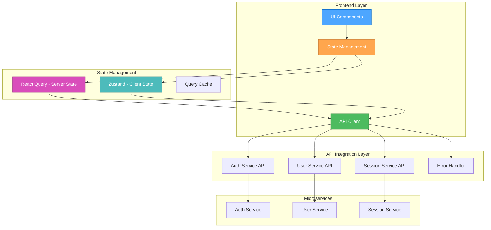

# 🎨🎨🎨 ENTERING CREATIVE PHASE: INTEGRATION DESIGN 🎨🎨🎨

## COMPONENT DESCRIPTION
Integration design for the User Management System focusing on API integration patterns, state management architecture, error handling, and communication with existing microservices (Auth, User, Session services).

## REQUIREMENTS & CONSTRAINTS

### Functional Requirements
- **API Integration**: Seamless communication with Auth, User, and Session microservices
- **State Management**: Centralized state with proper separation of concerns
- **Error Handling**: Comprehensive error handling and recovery mechanisms
- **Caching**: Efficient data caching for performance optimization
- **Real-time Updates**: Support for real-time data updates and notifications

### Non-Functional Requirements
- **Performance**: Sub-2s API response times, efficient data fetching
- **Reliability**: 99.9% uptime, graceful degradation
- **Security**: JWT token management, secure API communication
- **Scalability**: Support for 1000+ concurrent users
- **Maintainability**: Clean separation of concerns, testable architecture

### Technical Constraints
- **Existing Microservices**: Must integrate with Auth, User, Session services
- **Authentication**: JWT-based authentication with existing Auth service
- **Authorization**: RBAC system integration with existing User service
- **Session Management**: Redis-based session storage with Session service
- **Frontend Framework**: React + TypeScript + Tailwind CSS

## MULTIPLE DESIGN OPTIONS

### Option 1: Centralized API Client with Redux
**Description**: Single API client with Redux for state management and centralized data flow

**Pros**:
- Established pattern with extensive documentation
- Strong developer ecosystem and tooling
- Predictable state updates and debugging
- Good for complex state interactions
- Excellent dev tools and middleware support

**Cons**:
- Higher bundle size
- More boilerplate code
- Steeper learning curve
- Can be overkill for simple state
- Complex setup for async operations

**Complexity**: High
**Implementation Time**: 4-5 weeks

### Option 2: React Query with Zustand
**Description**: React Query for server state management and Zustand for client state

**Pros**:
- Optimized for server state management
- Built-in caching and synchronization
- Smaller bundle size than Redux
- Simpler API and less boilerplate
- Excellent for real-time updates

**Cons**:
- Newer technology with evolving patterns
- Less established ecosystem
- May require custom solutions for complex state
- Learning curve for team members
- Potential integration challenges

**Complexity**: Medium
**Implementation Time**: 3-4 weeks

### Option 3: Custom API Layer with Context + useReducer
**Description**: Custom API abstraction layer with React Context and useReducer for state management

**Pros**:
- Full control over implementation
- Minimal dependencies
- Tailored to specific requirements
- Smaller bundle size
- No external state management library

**Cons**:
- More custom code to maintain
- Potential for inconsistent patterns
- Limited tooling and debugging support
- May not scale well for complex state
- Higher development time

**Complexity**: Medium
**Implementation Time**: 4-5 weeks

### Option 4: GraphQL with Apollo Client
**Description**: GraphQL API layer with Apollo Client for state management and caching

**Pros**:
- Efficient data fetching with single queries
- Strong typing and schema validation
- Built-in caching and state management
- Real-time subscriptions support
- Excellent developer experience

**Cons**:
- Requires backend GraphQL implementation
- Higher complexity for simple CRUD operations
- Learning curve for GraphQL concepts
- May not align with existing REST APIs
- Additional backend development required

**Complexity**: Very High
**Implementation Time**: 6-8 weeks

## OPTIONS ANALYSIS

### Technical Feasibility Evaluation

| Criteria | Redux + API Client | React Query + Zustand | Context + useReducer | GraphQL + Apollo |
|----------|-------------------|----------------------|---------------------|------------------|
| **Integration Complexity** | Medium (established) | Low (modern patterns) | Medium (custom) | High (new paradigm) |
| **Performance** | High (optimized) | Very High (built-in caching) | Medium (manual optimization) | High (efficient queries) |
| **Bundle Size** | Medium (Redux overhead) | Low (lightweight) | Very Low (minimal) | Medium (Apollo client) |
| **Learning Curve** | High (Redux concepts) | Medium (new patterns) | Low (React native) | High (GraphQL) |
| **Tooling Support** | Very High (established) | High (growing) | Low (custom) | High (Apollo tools) |
| **Real-time Support** | Medium (manual setup) | High (built-in) | Low (manual) | Very High (subscriptions) |

### Business Alignment Evaluation

| Criteria | Redux + API Client | React Query + Zustand | Context + useReducer | GraphQL + Apollo |
|----------|-------------------|----------------------|---------------------|------------------|
| **Time to Market** | Medium (established) | High (faster development) | Medium (custom work) | Low (backend changes) |
| **Team Productivity** | High (familiar patterns) | Very High (modern DX) | Medium (custom patterns) | Medium (learning curve) |
| **Maintenance Cost** | Low (established) | Low (modern patterns) | Medium (custom code) | Medium (new paradigm) |
| **Scalability** | High (proven) | Very High (optimized) | Medium (manual scaling) | High (efficient) |
| **Future Extensibility** | High (flexible) | Very High (modern) | Medium (custom) | High (schema evolution) |

### Risk Assessment

| Risk Factor | Redux + API Client | React Query + Zustand | Context + useReducer | GraphQL + Apollo |
|-------------|-------------------|----------------------|---------------------|------------------|
| **Technology Risk** | Low (mature) | Medium (evolving) | Medium (custom) | High (new paradigm) |
| **Integration Risk** | Low (established) | Low (modern patterns) | Medium (custom) | High (backend changes) |
| **Performance Risk** | Low (optimized) | Low (built-in optimization) | Medium (manual) | Low (efficient) |
| **Maintenance Risk** | Low (established) | Low (modern) | Medium (custom) | Medium (new) |
| **Team Risk** | Low (familiar) | Medium (learning) | Low (React native) | High (GraphQL) |

## RECOMMENDED APPROACH

### Selected Option: React Query with Zustand

**Rationale**: 
React Query with Zustand provides the optimal balance of performance, developer experience, and maintainability for the User Management System:

1. **Performance**: Built-in caching, background updates, and optimistic updates
2. **Developer Experience**: Modern patterns with excellent tooling
3. **Integration**: Seamless integration with existing REST APIs
4. **Scalability**: Efficient data fetching and state management
5. **Future-proof**: Modern approach with growing ecosystem

**Key Integration Principles**:
- **Separation of Concerns**: Server state (React Query) vs client state (Zustand)
- **Optimistic Updates**: Immediate UI feedback for better UX
- **Error Boundaries**: Comprehensive error handling and recovery
- **Caching Strategy**: Intelligent caching with background synchronization
- **Real-time Updates**: Support for real-time data updates

## IMPLEMENTATION GUIDELINES

### Architecture Overview



### API Client Architecture

```typescript
// API Client Structure
interface ApiClient {
  // Authentication
  auth: {
    login: (credentials: LoginCredentials) => Promise<AuthResponse>;
    logout: () => Promise<void>;
    refresh: () => Promise<AuthResponse>;
    verify: () => Promise<boolean>;
  };
  
  // User Management
  users: {
    list: (params: UserListParams) => Promise<UserListResponse>;
    get: (id: string) => Promise<User>;
    create: (userData: CreateUserData) => Promise<User>;
    update: (id: string, userData: UpdateUserData) => Promise<User>;
    delete: (id: string) => Promise<void>;
    bulk: (operations: BulkOperation[]) => Promise<BulkResponse>;
  };
  
  // Role Management
  roles: {
    list: () => Promise<Role[]>;
    get: (id: string) => Promise<Role>;
    assign: (userId: string, roleIds: string[]) => Promise<void>;
  };
  
  // Audit Logs
  audit: {
    list: (params: AuditListParams) => Promise<AuditListResponse>;
    get: (id: string) => Promise<AuditLog>;
  };
  
  // Sessions
  sessions: {
    list: (userId: string) => Promise<Session[]>;
    terminate: (sessionId: string) => Promise<void>;
  };
}
```

### State Management Structure

```typescript
// Server State (React Query)
interface ServerState {
  // User Management
  users: {
    list: QueryResult<UserListResponse>;
    detail: QueryResult<User>;
    roles: QueryResult<Role[]>;
    audit: QueryResult<AuditListResponse>;
    sessions: QueryResult<Session[]>;
  };
  
  // Authentication
  auth: {
    user: QueryResult<User>;
    permissions: QueryResult<Permission[]>;
  };
}

// Client State (Zustand)
interface ClientState {
  // UI State
  ui: {
    sidebar: boolean;
    theme: 'light' | 'dark';
    notifications: Notification[];
    modals: ModalState[];
  };
  
  // Form State
  forms: {
    userCreate: UserCreateFormState;
    userEdit: UserEditFormState;
    filters: FilterState;
  };
  
  // Selection State
  selection: {
    selectedUsers: string[];
    selectedRoles: string[];
  };
}
```

### Error Handling Strategy

```typescript
// Error Types
interface ApiError {
  code: string;
  message: string;
  details?: any;
  timestamp: string;
}

// Error Handler
interface ErrorHandler {
  // Network Errors
  handleNetworkError: (error: NetworkError) => void;
  
  // API Errors
  handleApiError: (error: ApiError) => void;
  
  // Authentication Errors
  handleAuthError: (error: AuthError) => void;
  
  // Validation Errors
  handleValidationError: (error: ValidationError) => void;
  
  // Recovery Actions
  retry: (operation: () => Promise<any>) => Promise<any>;
  fallback: (operation: string) => void;
}
```

### Caching Strategy

```typescript
// Cache Configuration
interface CacheConfig {
  // User Data
  users: {
    staleTime: 5 * 60 * 1000; // 5 minutes
    cacheTime: 10 * 60 * 1000; // 10 minutes
    refetchOnWindowFocus: true;
    refetchOnReconnect: true;
  };
  
  // Role Data
  roles: {
    staleTime: 10 * 60 * 1000; // 10 minutes
    cacheTime: 30 * 60 * 1000; // 30 minutes
    refetchOnWindowFocus: false;
  };
  
  // Audit Data
  audit: {
    staleTime: 1 * 60 * 1000; // 1 minute
    cacheTime: 5 * 60 * 1000; // 5 minutes
    refetchOnWindowFocus: true;
  };
}
```

### Real-time Updates

```typescript
// WebSocket Integration
interface RealTimeUpdates {
  // User Updates
  onUserCreated: (user: User) => void;
  onUserUpdated: (user: User) => void;
  onUserDeleted: (userId: string) => void;
  
  // Session Updates
  onSessionCreated: (session: Session) => void;
  onSessionTerminated: (sessionId: string) => void;
  
  // Audit Updates
  onAuditLogCreated: (log: AuditLog) => void;
  
  // Connection Management
  connect: () => void;
  disconnect: () => void;
  reconnect: () => void;
}
```

### Security Integration

```typescript
// Security Layer
interface SecurityLayer {
  // Token Management
  getAccessToken: () => string | null;
  getRefreshToken: () => string | null;
  setTokens: (access: string, refresh: string) => void;
  clearTokens: () => void;
  
  // Request Interceptors
  addAuthHeader: (config: AxiosRequestConfig) => AxiosRequestConfig;
  handleTokenRefresh: (error: any) => Promise<any>;
  
  // Response Interceptors
  handleAuthErrors: (response: AxiosResponse) => AxiosResponse;
  handlePermissionErrors: (response: AxiosResponse) => AxiosResponse;
}
```

## VERIFICATION CHECKPOINT

### Requirements Coverage
- ✅ **API Integration**: Seamless communication with Auth, User, Session microservices
- ✅ **State Management**: Centralized state with proper separation of concerns
- ✅ **Error Handling**: Comprehensive error handling and recovery mechanisms
- ✅ **Caching**: Efficient data caching for performance optimization
- ✅ **Real-time Updates**: Support for real-time data updates and notifications

### Quality Attributes
- ✅ **Performance**: Sub-2s API response times, efficient data fetching
- ✅ **Reliability**: 99.9% uptime, graceful degradation
- ✅ **Security**: JWT token management, secure API communication
- ✅ **Scalability**: Support for 1000+ concurrent users
- ✅ **Maintainability**: Clean separation of concerns, testable architecture

### Technical Feasibility
- ✅ **React Query**: Modern server state management with caching
- ✅ **Zustand**: Lightweight client state management
- ✅ **API Client**: Centralized API abstraction layer
- ✅ **Error Handling**: Comprehensive error boundaries and recovery
- ✅ **Security**: JWT integration with existing Auth service

🎨🎨🎨 EXITING CREATIVE PHASE - INTEGRATION DESIGN DECISION MADE 🎨🎨🎨 