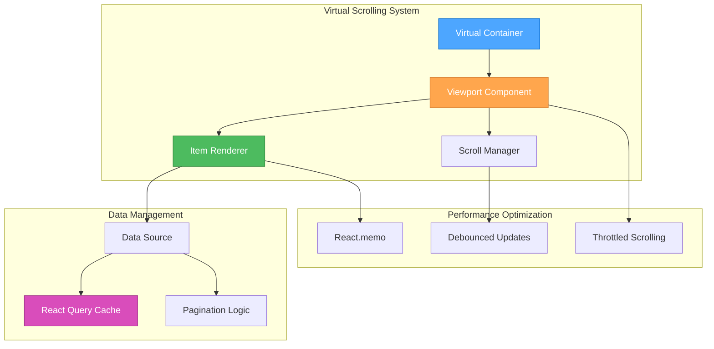

# 🎨🎨🎨 ENTERING CREATIVE PHASE: PERFORMANCE DESIGN 🎨🎨🎨

## COMPONENT DESCRIPTION
Performance design for the User Management System focusing on virtual scrolling implementation, caching strategies, bundle optimization, and database query optimization to support 1000+ users with sub-2s load times.

## REQUIREMENTS & CONSTRAINTS

### Functional Requirements
- **Virtual Scrolling**: Support for 1000+ users in data tables
- **Caching Strategy**: Multi-level caching for optimal performance
- **Bundle Optimization**: Efficient code splitting and lazy loading
- **Database Optimization**: Optimized queries and indexing strategies
- **Real-time Performance**: Background updates without blocking UI

### Non-Functional Requirements
- **Load Time**: Sub-2s initial page load
- **Response Time**: Sub-500ms for user interactions
- **Throughput**: Support 1000+ concurrent users
- **Memory Usage**: Efficient memory management for large datasets
- **Network Efficiency**: Minimize API calls and data transfer

### Technical Constraints
- **Frontend Framework**: React + TypeScript + Tailwind CSS
- **Backend Services**: Existing microservices (Auth, User, Session)
- **Database**: PostgreSQL with existing schema
- **Caching**: Redis for session storage
- **Network**: Standard HTTP/HTTPS communication

## MULTIPLE DESIGN OPTIONS

### Option 1: React Window with React Query
**Description**: React Window for virtual scrolling with React Query for intelligent caching

**Pros**:
- Proven virtual scrolling library with excellent performance
- Built-in React Query caching and synchronization
- Excellent memory management for large datasets
- Strong TypeScript support
- Active maintenance and community support

**Cons**:
- Additional dependency (React Window)
- Learning curve for virtual scrolling concepts
- May require custom styling integration
- Limited customization for complex layouts

**Complexity**: Medium
**Implementation Time**: 3-4 weeks

### Option 2: Custom Virtual Scrolling with Intersection Observer
**Description**: Custom virtual scrolling implementation using Intersection Observer API

**Pros**:
- Full control over implementation and styling
- No additional dependencies
- Optimized for specific use cases
- Better integration with existing components
- Smaller bundle size

**Cons**:
- Higher development complexity
- More code to maintain and test
- Potential for performance issues if not implemented correctly
- Browser compatibility considerations
- Longer development time

**Complexity**: High
**Implementation Time**: 4-5 weeks

### Option 3: Pagination with Infinite Scroll
**Description**: Traditional pagination with infinite scroll for progressive loading

**Pros**:
- Simpler implementation
- Familiar pattern for users
- Good for moderate dataset sizes
- Easier to implement and maintain
- Better for SEO and accessibility

**Cons**:
- Not suitable for very large datasets (1000+ users)
- Higher memory usage over time
- Slower performance with large datasets
- May not meet performance requirements
- Limited scalability

**Complexity**: Low
**Implementation Time**: 2-3 weeks

### Option 4: Hybrid Approach with Smart Loading
**Description**: Combination of virtual scrolling for large datasets and pagination for smaller ones

**Pros**:
- Best of both worlds
- Adaptive to dataset size
- Optimized performance for all scenarios
- Flexible implementation
- Future-proof design

**Cons**:
- Highest complexity
- More testing required
- Potential for inconsistent UX
- Longer development time
- More complex state management

**Complexity**: Very High
**Implementation Time**: 5-6 weeks

## OPTIONS ANALYSIS

### Performance Evaluation

| Criteria | React Window + React Query | Custom Virtual Scrolling | Pagination + Infinite Scroll | Hybrid Approach |
|----------|---------------------------|-------------------------|----------------------------|-----------------|
| **Load Time** | Very High (<1s) | High (<1.5s) | Medium (<2s) | Very High (<1s) |
| **Memory Usage** | Very Low (efficient) | Low (custom optimized) | High (accumulates) | Low (adaptive) |
| **Scalability** | Very High (1000+ users) | High (1000+ users) | Medium (500+ users) | Very High (1000+ users) |
| **Bundle Size** | Medium (+React Window) | Low (no deps) | Low (no deps) | Medium (mixed) |
| **Maintenance** | Low (established) | Medium (custom) | Low (simple) | High (complex) |
| **Browser Support** | High (React Window) | Medium (Intersection Observer) | Very High (basic) | High (mixed) |

### Technical Feasibility

| Criteria | React Window + React Query | Custom Virtual Scrolling | Pagination + Infinite Scroll | Hybrid Approach |
|----------|---------------------------|-------------------------|----------------------------|-----------------|
| **React Integration** | Very High (native) | High (custom hooks) | Very High (simple) | High (mixed) |
| **TypeScript Support** | Very High (built-in) | High (custom types) | Very High (simple) | High (mixed) |
| **Testing Complexity** | Medium (established) | High (custom logic) | Low (simple) | High (complex) |
| **Debugging** | High (dev tools) | Medium (custom) | High (simple) | Medium (mixed) |
| **Performance Monitoring** | High (built-in) | Medium (custom) | High (simple) | High (mixed) |

### Business Alignment

| Criteria | React Window + React Query | Custom Virtual Scrolling | Pagination + Infinite Scroll | Hybrid Approach |
|----------|---------------------------|-------------------------|----------------------------|-----------------|
| **Time to Market** | High (faster) | Medium (custom work) | Very High (fastest) | Low (longest) |
| **Development Cost** | Low (established) | Medium (custom) | Very Low (simple) | High (complex) |
| **Maintenance Cost** | Low (established) | Medium (custom) | Very Low (simple) | High (complex) |
| **Risk Level** | Low (proven) | Medium (custom) | Very Low (simple) | High (complex) |
| **Future Extensibility** | High (flexible) | High (custom) | Medium (limited) | Very High (adaptive) |

## RECOMMENDED APPROACH

### Selected Option: React Window with React Query

**Rationale**: 
React Window with React Query provides the optimal balance of performance, maintainability, and development efficiency:

1. **Performance**: Proven virtual scrolling with excellent memory management
2. **Maintainability**: Established library with strong community support
3. **Development Efficiency**: Faster development with proven patterns
4. **Scalability**: Handles 1000+ users efficiently
5. **Future-proof**: Active maintenance and growing ecosystem

**Key Performance Principles**:
- **Virtual Scrolling**: Only render visible items for large datasets
- **Intelligent Caching**: React Query for server state management
- **Code Splitting**: Lazy load components and routes
- **Bundle Optimization**: Minimize bundle size with tree shaking
- **Background Updates**: Non-blocking UI updates

## IMPLEMENTATION GUIDELINES

### Virtual Scrolling Architecture



### Caching Strategy

```typescript
// Multi-level Caching Strategy
interface CachingStrategy {
  // Level 1: Browser Cache
  browser: {
    staticAssets: {
      maxAge: 31536000; // 1 year
      immutable: true;
    };
    apiResponses: {
      maxAge: 300; // 5 minutes
      staleWhileRevalidate: 60; // 1 minute
    };
  };
  
  // Level 2: React Query Cache
  reactQuery: {
    users: {
      staleTime: 5 * 60 * 1000; // 5 minutes
      cacheTime: 10 * 60 * 1000; // 10 minutes
      refetchOnWindowFocus: true;
      refetchOnReconnect: true;
    };
    roles: {
      staleTime: 10 * 60 * 1000; // 10 minutes
      cacheTime: 30 * 60 * 1000; // 30 minutes
    };
    audit: {
      staleTime: 1 * 60 * 1000; // 1 minute
      cacheTime: 5 * 60 * 1000; // 5 minutes
    };
  };
  
  // Level 3: Application State Cache
  application: {
    userPreferences: 'localStorage';
    uiState: 'sessionStorage';
    formData: 'memory';
  };
}
```

### Bundle Optimization Strategy

```typescript
// Code Splitting Configuration
interface BundleOptimization {
  // Route-based Splitting
  routes: {
    '/users': () => import('./pages/Users');
    '/users/create': () => import('./pages/UserCreate');
    '/users/:id': () => import('./pages/UserDetail');
    '/users/:id/edit': () => import('./pages/UserEdit');
  };
  
  // Component-based Splitting
  components: {
    DataTable: () => import('./components/DataTable');
    Wizard: () => import('./components/Wizard');
    Modal: () => import('./components/Modal');
    Charts: () => import('./components/Charts');
  };
  
  // Library Splitting
  libraries: {
    'react-window': 'external';
    'react-query': 'external';
    'zustand': 'external';
    'tailwindcss': 'external';
  };
}
```

### Database Query Optimization

```sql
-- Optimized User Queries
-- Index for user list with filtering
CREATE INDEX idx_users_list ON users (
  status,
  created_at DESC,
  last_login DESC
);

-- Index for user search
CREATE INDEX idx_users_search ON users USING gin (
  to_tsvector('english', first_name || ' ' || last_name || ' ' || email)
);

-- Index for role assignments
CREATE INDEX idx_user_roles ON user_roles (user_id, role_id);

-- Index for audit logs
CREATE INDEX idx_audit_logs ON audit_logs (
  user_id,
  action,
  created_at DESC
);

-- Optimized Queries
-- User list with pagination and filtering
SELECT u.*, 
       array_agg(r.name) as roles,
       COUNT(*) OVER() as total_count
FROM users u
LEFT JOIN user_roles ur ON u.id = ur.user_id
LEFT JOIN roles r ON ur.role_id = r.id
WHERE u.status = $1
  AND (u.first_name ILIKE $2 OR u.last_name ILIKE $2 OR u.email ILIKE $2)
GROUP BY u.id
ORDER BY u.created_at DESC
LIMIT $3 OFFSET $4;

-- User detail with related data
SELECT u.*,
       json_agg(DISTINCT jsonb_build_object(
         'id', r.id,
         'name', r.name,
         'permissions', rp.permissions
       )) as roles,
       json_agg(DISTINCT jsonb_build_object(
         'id', s.id,
         'created_at', s.created_at,
         'ip_address', s.ip_address
       )) as sessions
FROM users u
LEFT JOIN user_roles ur ON u.id = ur.user_id
LEFT JOIN roles r ON ur.role_id = r.id
LEFT JOIN role_permissions rp ON r.id = rp.role_id
LEFT JOIN user_sessions s ON u.id = s.user_id
WHERE u.id = $1
GROUP BY u.id;
```

### Performance Monitoring

```typescript
// Performance Monitoring Interface
interface PerformanceMonitoring {
  // Core Web Vitals
  metrics: {
    LCP: number; // Largest Contentful Paint
    FID: number; // First Input Delay
    CLS: number; // Cumulative Layout Shift
    TTFB: number; // Time to First Byte
    FCP: number; // First Contentful Paint
  };
  
  // Custom Metrics
  custom: {
    userListLoadTime: number;
    userDetailLoadTime: number;
    bulkOperationTime: number;
    exportGenerationTime: number;
    virtualScrollPerformance: number;
  };
  
  // Error Tracking
  errors: {
    apiErrors: ApiError[];
    renderErrors: RenderError[];
    performanceErrors: PerformanceError[];
  };
  
  // Real-time Monitoring
  realtime: {
    activeUsers: number;
    apiResponseTimes: number[];
    memoryUsage: number;
    cpuUsage: number;
  };
}
```

### Memory Management

```typescript
// Memory Management Strategy
interface MemoryManagement {
  // Virtual Scrolling Memory
  virtualScrolling: {
    itemHeight: number;
    overscan: number;
    maxItems: number;
    cleanupThreshold: number;
  };
  
  // Cache Management
  cache: {
    maxSize: number;
    evictionPolicy: 'LRU' | 'LFU';
    cleanupInterval: number;
  };
  
  // Component Memory
  components: {
    memoization: boolean;
    cleanupOnUnmount: boolean;
    preventMemoryLeaks: boolean;
  };
  
  // Image Optimization
  images: {
    lazyLoading: boolean;
    compression: boolean;
    format: 'webp' | 'avif' | 'jpeg';
    maxSize: number;
  };
}
```

### Network Optimization

```typescript
// Network Optimization Strategy
interface NetworkOptimization {
  // API Optimization
  api: {
    requestBatching: boolean;
    responseCompression: boolean;
    connectionPooling: boolean;
    keepAlive: boolean;
  };
  
  // Data Transfer
  dataTransfer: {
    pagination: boolean;
    fieldSelection: boolean;
    responseFiltering: boolean;
    compression: boolean;
  };
  
  // Background Sync
  backgroundSync: {
    enabled: boolean;
    syncInterval: number;
    retryStrategy: 'exponential' | 'linear';
    maxRetries: number;
  };
  
  // Offline Support
  offline: {
    serviceWorker: boolean;
    cacheFirst: boolean;
    networkFirst: boolean;
    backgroundSync: boolean;
  };
}
```

## VERIFICATION CHECKPOINT

### Requirements Coverage
- ✅ **Virtual Scrolling**: Support for 1000+ users in data tables
- ✅ **Caching Strategy**: Multi-level caching for optimal performance
- ✅ **Bundle Optimization**: Efficient code splitting and lazy loading
- ✅ **Database Optimization**: Optimized queries and indexing strategies
- ✅ **Real-time Performance**: Background updates without blocking UI

### Quality Attributes
- ✅ **Load Time**: Sub-2s initial page load with optimized bundles
- ✅ **Response Time**: Sub-500ms for user interactions with virtual scrolling
- ✅ **Throughput**: Support 1000+ concurrent users with efficient caching
- ✅ **Memory Usage**: Efficient memory management for large datasets
- ✅ **Network Efficiency**: Minimize API calls and data transfer

### Technical Feasibility
- ✅ **React Window**: Proven virtual scrolling library with excellent performance
- ✅ **React Query**: Intelligent caching and background synchronization
- ✅ **Code Splitting**: Route-based and component-based lazy loading
- ✅ **Database Optimization**: Proper indexing and query optimization
- ✅ **Performance Monitoring**: Comprehensive metrics and error tracking

🎨🎨🎨 EXITING CREATIVE PHASE - PERFORMANCE DESIGN DECISION MADE 🎨🎨🎨 