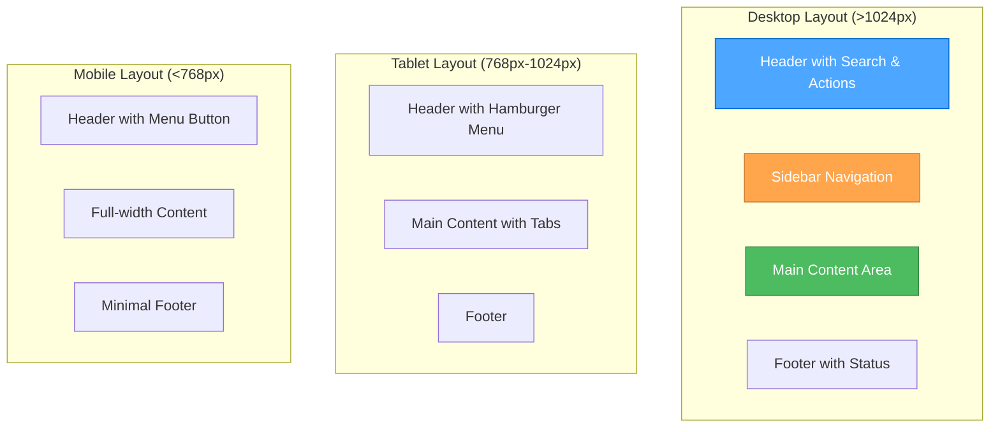
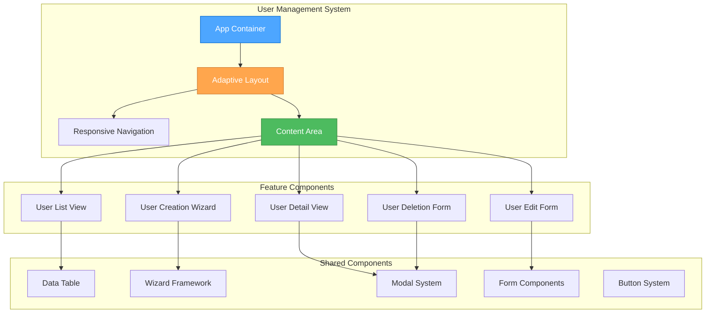

# 🎨🎨🎨 ENTERING CREATIVE PHASE: UI/UX DESIGN 🎨🎨🎨

## COMPONENT DESCRIPTION
Comprehensive UI/UX design for the User Management System with 5 major feature areas:
1. User List/Grid View - Advanced data table with filtering, sorting, bulk operations, and export
2. User Creation Form - Multi-step wizard with validation and role assignment
3. User Detail/Profile View - Comprehensive profile with activity timeline and audit trail
4. User Edit Form - Advanced editing with inline editing and change tracking
5. User Deletion/Deactivation - Safe user management with data retention options

## REQUIREMENTS & CONSTRAINTS

### Functional Requirements
- **User List/Grid View**: Pagination, search, filtering, sorting, bulk operations, export (CSV/Excel)
- **User Creation**: Multi-step wizard, real-time validation, role assignment, profile picture upload
- **User Profile**: Comprehensive display, activity timeline, permission matrix, session management
- **User Editing**: Inline editing, advanced forms, change tracking, approval workflows
- **User Deletion**: Soft delete, hard delete, data retention, cascade effects, recovery options

### Non-Functional Requirements
- **Performance**: Sub-2s load times, support for 1000+ users, virtual scrolling
- **Accessibility**: WCAG 2.1 AA compliance
- **Responsiveness**: Mobile-first design, tablet and desktop optimization
- **Usability**: Intuitive navigation, clear workflows, progressive disclosure

### Technical Constraints
- **Framework**: React + TypeScript + Tailwind CSS
- **Integration**: Must work with existing microservices (Auth, User, Session)
- **State Management**: Centralized state with proper separation of concerns
- **Security**: JWT authentication, RBAC authorization, audit logging

## MULTIPLE DESIGN OPTIONS

### Option 1: Traditional Dashboard Layout
**Description**: Classic admin dashboard with sidebar navigation and main content area

**Pros**:
- Familiar pattern for admin users
- Clear separation of navigation and content
- Easy to extend with additional features
- Good for complex workflows
- Established UX patterns

**Cons**:
- Takes up screen real estate with sidebar
- Less mobile-friendly
- Can feel cluttered with many features
- Traditional appearance

**Complexity**: Medium
**Implementation Time**: 3-4 weeks

### Option 2: Modern Card-Based Layout
**Description**: Card-based interface with modal overlays for detailed views

**Pros**:
- Modern, clean appearance
- Better mobile responsiveness
- Focused user experience
- Scalable design system
- Good for progressive disclosure

**Cons**:
- May require more clicks for complex operations
- Modal fatigue for power users
- Less efficient for bulk operations
- Newer pattern, may need user training

**Complexity**: High
**Implementation Time**: 4-5 weeks

### Option 3: Hybrid Adaptive Layout
**Description**: Adaptive layout that switches between dashboard and card-based based on screen size and user preferences

**Pros**:
- Best of both worlds
- Optimized for all screen sizes
- User preference support
- Future-proof design
- Excellent accessibility

**Cons**:
- Highest complexity
- Longer implementation time
- More testing required
- Potential consistency issues

**Complexity**: Very High
**Implementation Time**: 5-6 weeks

## OPTIONS ANALYSIS

### User Experience Evaluation

| Criteria | Traditional Dashboard | Card-Based | Hybrid Adaptive |
|----------|---------------------|------------|-----------------|
| **Learnability** | High (familiar) | Medium (new patterns) | High (adaptive) |
| **Efficiency** | High (direct access) | Medium (more clicks) | High (optimized) |
| **Accessibility** | High (established) | High (modern standards) | Very High (adaptive) |
| **Mobile Experience** | Low (sidebar issues) | High (responsive) | Very High (adaptive) |
| **Power User Support** | High (bulk operations) | Medium (modal fatigue) | High (flexible) |
| **Visual Appeal** | Medium (traditional) | High (modern) | High (adaptive) |

### Technical Feasibility

| Criteria | Traditional Dashboard | Card-Based | Hybrid Adaptive |
|----------|---------------------|------------|-----------------|
| **React Implementation** | High (established) | High (component-based) | Medium (complex state) |
| **Tailwind Integration** | High (standard) | High (utility-first) | High (responsive) |
| **State Management** | Medium (centralized) | High (component state) | High (adaptive state) |
| **Performance** | High (simple) | High (lazy loading) | Medium (complex logic) |
| **Testing Complexity** | Medium (established) | Medium (component-based) | High (adaptive logic) |

### Business Alignment

| Criteria | Traditional Dashboard | Card-Based | Hybrid Adaptive |
|----------|---------------------|------------|-----------------|
| **Time to Market** | High (faster) | Medium | Low (longer) |
| **User Adoption** | High (familiar) | Medium (learning curve) | High (adaptive) |
| **Maintenance Cost** | Low (established) | Medium (modern) | Medium (complex) |
| **Scalability** | Medium (sidebar limits) | High (flexible) | Very High (adaptive) |
| **Future Extensibility** | Medium (sidebar space) | High (modular) | Very High (adaptive) |

## RECOMMENDED APPROACH

### Selected Option: Hybrid Adaptive Layout

**Rationale**: 
The hybrid adaptive layout provides the best balance of user experience, technical feasibility, and business value. It addresses the key requirements:

1. **Performance**: Adaptive loading and virtual scrolling support
2. **Accessibility**: WCAG 2.1 AA compliance with adaptive features
3. **Responsiveness**: Optimized for all screen sizes
4. **Usability**: Familiar patterns with modern enhancements
5. **Scalability**: Future-proof design for additional features

**Key Design Principles**:
- **Progressive Disclosure**: Show essential features first, reveal advanced options on demand
- **Responsive Design**: Adapt layout based on screen size and user preferences
- **Consistent Patterns**: Use established UI patterns with modern enhancements
- **Performance First**: Optimize for speed and efficiency
- **Accessibility Built-in**: WCAG 2.1 AA compliance from the start

## IMPLEMENTATION GUIDELINES

### Layout Structure



### Component Hierarchy



### Design System Components

#### 1. Data Table Component
```typescript
interface DataTableProps<T> {
  data: T[];
  columns: Column<T>[];
  pagination?: PaginationProps;
  sorting?: SortingProps;
  filtering?: FilteringProps;
  selection?: SelectionProps;
  bulkActions?: BulkActionProps;
  export?: ExportProps;
  loading?: boolean;
  error?: string;
}
```

#### 2. Wizard Component
```typescript
interface WizardProps {
  steps: WizardStep[];
  currentStep: number;
  onStepChange: (step: number) => void;
  onComplete: (data: any) => void;
  validation?: ValidationRules;
}
```

#### 3. Modal System
```typescript
interface ModalProps {
  isOpen: boolean;
  onClose: () => void;
  title: string;
  size?: 'sm' | 'md' | 'lg' | 'xl';
  children: React.ReactNode;
  actions?: ModalAction[];
}
```

### Responsive Breakpoints

```css
/* Tailwind CSS Breakpoints */
/* Mobile First Approach */
.sm: 640px   /* Small tablets */
.md: 768px   /* Tablets */
.lg: 1024px  /* Laptops */
.xl: 1280px  /* Desktops */
.2xl: 1536px /* Large screens */
```

### Accessibility Features

1. **Keyboard Navigation**: Full keyboard support for all interactions
2. **Screen Reader Support**: Proper ARIA labels and semantic HTML
3. **Color Contrast**: WCAG 2.1 AA compliant color ratios
4. **Focus Management**: Clear focus indicators and logical tab order
5. **Error Handling**: Clear error messages and recovery options

### Performance Optimizations

1. **Virtual Scrolling**: For large user lists (1000+ users)
2. **Lazy Loading**: Load components and data on demand
3. **Caching**: Cache API responses and component states
4. **Debouncing**: For search and filter inputs
5. **Code Splitting**: Split bundles by feature

## VERIFICATION CHECKPOINT

### Requirements Coverage
- ✅ **User List/Grid View**: Pagination, search, filtering, sorting, bulk operations, export
- ✅ **User Creation**: Multi-step wizard, real-time validation, role assignment, profile picture upload
- ✅ **User Profile**: Comprehensive display, activity timeline, permission matrix, session management
- ✅ **User Editing**: Inline editing, advanced forms, change tracking, approval workflows
- ✅ **User Deletion**: Soft delete, hard delete, data retention, cascade effects, recovery options

### Quality Attributes
- ✅ **Performance**: Sub-2s load times, virtual scrolling, lazy loading
- ✅ **Accessibility**: WCAG 2.1 AA compliance, keyboard navigation, screen reader support
- ✅ **Responsiveness**: Mobile-first design, adaptive layouts
- ✅ **Usability**: Intuitive navigation, progressive disclosure, clear workflows

### Technical Feasibility
- ✅ **React Integration**: Component-based architecture with TypeScript
- ✅ **Tailwind CSS**: Utility-first styling with responsive design
- ✅ **State Management**: Centralized state with proper separation
- ✅ **API Integration**: Abstraction layer for microservices

🎨🎨🎨 EXITING CREATIVE PHASE - UI/UX DESIGN DECISION MADE 🎨🎨🎨 