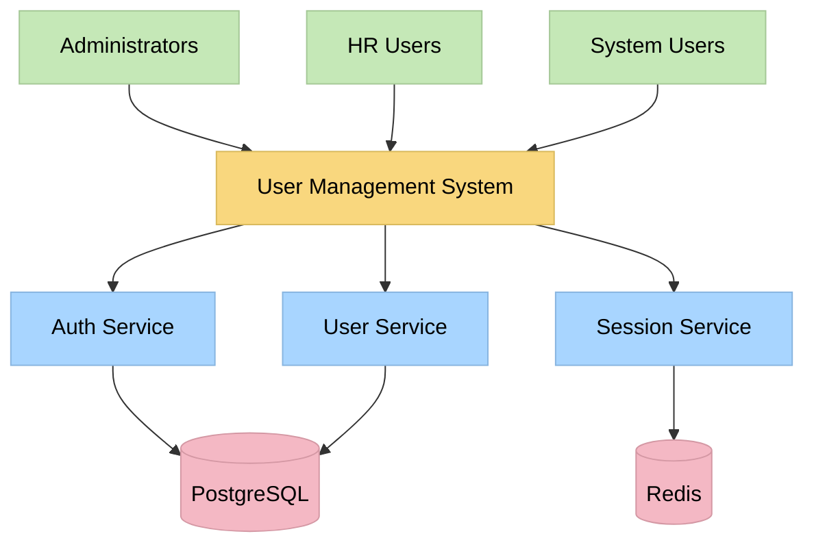
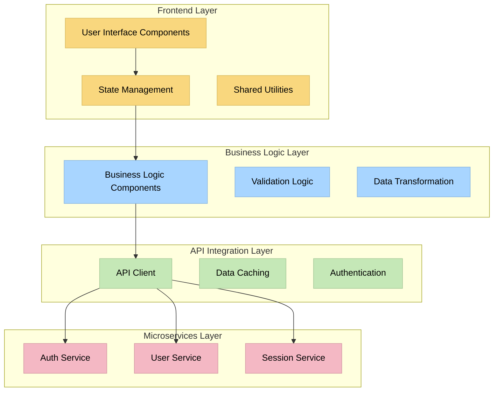
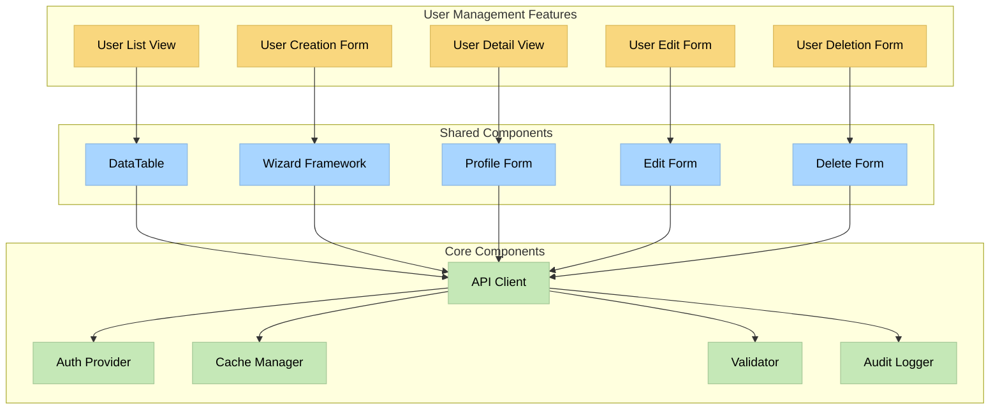
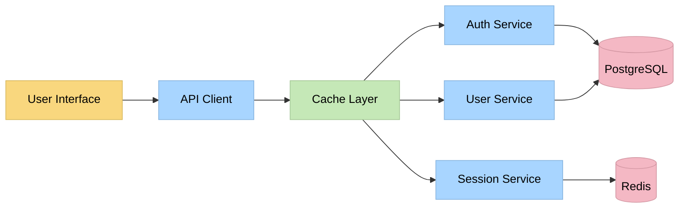
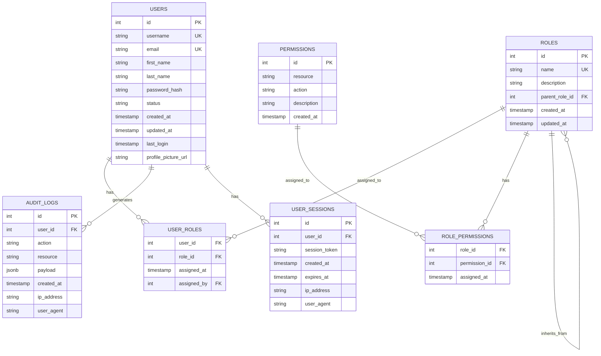
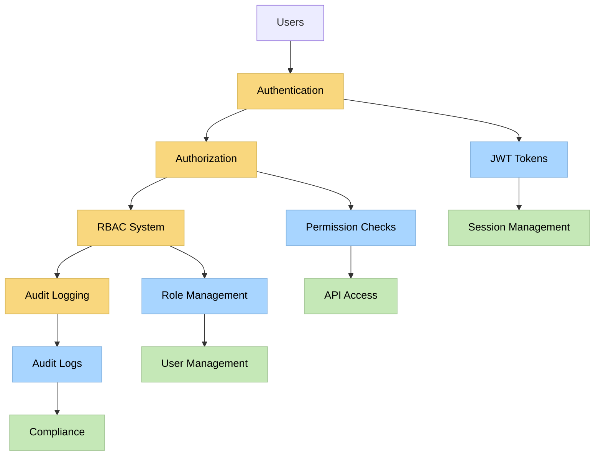
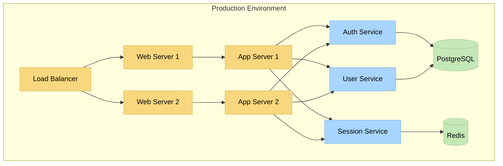

# SYSTEM PATTERNS

## ARCHITECTURAL PRINCIPLES

### 1. Monorepo Structure
- **Statement**: All user management features share a common codebase with shared components, utilities, and types
- **Rationale**: Promotes code reuse, consistent patterns, and easier maintenance
- **Implications**: Shared component library, common utilities, unified build process
- **Examples**: Shared DataTable component, common API client, unified TypeScript types

### 2. Component-Based Architecture
- **Statement**: Features are built from reusable, composable components with clear interfaces
- **Rationale**: Enables rapid development, consistent UX, and easier testing
- **Implications**: Component library, design system, prop interfaces
- **Examples**: Wizard component, DataTable, FormField components

### 3. State Management Centralization
- **Statement**: Application state is managed centrally with clear separation of concerns
- **Rationale**: Prevents state inconsistencies, enables debugging, and improves performance
- **Implications**: Global state store, local component state, state persistence
- **Examples**: User data cache, form state management, UI state tracking

### 4. Security-First Design
- **Statement**: Security considerations are integrated into every component and feature
- **Rationale**: Protects user data, ensures compliance, and prevents vulnerabilities
- **Implications**: Input validation, authorization checks, audit logging
- **Examples**: Form validation, permission checks, audit trail integration

### 5. Performance Optimization
- **Statement**: Performance is optimized through virtualization, caching, and lazy loading
- **Rationale**: Ensures good user experience with large datasets and complex operations
- **Implications**: Virtual scrolling, data caching, code splitting
- **Examples**: Virtualized user lists, API response caching, lazy-loaded components

## USER MANAGEMENT SYSTEM ARCHITECTURE

### System Context Diagram



### High-Level Architecture



### Component Architecture



## DATA ARCHITECTURE

### Data Flow Diagram



### Entity Relationship Model



## SECURITY ARCHITECTURE

### Security Model



### Security Controls

1. **Authentication**
   - JWT token-based authentication
   - Token refresh mechanism
   - Session management with Redis
   - Multi-factor authentication support

2. **Authorization**
   - Role-based access control (RBAC)
   - Permission-based authorization
   - Hierarchical role inheritance
   - Resource-level permissions

3. **Data Protection**
   - Input validation and sanitization
   - SQL injection prevention
   - XSS protection
   - CSRF protection

4. **Audit and Logging**
   - Comprehensive audit trail
   - Security event logging
   - User action tracking
   - Compliance reporting

## PERFORMANCE ARCHITECTURE

### Performance Optimization Strategies

1. **Frontend Optimization**
   - Virtual scrolling for large datasets
   - Component lazy loading
   - Image optimization and compression
   - Bundle splitting and code splitting

2. **API Optimization**
   - Response caching with Redis
   - Pagination and filtering
   - GraphQL for efficient data fetching
   - Request batching and debouncing

3. **Database Optimization**
   - Proper indexing strategies
   - Query optimization
   - Connection pooling
   - Read replicas for scaling

4. **Caching Strategy**
   - Browser caching for static assets
   - API response caching
   - User session caching
   - Permission cache for RBAC

## DEPLOYMENT ARCHITECTURE

### Deployment Model



## INTEGRATION PATTERNS

### API Integration Pattern

```typescript
// API Client Pattern
interface ApiClient {
  get<T>(endpoint: string, params?: Record<string, any>): Promise<T>;
  post<T>(endpoint: string, data: any): Promise<T>;
  put<T>(endpoint: string, data: any): Promise<T>;
  delete<T>(endpoint: string): Promise<T>;
}

// Service Layer Pattern
interface UserService {
  getUsers(params: UserListParams): Promise<UserListResponse>;
  createUser(userData: CreateUserData): Promise<User>;
  updateUser(id: string, userData: UpdateUserData): Promise<User>;
  deleteUser(id: string): Promise<void>;
  getUserProfile(id: string): Promise<UserProfile>;
}
```

### State Management Pattern

```typescript
// State Management Pattern
interface AppState {
  users: UserState;
  auth: AuthState;
  ui: UIState;
}

interface UserState {
  list: User[];
  selected: User | null;
  loading: boolean;
  error: string | null;
  filters: UserFilters;
  pagination: PaginationState;
}
```

### Component Pattern

```typescript
// Component Interface Pattern
interface DataTableProps<T> {
  data: T[];
  columns: Column<T>[];
  pagination?: PaginationProps;
  sorting?: SortingProps;
  filtering?: FilteringProps;
  onRowSelect?: (rows: T[]) => void;
  onBulkAction?: (action: string, rows: T[]) => void;
}
```

## QUALITY ATTRIBUTES

### Performance
- **Response Time**: Sub-2s for user list loading
- **Throughput**: Support 1000+ concurrent users
- **Scalability**: Horizontal scaling capability
- **Efficiency**: Optimized resource utilization

### Security
- **Authentication**: Secure JWT-based authentication
- **Authorization**: Comprehensive RBAC system
- **Data Protection**: Encryption at rest and in transit
- **Audit**: Complete audit trail for compliance

### Usability
- **Accessibility**: WCAG 2.1 AA compliance
- **Responsiveness**: Mobile-first design
- **Intuitiveness**: Clear navigation and workflows
- **Error Handling**: User-friendly error messages

### Maintainability
- **Modularity**: Clear component boundaries
- **Testability**: Comprehensive test coverage
- **Documentation**: Complete API and component documentation
- **Code Quality**: TypeScript strict mode compliance

### Reliability
- **Availability**: 99.9% uptime target
- **Fault Tolerance**: Graceful error handling
- **Data Integrity**: ACID compliance for critical operations
- **Recovery**: Backup and restore procedures

## IMPLEMENTATION PHASES

### Phase 1: Foundation (Week 1-2)
- Monorepo structure setup
- Shared component library
- API integration layer
- State management architecture

### Phase 2: Core Features (Week 3-4)
- User List/Grid View
- Basic user creation
- User profile display
- Simple user editing

### Phase 3: Advanced Features (Week 5-6)
- Advanced filtering and search
- Multi-step wizard
- Inline editing
- Bulk operations

### Phase 4: Integration & Polish (Week 7-8)
- Export functionality
- Advanced user deletion
- Performance optimization
- Security audit

### Phase 5: Testing & Deployment (Week 9-10)
- Comprehensive testing
- User acceptance testing
- Performance testing
- Production deployment

## RISK MITIGATION

### Technical Risks
- **Complex State Management**: Use proven state management patterns
- **Performance Issues**: Implement virtualization and caching
- **Security Vulnerabilities**: Comprehensive security review
- **Integration Complexity**: Gradual migration and testing

### Business Risks
- **Scope Creep**: Clear requirements and change control
- **Timeline Delays**: Agile development with regular checkpoints
- **User Adoption**: User testing and training
- **Compliance Issues**: Early compliance review and audit

## SUCCESS METRICS

### Technical Metrics
- **Performance**: <2s page load times
- **Reliability**: 99.9% uptime
- **Security**: Zero critical vulnerabilities
- **Code Quality**: 90%+ test coverage

### Business Metrics
- **User Adoption**: 95% user satisfaction
- **Efficiency**: 50% reduction in user management time
- **Compliance**: 100% audit trail compliance
- **ROI**: Positive ROI within 6 months 