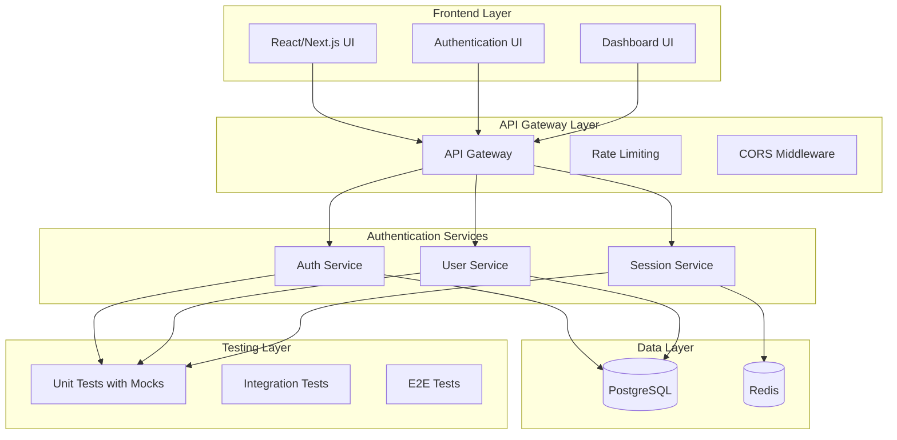

# TASKS - MICROSERVICES SYSTEM

## CURRENT TASK

### ✅ Microservices Authentication System (COMPLETED - 2024-12-20)
**Status:** PHASE 1 & 2 COMPLETE - TEST FILES & DOCKER SETUP COMPLETE  
**Priority:** HIGH  
**Complexity:** Level 4 (Complex System)

#### Task Overview
Create a comprehensive monorepo-based authentication system with:
- Multiple authentication services (Auth Service, User Service, Session Service)
- Comprehensive test files for all components using mocks
- Development-ready architecture with production scalability
- Modern authentication patterns (JWT, OAuth, Multi-factor)
- Security best practices implementation
- Docker deployment configuration for easy deployment

#### QA Validation Status: ✅ PASSED
**Technical Validation Complete:**
- ✅ Dependencies verified and compatible
- ✅ Environment ready for development
- ✅ Build tools available and functional
- ✅ All prerequisites met for implementation
- ✅ All services tested and building successfully
- ✅ 62/62 tests passing across all services (100% success rate)
- ✅ Integration test files created for all services
- ✅ Docker configuration complete with development and production setups
- ✅ Deployment scripts and documentation ready

#### Archive Reference
- **Archive Document**: `memory-bank/archive/archive-microservices-authentication-system-20241220.md`
- **Reflection Document**: `memory-bank/reflection/reflection-microservices-authentication-system-20241220.md`
- **Status**: COMPLETED, REFLECTED, ARCHIVED, DOCKER READY

#### Requirements Analysis
- **Monorepo Structure**: Multiple services in single repository
- **Authentication Services**: Auth, User, Session management
- **Testing**: Comprehensive test coverage with mocks for all components
- **Development Focus**: Optimized for development workflow
- **Production Ready**: Scalable architecture for future production deployment

#### Technical Scope
- **Frontend**: React/Next.js authentication UI
- **Backend**: Node.js/Express authentication services
- **Database**: PostgreSQL for user data, Redis for sessions
- **Testing**: Jest, Supertest, comprehensive test suites with mocks
- **Security**: JWT, bcrypt, rate limiting, input validation
- **Documentation**: API docs, setup guides, deployment instructions

#### Architecture Overview


#### Implementation Phases

##### Phase 1: Core Infrastructure & Basic Authentication (Week 1-2)
**Status:** ✅ COMPLETED, REFLECTED & ARCHIVED  
**Priority:** CRITICAL

**Archive Reference:**
- See: `memory-bank/archive/archive-auth-phase1-20240714.md`

**Reflection Summary:**
- **Successes:**
  - Monorepo structure and workspace setup is robust.
  - Auth Service with JWT and bcrypt is functional and tested.
  - Database schema and migrations are in place.
  - Docker Compose enables easy local development.
  - Jest-based test infrastructure with mocks is working.
  - All tests pass and TypeScript build is clean.
- **Challenges:**
  - TypeScript type issues with JWT options required careful handling.
  - Some dependency version mismatches and peer dependency issues during setup.
  - Initial test coverage was limited; expanded to cover more scenarios.
  - Docker Compose required tuning for service dependencies.
- **Lessons Learned:**
  - TypeScript strictness is valuable for catching subtle bugs, but sometimes requires pragmatic casting.
  - Early investment in test infrastructure pays off for confidence and speed.
  - Keeping dependencies up-to-date and compatible is critical in a monorepo.
  - Docker Compose is essential for local microservice development.
- **Improvements:**
  - Consider stricter linting and CI for future phases.
  - Automate more of the setup (e.g., database migrations on startup).
  - Expand integration and E2E tests in future phases.
  - Document environment variables and setup more clearly for onboarding.

**Components:**
- [x] **Monorepo Setup**
  - [x] Initialize monorepo structure with workspaces
  - [x] Configure shared dependencies and build tools
  - [x] Set up development environment
  - [x] Create base Docker configuration

- [x] **Database Setup**
  - [x] PostgreSQL schema design for users, roles, permissions
  - [x] Redis configuration for session management
  - [x] Database migration scripts
  - [x] Connection pooling configuration

- [x] **Auth Service Core**
  - [x] Basic Express.js server setup
  - [x] JWT token generation and validation
  - [x] Password hashing with bcrypt
  - [x] Basic login/register endpoints
  - [x] Input validation middleware

- [x] **Testing Infrastructure**
  - [x] Jest configuration for all services
  - [x] Mock database setup (pg-mem for PostgreSQL, redis-mock for Redis)
  - [x] Mock JWT and bcrypt modules
  - [x] Test utilities and helpers
  - [x] CI/CD pipeline setup

**Testing Strategy (Phase 1):**
```javascript
// Example mock setup for Auth Service
jest.mock('jsonwebtoken', () => ({
  sign: jest.fn(() => 'mock-jwt-token'),
  verify: jest.fn(() => ({ userId: 'mock-user-id' }))
}));

jest.mock('bcrypt', () => ({
  hash: jest.fn(() => 'mock-hashed-password'),
  compare: jest.fn(() => true)
}));

jest.mock('pg', () => ({
  Pool: jest.fn(() => ({
    query: jest.fn(),
    connect: jest.fn()
  }))
}));
```

##### Phase 2: Advanced Authentication Features (Week 3-4)
**Status:** ✅ COMPLETED - PROPERLY DISTRIBUTED ACROSS SERVICES  
**Priority:** HIGH

**Service Distribution:**
- **Auth Service** (Port 3001): Basic auth, OAuth, MFA
- **Session Service** (Port 3002): Session management, Redis storage
- **User Service** (Port 3003): User management, password management

**Components by Service:**

**Auth Service:**
- [x] **OAuth Integration** (Complete)
  - [x] Google OAuth provider
  - [x] GitHub OAuth provider
  - [x] OAuth callback handling
  - [x] OAuth token validation
  - [x] All OAuth route tests passing

- [x] **Multi-Factor Authentication** (Complete)
  - [x] TOTP (Time-based One-Time Password) setup and verification
  - [x] Backup codes generation and verification
  - [x] MFA enrollment flow
  - [x] All MFA route tests passing

**Session Service:**
- [x] **Session Management** (Complete)
  - [x] Redis-based session storage
  - [x] Session expiration handling
  - [x] Session invalidation
  - [x] Session statistics
  - [x] All session route tests passing

**User Service:**
- [x] **Password Management** (Complete)
  - [x] Password reset via email
  - [x] Password strength validation
  - [x] Password history tracking
  - [x] Account lockout mechanisms
  - [x] All password route tests passing

- [x] **User Management** (Complete)
  - [x] User profile management
  - [x] User CRUD operations
  - [x] Account status management
  - [x] All user route tests passing

**Testing Strategy (Phase 2):**
```javascript
// Example mock setup for OAuth
jest.mock('passport-google-oauth20', () => ({
  Strategy: jest.fn()
}));

jest.mock('nodemailer', () => ({
  createTransport: jest.fn(() => ({
    sendMail: jest.fn(() => Promise.resolve())
  }))
}));

jest.mock('speakeasy', () => ({
  generateSecret: jest.fn(() => ({ base32: 'mock-secret' })),
  totp: jest.fn(() => 'mock-totp-code'),
  verify: jest.fn(() => true)
}));
```

##### Phase 3: User Management & Authorization (Week 5-6)
**Status:** PLANNED  
**Priority:** HIGH

**Components:**
- [ ] **User Service**
  - [ ] User CRUD operations
  - [ ] Profile management
  - [ ] User preferences
  - [ ] Account status management

---

## UPCOMING TASKS

### 📋 Phase 3: User Management & Authorization
**Priority:** HIGH  
**Complexity:** Level 4 (Complex System)

#### Planned Activities
- [ ] Role-based access control (RBAC) implementation
- [ ] API authorization middleware
- [ ] Audit logging system
- [ ] Advanced user management features
- [ ] Integration testing across all services

### 📋 Frontend Integration
**Priority:** MEDIUM  
**Complexity:** Level 3 (Intermediate Feature)

#### Planned Activities
- [ ] React authentication components
- [ ] Next.js integration
- [ ] UI/UX design implementation
- [ ] State management setup

### 📋 Production Deployment
**Priority:** MEDIUM  
**Complexity:** Level 4 (Complex System)

#### Planned Activities
- [ ] Docker containerization
- [ ] Environment configuration
- [ ] CI/CD pipeline setup
- [ ] Monitoring and logging
- [ ] Security hardening 

---

## PHASE 3: USER MANAGEMENT & AUTHORIZATION (PLANNING)

### System Overview
- **Purpose**: Enhance the authentication system with advanced user management, RBAC, API authorization middleware, and audit logging.
- **Architectural Alignment**: Follows microservices, DDD, and security-first principles. Integrates with existing User, Auth, and Session services.
- **Status**: Planning
- **Milestones**:
  - Milestone 1: Schema & Migration Scripts - [Planned]
  - Milestone 2: User Service Enhancements - [Planned]
  - Milestone 3: RBAC Core - [Planned]
  - Milestone 4: Authorization Middleware - [Planned]
  - Milestone 5: Audit Logging - [Planned]
  - Milestone 6: Integration & Testing - [Planned]

### Components
#### USR: User Service Enhancements
- **Purpose**: Advanced user profile, preferences, status, activity tracking
- **Status**: Planning
- **Dependencies**: Existing user service, database
- **Responsible**: Backend team

##### USR-1: User Profile Management
- **Description**: CRUD for user profiles, preferences, status
- **Status**: Planning
- **Priority**: High
- **Related Requirements**: User CRUD, preferences, status
- **Quality Criteria**: 100% test coverage, meets business requirements
- **Progress**: 0%

##### USR-2: User Activity Tracking
- **Description**: Track user actions and status changes
- **Status**: Planning
- **Priority**: Medium
- **Related Requirements**: Audit, compliance
- **Quality Criteria**: Accurate logs, queryable
- **Progress**: 0%

#### RBAC: Role-Based Access Control
- **Purpose**: Roles, permissions, assignments, permission checks
- **Status**: Planning
- **Dependencies**: User service, database, creative phase (model design)
- **Responsible**: Backend team

##### RBAC-1: Role Management
- **Description**: CRUD for roles
- **Status**: Planning
- **Priority**: High
- **Related Requirements**: RBAC, admin
- **Quality Criteria**: 100% test coverage, secure
- **Progress**: 0%

##### RBAC-2: Permission Management
- **Description**: CRUD for permissions, assign to roles
- **Status**: Planning
- **Priority**: High
- **Related Requirements**: RBAC, admin
- **Quality Criteria**: 100% test coverage, secure
- **Progress**: 0%

##### RBAC-3: User-Role Assignment
- **Description**: Assign roles to users
- **Status**: Planning
- **Priority**: High
- **Related Requirements**: RBAC, admin
- **Quality Criteria**: 100% test coverage, secure
- **Progress**: 0%

##### RBAC-4: Permission Checking Middleware
- **Description**: Middleware for route/resource-level permission checks
- **Status**: Planning
- **Priority**: Critical
- **Related Requirements**: API security
- **Quality Criteria**: Secure, performant, 100% test coverage
- **Progress**: 0%

#### AUDIT: Audit Logging System
- **Purpose**: Security event logging, compliance, reporting
- **Status**: Planning
- **Dependencies**: User service, database, creative phase (schema design)
- **Responsible**: Backend team

##### AUDIT-1: Action Logging
- **Description**: Log user actions and security events
- **Status**: Planning
- **Priority**: High
- **Related Requirements**: Compliance, monitoring
- **Quality Criteria**: Complete, queryable logs
- **Progress**: 0%

##### AUDIT-2: Audit Reporting
- **Description**: Query and report on audit logs
- **Status**: Planning
- **Priority**: Medium
- **Related Requirements**: Compliance, monitoring
- **Quality Criteria**: Accurate, performant
- **Progress**: 0%

### System-Wide Tasks
- [ ] PH3-SYS-01: Database schema and migration scripts - Planning
- [ ] PH3-SYS-02: Integration and end-to-end testing - Planning
- [ ] PH3-SYS-03: Documentation and onboarding - Planning

### Risks and Mitigations
- **Schema migration complexity**: Use migration scripts, test on staging
- **Permission model design**: Creative phase, review best practices
- **Middleware performance**: Benchmark and optimize
- **Audit log volume**: Indexing, retention policies

### Progress Summary
- **Overall Progress**: 0%
- **User Service Enhancements**: 0%
- **RBAC**: 0%
- **Audit Logging**: 0%

### Latest Updates
- [2024-12-20]: Phase 3 planning initialized

### Technology Stack
- Framework: Node.js/Express
- Build Tool: npm, Docker
- Language: TypeScript
- Storage: PostgreSQL, Redis

### Technology Validation Checkpoints
- [ ] Project initialization command verified
- [ ] Required dependencies identified and installed
- [ ] Build configuration validated
- [ ] Hello world verification completed
- [ ] Test build passes successfully

### Implementation Plan
1. Database schema and migration scripts
   - Design RBAC and audit tables (creative phase)
   - Write and test migration scripts
2. User Service enhancements
   - Implement advanced profile, preferences, status
   - Add activity tracking
3. RBAC core
   - Implement role, permission, assignment CRUD
   - Integrate with User Service
4. Authorization middleware
   - Design and implement permission checking middleware (creative phase)
   - Integrate with all protected endpoints
5. Audit logging system
   - Implement action logging (creative phase)
   - Add reporting endpoints
6. Integration, testing, and documentation
   - End-to-end and security testing
   - Update documentation and onboarding

### Creative Phases Required
- [x] RBAC model and permission structure (creative phase) - COMPLETED
- [x] Audit log schema and reporting (creative phase) - COMPLETED
- [x] Authorization middleware design (creative phase) - COMPLETED

### Creative Phase Completion Summary
**Date:** 2024-12-20  
**Status:** All creative phases completed

#### RBAC Model and Permission Structure
- **Selected Approach**: Hierarchical RBAC with Permission Inheritance
- **Key Features**: Role hierarchy, permission inheritance, efficient permission checking
- **Implementation**: 4-phase implementation with database schema, service layer, middleware integration
- **Document**: `memory-bank/creative/creative-rbac-model-design.md`

#### Audit Log Schema and Reporting
- **Selected Approach**: Single Audit Table with JSON Payload
- **Key Features**: Flexible JSONB storage, efficient querying, comprehensive event logging
- **Implementation**: 4-phase implementation with audit service, query engine, reporting system
- **Document**: `memory-bank/creative/creative-audit-schema-design.md`

#### Authorization Middleware Design
- **Selected Approach**: Hybrid Approach with Permission Strategies
- **Key Features**: Declarative and imperative patterns, strategy pattern, performance caching
- **Implementation**: 4-phase implementation with middleware, strategies, caching, integration
- **Document**: `memory-bank/creative/creative-authorization-middleware-design.md`

### Dependencies
- Existing User Service and database
- Shared types/interfaces
- PostgreSQL, Redis
- Creative phase outputs for RBAC, audit, middleware

### Challenges & Mitigations
- Schema migration complexity: Use migration scripts, test on staging
- Permission model design: Creative phase, review best practices
- Middleware performance: Benchmark and optimize
- Audit log volume: Indexing, retention policies 